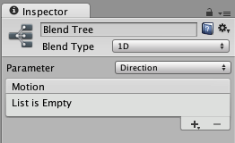

#混合树

游戏动画中的一项常见任务是在两个或更多相似运动之间进行混合。也许最熟知的示例就是根据角色的速度来混合行走和奔跑动画。另一个示例是角色在奔跑期间转向时向左或向右倾斜。

区分过渡与混合树十分重要。虽然两者都用于创建平滑动画，但它们用于不同种类的情况。

* __过渡__用于在给定时间内从一个动画状态平滑过渡到另一动画状态。过渡作为[动画状态机](AnimationStateMachines.html)的一部分指定。如果过渡很快，从一个运动到完全不同运动的过渡通常没有问题。

* __混合树__允许通过不同程度合并多个动画来使动画平滑混合。每个运动对最终效果的影响由一个_混合参数_控制，该参数只是与 Animator Controller 相关联的数字[动画参数](AnimationParameters.html)之一。为了使混合后的运动合理，要混合的运动必须具有相似的性质和时机。混合树是动画状态机中的一种特殊状态类型。

例如，类似运动可能是各种行走和奔跑动画。为了使混合取得良好效果，剪辑中的动作必须在标准化时间内的相同点进行。例如，可将行走和奔跑动画对齐，使得脚与地面的接触时刻发生在标准化时间内的相同点（例如，左脚接触点为 0.0，右脚接触点为 0.5）。由于使用标准化时间，因此剪辑长度不同并不要紧。

##使用混合树

要开始使用新混合树，您需要：

1.右键单击 Animator Controller 窗口上的空白区域。
1.从显示的上下文菜单中，选择 __Create State &gt; From New Blend Tree__。
1.双击混合树 (Blend Tree) 以进入混合树视图 (Blend Tree Graph)。

Animator 窗口现在显示整个混合树的图示，而 Inspector 显示当前选定节点及其直接子节点。

要将动画剪辑添加到混合树，可选择该混合树，然后单击 Inspector 的 Motion 字段内的加号图标。

或者，也可通过右键单击混合树并从上下文菜单进行选择来添加动画剪辑或子混合节点：

使用动画剪辑和输入参数来设置混合树时，Inspector 窗口通过图形显示动画如何随着参数值变化而进行组合（拖动滑动条时，树根中的箭头会改变其着色以显示其控制的动画剪辑）。

您可以选择混合树图中的任何节点，然后在 Inspector 中检查它。如果所选节点是动画剪辑，则会显示该动画剪辑的 Inspector。如果该动画是从模型导入的，设置将处于只读状态。如果节点是混合节点，则会显示混合节点的 Inspector。

您可以从 _Blend Type_ 菜单选择 [1D](BlendTree-1DBlending.html) 或 [2D](BlendTree-2DBlending.html) 混合；这两个类型之间的差异在本部分的相应页面中有介绍。

##混合树和根运动

动画之间的混合是使用线性插值处理的（即，每个动画的量是由混合参数加权的单独动画的平均值）。但应注意，根运动_不是_以相同方式插值的。请参阅有关[根运动](RootMotion.html)的页面，详细了解这种情况可能给角色带来何种影响。
