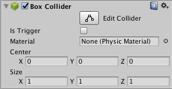

#盒型碰撞体

__盒型碰撞体 (Box Collider)__ 是一种基本的立方体形状原始碰撞体。

 

##属性

|**_属性：_** |**_功能：_** |
|:---|:---|
|__Is Trigger__ |如果启用此属性，则该碰撞体将用于触发事件，并被物理引擎忽略。 |
|__Material__ |引用[物理材质](class-PhysicMaterial.html)，可确定该碰撞体与其他对象的交互方式。 |
|__Center__ |碰撞体在对象局部空间中的位置。 |
|__Size__ |碰撞体在 X、Y、Z 方向上的大小。 |

##详细信息

盒型碰撞体显然可用于形状大致类似于盒体的任何东西，例如板条箱或木箱。但是，可以使用薄形盒体作为地板、墙壁或坡道。盒体形状也是复合碰撞体中的有用元素。
