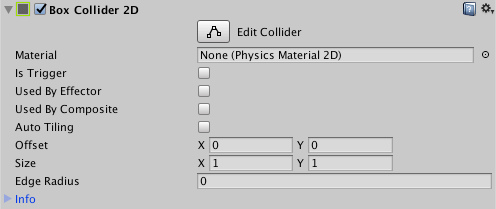

2D 盒型碰撞体 (Box Collider 2D)
===============

__2D 盒型碰撞体__组件是用于 2D 物理的碰撞体。该碰撞体的形状是矩形，在__精灵__的局部坐标空间中具有定义的位置、宽度和高度。请注意，矩形为轴对齐，即矩形的边与局部空间的 X 或 Y 轴平行。

 

|**_属性_** |**_功能_** |
|:---|:---|
|__Material__ |一种物理材质，可用于确定碰撞的属性（例如摩擦和弹性）。 |
|__Is Trigger__ |如果希望 2D 盒型碰撞体作为触发器运行，请选中此框。 |
|__Used by Effector__ |如果希望 2D 盒型碰撞体由附加的 2D 效应器组件使用，请选中此框。 |
| __Used by Composite__ | 如果希望此碰撞体由附加的 [2D 复合碰撞体 (Composite Collider 2D)](class-CompositeCollider2D.html) 使用，请勾选此复选框。  启用 __Used by Composite__ 时，其他属性会从 2D 盒型碰撞体组件中消失，因为这些属性现在由附加的 2D 复合碰撞体控制。从 2D 盒型碰撞体消失的属性为 __Material__、__Is Trigger__、__Used By Effector__ 和 __Edge Radius__。 |
|__Auto Tiling__ |如果所选精灵的[精灵渲染器 (Sprite Renderer)](class-SpriteRenderer.html) 组件将 __Draw Mode__ 设置为 __Tiled__，请勾选此复选框。这样可以自动更新 [2D 碰撞体](Collider2D.html)的形状，意味着精灵的尺寸变化时，会自动重新调整形状。如果没有启用 __Auto Tiling__，2D 碰撞体几何形状不会自动重复。 |
|__Offset__ |设置 2D 碰撞体几何形状的局部偏移。 |
|__Size__ |按局部空间单位设置盒体的大小。 |
| __Edge Radius__| 控制边缘周围的半径，使顶点为圆形。这会产生一个具有圆凸角的更大 [2D 碰撞体](Collider2D.html)。此设置的默认值是 __0__（无半径）。 |

