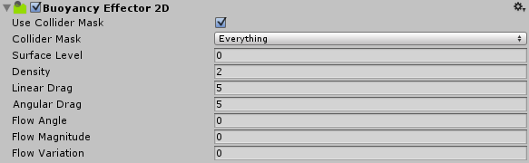

# 2D 浮力效应器 (Buoyancy Effector 2D)

Buoyancy Effector 2D 定义简单的流体行为，例如浮动以及流体阻力和流量。还可以控制流体表面以及下方发生的流体行为。

属性
----------

|**_属性：_** |**_功能：_** |
|:---|:---|
|__Use Collider Mask__ |选中此框可启用“Collider Mask”属性。如果未启用此选项，则所有 2D 碰撞体都将默认采用全局碰撞矩阵 (Global Collision Matrix)。|
|__Collider Mask__ |此遮罩用于选择允许与效应器进行交互的特定层。请注意，仅在已选择 __Use Collider Mask__ 的情况下，才显示此选项。 |
|__Surface Level__ |定义浮力流体的表面位置。游戏对象高于此线时，不会对其施加浮力。游戏对象与此线相交或完全在此线下方时，将对其施加浮力。此位置指定为沿世界 y 轴的世界空间偏移，但也由游戏对象的__变换__组件缩放。|
|__Density__ | Buoyancy Effector 2D 流体的密度。此属性会影响 2D 碰撞体的行为：密度较大的碰撞体会下沉，密度较小的碰撞体会上浮，密度与流体相同的碰撞体会悬浮在流体中。|
|__Linear Drag__ |影响游戏对象位置移动的阻力系数。该系数仅适用于流体内部。|
|__Angular Drag__ |影响游戏对象旋转移动的阻力系数。该系数仅适用于流体内部。|
|__Flow Angle__ |流体流动方向的世界空间角度（以度为单位）。流体流动将沿指定方向施加浮力。|
|__Flow Magnitude__ |流体流动力的“力量”。此项与 __Fluid Angle__ 结合，共同指定施加于流体内游戏对象的浮力水平。此大小也可以为负值，在此情况下，以相对于 __Flow Angle__ 的 180 度方向施加浮力。|
|__Flow Variation__ |在此处输入一个随机改变流体力的值。可指定正负变化来表示 __Fluid Magnitude__ 的随机加减值。|

