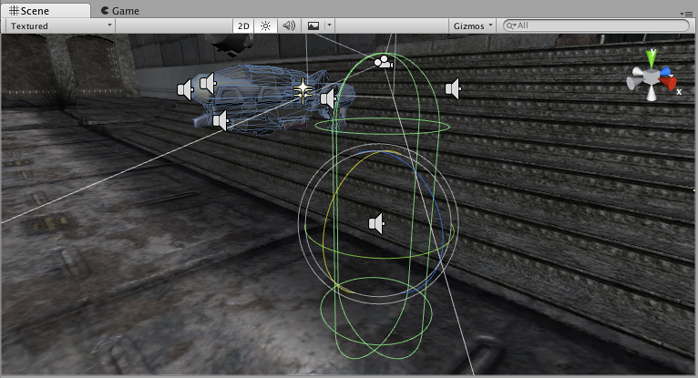
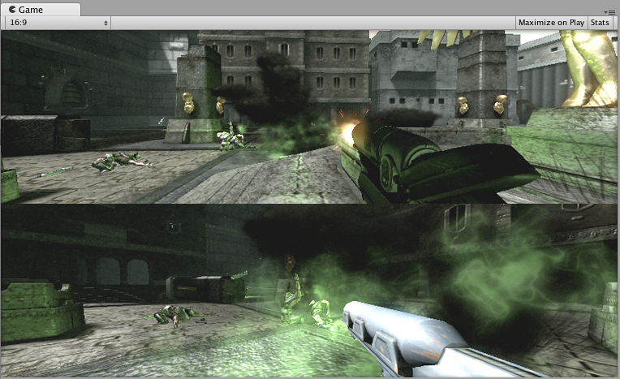
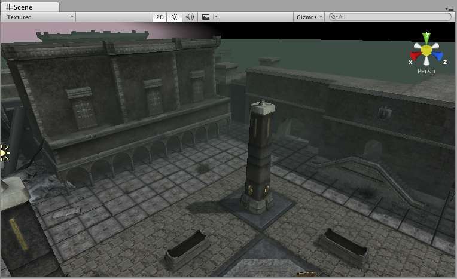
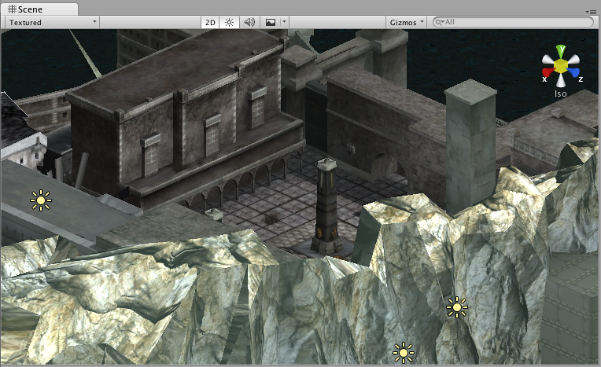
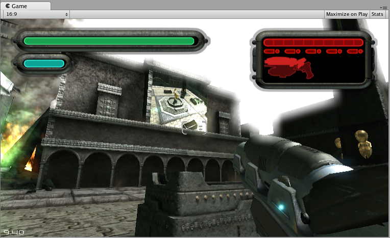

摄像机
======

__摄像机__是为玩家捕捉和展示世界的设备。通过自定义和操纵摄像机，您可以让自己的游戏呈现出真正的独特性。在场景中可拥有无限数量的摄像机。这些摄像机可设置为以任何顺序在屏幕上任何位置或仅在屏幕的某些部分进行渲染。

 

属性
----------

|**_属性：_** |**_功能：_** |
|:---|:---|
|__Clear Flags__ |确定将清除屏幕的哪些部分。使用多个摄像机来绘制不同游戏元素时，这会很方便。 |
|__Background__ |在绘制视图中的所有元素之后但没有天空盒的情况下，应用于剩余屏幕部分的颜色。 |
|__Culling Mask__ |包含或忽略要由摄像机渲染的对象层。在检视面板中将层分配到对象。 | 
|__Projection__ |切换摄像机模拟透视的功能。 |
|&amp;#160;&amp;#160;&amp;#160;&amp;#160;&amp;#160;&amp;#160;&amp;#160;&amp;#160;_Perspective_ |摄像机将以完整透视角度渲染对象。 |
|&amp;#160;&amp;#160;&amp;#160;&amp;#160;&amp;#160;&amp;#160;&amp;#160;&amp;#160;_Orthographic_ |摄像机将均匀渲染对象，没有透视感。**注意**：在正交模式下不支持延迟渲染。始终使用前向渲染。 |
|__Size__（选择 Orthographic 时） |设置为 Orthographic 时摄像机的视口大小。 |
|__Field of view__（选择 Perspective 时） |摄像机视角的宽度（以沿着局部 Y 轴的度数为单位）。 |
|__Clipping Planes__ |开始和停止渲染位置到摄像机的距离。 |
|&amp;#160;&amp;#160;&amp;#160;&amp;#160;&amp;#160;&amp;#160;&amp;#160;&amp;#160;_Near_ |相对于摄像机的最近绘制点。 |
|&amp;#160;&amp;#160;&amp;#160;&amp;#160;&amp;#160;&amp;#160;&amp;#160;&amp;#160;_Far_ |相对于摄像机的最远绘制点。 |
|__Viewport Rect__ |通过四个值指示将在屏幕上绘制此摄像机视图的位置。在视口坐标中测量（值为 0-1）。 |
|&amp;#160;&amp;#160;&amp;#160;&amp;#160;&amp;#160;&amp;#160;&amp;#160;&amp;#160;_X_ |绘制摄像机视图的起始水平位置。 |
|&amp;#160;&amp;#160;&amp;#160;&amp;#160;&amp;#160;&amp;#160;&amp;#160;&amp;#160;_Y_ |绘制摄像机视图的起始垂直位置。 |
|&amp;#160;&amp;#160;&amp;#160;&amp;#160;&amp;#160;&amp;#160;&amp;#160;&amp;#160;_W_（宽度） |屏幕上摄像机输出的宽度。 |
|&amp;#160;&amp;#160;&amp;#160;&amp;#160;&amp;#160;&amp;#160;&amp;#160;&amp;#160;_H_（高度） |屏幕上摄像机输出的高度。 |
|__Depth__ |摄像机在绘制顺序中的位置。具有更大值的摄像机将绘制在具有更小值的摄像机之上。 |
|__Rendering Path__ |定义摄像机将使用的渲染方法的选项。 |
|&amp;#160;&amp;#160;&amp;#160;&amp;#160;&amp;#160;&amp;#160;&amp;#160;&amp;#160;_Use Player Settings_ |此摄像机将使用 Player Settings 中设置的任何渲染路径 (Rendering Path)。 |
|&amp;#160;&amp;#160;&amp;#160;&amp;#160;&amp;#160;&amp;#160;&amp;#160;&amp;#160;_Vertex Lit_ |此摄像机渲染的所有对象都将渲染为顶点光照对象。 |
|&amp;#160;&amp;#160;&amp;#160;&amp;#160;&amp;#160;&amp;#160;&amp;#160;&amp;#160;_Forward_ |每种材质采用一个通道渲染所有对象。 |
|&amp;#160;&amp;#160;&amp;#160;&amp;#160;&amp;#160;&amp;#160;&amp;#160;&amp;#160;_Deferred Lighting_ |将在没有光照的情况下一次性绘制所有对象，然后在渲染队列末尾一起渲染所有对象的光照。**注意：***如果摄像机的投影模式设置为 Orthographic，则会覆盖该值，并且摄像机将始终使用前向渲染。* |
|__Target Texture__ |引用将包含摄像机视图输出的[渲染纹理](class-RenderTexture.html)。设置此引用将禁用此摄像机的渲染到屏幕功能。 | 
|__HDR__|为此摄像机启用高动态范围渲染。|
|__Target Display__|定义要渲染到的外部设备。值为 1 到 8 之间。|

详细信息
-------

为了向玩家显示游戏，摄像机至关重要。可对摄像机进行自定义、为其编写脚本或对其进行管控以实现任何可想象的效果。对于拼图游戏，摄像机可保持静态以获得拼图的完整视图。对于第一人称射击游戏，可让摄像机跟随玩家角色，并将其置于角色的视线水平。对于赛车游戏，可能希望让摄像机跟随玩家的车辆。

可创建多个摄像机，并将每个摄像机分配给不同的__深度 (Depth)__。按照从低__深度__到高__深度__的顺序绘制摄像机。换言之，__深度__为 2 的摄像机将绘制在深度为 1 的摄像机之上。您可以调整 __Normalized View Port Rectangle__ 属性的值，从而调整屏幕上摄像机视图的大小和位置。这样就能创建多种迷你视图，如导弹摄像机、地图视图、后视镜等。

###Render path
Unity 支持不同的渲染路径。您应该根据自己的游戏内容和目标平台/硬件而选择使用哪一个渲染路径。不同的渲染路径具有不同的功能和性能特征，主要影响光照和阴影。
在 __Player Settings__ 中选择项目使用的渲染路径。此外，可针对每个摄像机重写渲染路径。

有关渲染路径的更多信息，请查看[渲染路径](RenderingPaths.html)页面。

###Clear Flags

每个摄像机在渲染其视图时都会存储颜色和深度信息。屏幕中未绘制的部分为空，默认情况下将显示天空盒。使用多个摄像机时，每个摄像机都会在缓冲区中存储自己的颜色和深度信息，随着每个摄像机渲染而累积越来越多数据。场景中的任何特定摄像机渲染其视图时，您可以设置 __Clear Flags__ 来清除不同的缓冲区信息集合。为此，请选择以下四个选项之一：

####Skybox

这是默认设置。屏幕的任何空白部分都将显示当前摄像机的天空盒。如果当前摄像机没有设置天空盒，它将默认为 [Lighting 窗口](GlobalIllumination.html)（菜单：__Window &gt; Lighting__）中选择的天空盒。随后，它将恢复为__背景颜色 (Background Color)__。或者，可将 [Skybox 组件](class-Skybox.html)添加到摄像机。如果要创建新的天空盒，[可参考此指南](HOWTO-UseSkybox.html)。

####Solid color

屏幕的任何空白部分都将显示当前摄像机的__背景颜色__。

####Depth only

如果要绘制玩家的枪支而不使其陷入环境中，请设置一个__深度 (Depth)__ 为 0 的摄像机来绘制环境，并设置另一个__深度__为 1 的摄像机来单独绘制武器。将武器摄像机的 __Clear Flags__ 设置为 __Depth Only__。这样将在屏幕上保持环境的图形显示，但丢弃有关每个对象在 3D 空间中所处位置的所有信息。绘制枪支时，不透明部分将完全覆盖所绘制的任何对象（无论枪支与墙壁的接近程度如何）。

####Don't clear

此模式不会清除颜色或深度缓冲区。结果是将每帧绘制在下一帧之上，从而产生涂抹效果。此模式通常不用于游戏，更可能与自定义着色器一起使用。

请注意，在某些 GPU（主要是移动端 GPU）上，不清除屏幕可能会导致其内容在下一帧中未定义。在某些系统上，屏幕可能包含前一帧图像、纯黑色屏幕或随机有色像素。

###裁剪面 (Clip Planes)

__Near__ 和 __Far Clip Plane__ 属性可确定摄像机视图的开始和结束位置。这些平面垂直于摄像机的方向，并从摄像机位置算起。__近平面__是将要渲染的最近位置，而__远平面__是最远位置。

裁剪面还将确定深度缓冲区精度在场景上的分布情况。一般情况下，为了获得更好的精度，应将__近平面__尽可能移到远处。

注意，近裁剪面和远裁剪面以及由摄像机可视角度定义的平面一起描述了通常所知的摄像机_视椎体_。Unity 确保在渲染对象时不会显示完全位于此视椎体之外的对象。这就是所谓的视椎体剔除 (Frustum Culling)。无论您是否在游戏中使用遮挡剔除 (Occlusion Culling)，都会发生视椎体剔除。

出于性能原因，您可能希望更早剔除小对象。例如，使小石块和碎片不可见的距离可远小于使大型建筑物不可见的距离。为此，可将小对象放入[单独一层](Layers.html)，并使用 [Camera.layerCullDistances](../ScriptReference/Camera-layerCullDistances.html) 脚本函数来设置每层剔除距离。

###剔除遮罩 (Culling Mask)

借助__剔除遮罩__，可使用层来选择性渲染对象组。可在[此处](Layers.html)找到有关使用层的更多信息。

###标准化视口矩形 (Normalized Viewport Rectangle)

__标准化视口矩形__专门用于定义将要绘制当前摄像机视图的屏幕特定部分。您可以将地图视图放在屏幕的右下角，或者将导弹尖端视图放置在左上角。通过一些设计工作，即可使用__视口矩形__来创建一些独特行为。

使用__标准化视口矩形__可以轻松创建双玩家分屏效果。创建两个摄像机后，将摄像机的 H 值更改为 0.5，然后将玩家 1 的 Y 值设置为 0.5，将玩家 2 的 Y 值设置为 0。这样，就能使玩家 1 的摄像机显示为屏幕的上半部，而玩家 2 的摄像机显示为屏幕的下半部。

###正交模式 (Orthographic)

将摄像机标记为__正交模式__，就会从摄像机视图移除全部透视。此模式最常用于创建等距视图游戏或 2D 游戏。

请注意，雾效在正交摄像机模式下均匀渲染，因此可能无法按预期显示。这是因为后透视空间的 Z 坐标用于雾的“深度”。这对于正交摄像机而言并不是严格准确的，但之所以使用该模式，是因为其在渲染过程中有一定的性能优势。

###渲染纹理 (Render Texture)

此设置将把摄像机的视图置于[纹理](class-RenderTexture.html)上，然后可以将纹理应用于另一对象。如此便可轻松创建运动竞技场视频监视器、监控摄像机和反射等。

###目标显示 (Target display)
一个摄像机最多可以有 8 种目标显示设置。可控制摄像机来渲染最多 8 种显示之一。仅在 PC、Mac 和 Linux 上支持该功能。在 Game 视图中将显示摄像机检视面板 (Camera Inspector) 中选择的显示方式。

提示
-----

* 可以像任何其他游戏对象一样，将摄像机实例化、父子化和脚本化。
* 为了增加赛车游戏的速度感，使用高__视野 (Field of View)__ 值。
* 如果添加__刚体__组件，摄像机可用于物理模拟。
* 允许在场景中使用的摄像机数量没有限制。
* 正交摄像机非常适合制作 3D 用户界面。
* 如果遇到深度瑕疵（表面彼此靠近而发生闪烁），请尝试将__近平面 (Near Plane)__ 设置得尽可能大。
* 摄像机无法同时渲染到游戏屏幕和渲染纹理，只能渲染一个或另一个。
* 可选择将摄像机的视图渲染到纹理（称为 Render-to-Texture）以获得更有趣的效果。
* Unity 会预安装摄像机脚本（位于 __Components &gt; Camera Control__ 中）。请尝试使用这些脚本来体验可能的效果。
