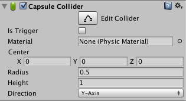

#胶囊碰撞体

__胶囊碰撞体 (Capsule Collider)__ 由两个半球与一个圆柱体连接在一起组成。胶囊碰撞体与胶囊原始碰撞体的形状相同。

 

##属性

|**_属性：_** |**_功能：_** |
|:---|:---|
|__Is Trigger__ |如果启用此属性，则该碰撞体将用于触发事件，并被物理引擎忽略。 |
|__Material__ |引用[物理材质](class-PhysicMaterial.html)，可确定该碰撞体与其他对象的交互方式。 |
|__Center__ |碰撞体在对象局部空间中的位置。 |
|__Radius__ |碰撞体的局部宽度的半径。 |
|__Height__ |碰撞体的总高度。 |
|__Direction__ |胶囊体在对象局部空间中纵向方向的轴。 |

##详细信息

可以独立调整胶囊碰撞体的 __Radius__ 和 __Height__。胶囊碰撞体在[角色控制器](class-CharacterController.html)中用于模拟杆体，也可与其他碰撞体组合用于表现不寻常的形状。

