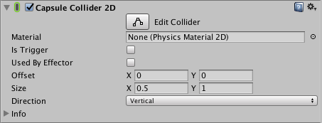
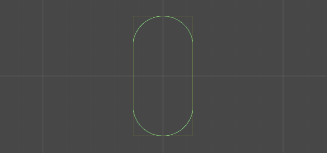

# 2D 胶囊碰撞体 (Capsule Collider 2D)

2D 胶囊碰撞体组件是一个可以在垂直或水平方向上伸长的 2D 物理基元。胶囊体形状没有顶角；它有连续的圆周，因此不容易卡在其他碰撞体角上。胶囊体形状为实心，因此完全位于胶囊体内部的任何其他 2D 碰撞体将视为与胶囊接触并且随着时间推移被迫离开胶囊。

 

|**属性：** |**功能：** |
|:---|:---|
| __Material__ |使用此属性来定义 2D 胶囊碰撞体使用的物理材质。此材质将覆盖所有 2D 刚体或全局物理碰撞体。 |
| __Is Trigger__ |选中此框可指定 2D 胶囊碰撞体将触发事件。如果选中此框，物理引擎会忽略此碰撞体。 |
| __Used by Effector__ |选中此框可指定附加的效应器将使用此 2D 胶囊碰撞体。 |
| __Offset__ |使用此属性来设置 2D 胶囊碰撞体几何形状的局部偏移。 |
| __Size__ |使用此属性来定义盒体大小。此盒体可指定 2D 胶囊碰撞体将填充的区域。 |
| __Direction__ |将此属性设置为 Vertical 或 Horizontal。此属性控制围绕胶囊体的方向：具体而言，它定义了半圆形端盖的定位。 |

定义 2D 胶囊碰撞体的设置是 __Size__ 和 __Direction__。Size 和 Direction 属性均表示 2D 胶囊碰撞体的局部空间中（而不是世界空间内）的 __X__ 和 __Y__（分别为水平和垂直）。

设置 2D 胶囊碰撞体的一般方法是设置 __Size__ 来匹配 __Direction__。例如，如果 2D 胶囊碰撞体的 __Direction__ 为 __Vertical__，__X__ 的 __Size__ 为 0.5，且 __Y__ 的 __Size__ 为 1，这种设置将使垂直方向的胶囊体更高，而不是更宽。

在以下示例中，__X__ 和 __Y__ 以黄线表示。

##胶囊体配置示例

可使用不同的配置来更改 2D 胶囊碰撞体。以下是一些示例。

请注意，__Size__ 属性的 __X__ 和 __Y__ 相同时，2D 胶囊碰撞体始终近似于圆形。

###提示

物理引擎（包括 2D 盒体）中有一个已知问题，即多个碰撞体（甚至是在数字上完美对齐的碰撞体）之间的移动会导致一个或两个碰撞体在两个碰撞体之间记录碰撞。这可能导致碰撞体减速或停止。

虽然 2D 胶囊碰撞体可能有助于减少此问题，但并非此问题的解决方案。更好的解决方案是对表面使用单个碰撞体；例如，2D 边界碰撞体 (Edge Collider 2D)。

