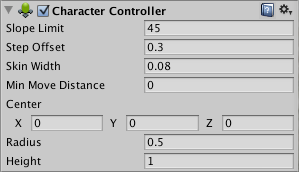
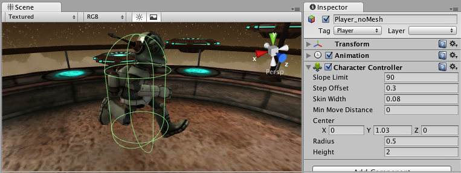

角色控制器
====================

__角色控制器 (Character Controller)__ 主要用于第三人称玩家控制或者是不使用__刚体__物理组件的第一人称玩家控制。

 

属性
----------

|**_属性：_** |**_功能：_** |
|:---|:---|
|__Slope Limit__ |将碰撞体限制为爬坡的斜率不超过指示值（以度为单位）。 |
|__Step Offset__ |仅当角色比指示值更接近地面时，角色才会升高一个台阶。该值不应该大于角色控制器的高度，否则会产生错误。|
|__Skin width__ |两个碰撞体可以穿透彼此且穿透深度最多为皮肤宽度 (Skin Width)。较大的皮肤宽度可减少抖动。较小的皮肤宽度可能导致角色卡住。合理设置是将此值设为半径的 10%。 |
|__Min Move Distance__ |如果角色试图移动到指示值以下，根本移动不了。此设置可以用来减少抖动。在大多数情况下，此值应保留为 0。 |
|__Center__ |此设置将使胶囊碰撞体在世界空间中偏移，并且不会影响角色的枢转方式。 |
|__Radius__ |胶囊碰撞体的半径长度。此值本质上是碰撞体的宽度。 |
|__Height__ |角色的__胶囊碰撞体__高度。更改此设置将在正方向和负方向沿 Y 轴缩放碰撞体。 |

详细信息
-------

传统末日风格的第一人称控制在现实中并不真实。该角色每小时能跑 90 英里，可以立即停止并急转弯。因为该角色非常不真实，所以使用刚体和物理组件来创造这种行为有点不切实际，并会让玩家产生错觉。解决方案是使用专门的角色控制器。角色控制器只是一个胶囊形状的__碰撞体__，可以通过脚本来命令这个碰撞体向某个方向移动。然后，控制器将执行运动，但会受到碰撞的约束。控制器将沿着墙壁滑动，走上楼梯（如果低于 __Step Offset__ 值），并走上 __Slope Limit__ 设置范围内的斜坡。

控制器本身不会对力作出反应，也不会自动推开刚体。

如果要通过角色控制器来推动刚体或对象，可以编写脚本通过 __OnControllerColliderHit()__ 函数对与控制器碰撞的任何对象施力。

另一方面，如果希望玩家角色受到物理组件的影响，那么可能更适合使用[刚体](class-Rigidbody.html)，而不是角色控制器。

###微调角色

可以修改 __Height__ 和 __Radius__ 属性来适应角色的网格。对于人形角色，建议始终使用 2 米左右的值。如果轴心点并非刚好在角色的中心，还可以修改胶囊体的 __Center__ 属性。

__Step Offset__ 属性也可能有影响，对于身高 2 米的人，请确保此值在 0.1 到 0.4 之间。

__Slope Limit__ 不应太小。通常，使用 90 度的值效果最佳。由于胶囊体形状的原因，角色控制器将无法爬墙。

###不要被卡住

要正确调整角色控制器，__Skin Width__ 属性是最重要的属性之一。
如果角色被卡住，那么很可能是因为 __Skin Width__ 设置过小。__Skin Width__ 允许对象轻微穿透控制器，但可消除抖动并防止被卡住。

最好是让 __Skin Width__ 的值至少大于 0.01 并且比 __Radius__ 的值大 10%。

建议将 __Min Move Distance__ 保持为 0。

请参阅[此处](../ScriptReference/CharacterController.html)的角色控制器脚本参考

可以从我们网站上的[资源 (Resources)](https://unity3d.com/learn/resources) 区域下载一个示例项目（其中显示了预设置的动画角色控制器和移动角色控制器）。

提示
-----

* 如果发现角色经常被卡住，请尝试调整 __Skin Width__。
* 如果是自己编写脚本，则角色控制器可能会影响使用物理组件的对象。
* 对象无法通过物理组件来影响角色控制器。
* 请注意，在 Inspector 中更改角色控制器属性将在场景中重新创建控制器，因此任何现有的触发器触点都将丢失，并且在再次移动控制器之前，不会收到任何 OnTriggerEntered 消息。
* 在查询中使用的角色控制器胶囊体（比如射线投射）可能会略有缩小。因此，在某些极端情况下，即使查询似乎命中了角色控制器的辅助图标，但实际可能未命中。
