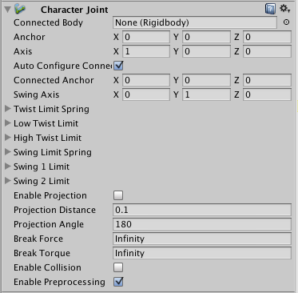
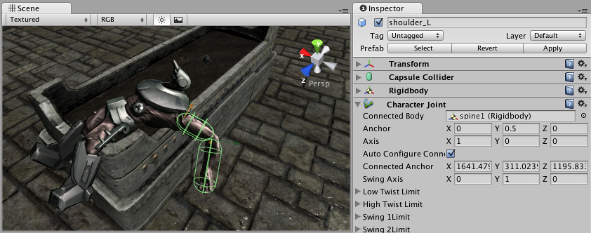

角色关节
===============

__角色关节 (Character Joint)__ 主要用于布娃娃效果。此类关节是延长的球窝关节，可在每个轴上限制该关节。

如果仅希望设置布娃娃，请阅读[布娃娃向导](wizard-RagdollWizard.html)。

 

属性
----------

|**_属性：_** |**_功能：_** |
|:---|:---|
|__Connected Body__ |对关节所依赖的__刚体__的引用（可选）。如果未设置，则关节连接到世界。 |
|__Anchor__ |关节在__游戏对象__的局部空间中旋转时围绕的点。 |
|__Axis__ |扭转轴。用橙色的辅助图标椎体可视化。 |
|__Auto Configure Connected Anchor__ |如果启用此属性，则会自动计算连接锚点 (Connected Anchor) 位置以便与锚点属性的全局位置匹配。这是默认行为。如果禁用此属性，则可以手动配置连接锚点的位置。|
|__Connected Anchor__ |手动配置连接锚点位置。 |
|__Swing Axis__ |摆动轴。用绿色的辅助图标椎体可视化。 |
|__Low Twist Limit__ |关节的下限。请参阅下文。 |
|__High Twist Limit__ |关节的上限。请参阅下文。 |
|__Swing 1 Limit__ |限制围绕定义的__摆动轴 (Swing Axis)__ 的一个元素的旋转（用辅助图标上的绿色轴可视化）。请参阅下文。 |
|__Swing 2 Limit__ |限制围绕定义的__摆动轴__的一个元素的移动。请参阅下文。 |
|__Break Force__ |为破坏此关节而需要施加的力。 |
|__Break Torque__ |为破坏此关节而需要施加的扭矩。 |
|__Enable Collision__ |选中此复选框后，允许关节连接的连接体之间发生碰撞。 |
|__Enable Preprocessing__ | 禁用预处理有助于稳定无法满足的配置。 |

详细信息
-------

角色关节提供了很多约束运动的可能性，就像使用万向节一样。

扭转轴（用辅助图标上的橙色椎体可视化）可在很大程度上控制上限和下限，允许按照度数指定上限和下限（限制角度是相对于开始位置进行测量的）。__Low Twist Limit__ &gt; __Limit__ 中的值 -30 和 __High Twist Limit__ &gt; __Limit__ 中的值 60 可将围绕扭转轴（橙色辅助图标）的旋转范围限制在 -30 度到 60 度之间。

__Swing 1 Limit__ 可限制摆动轴的旋转范围（用辅助图标上的绿色轴可视化）。限制角度是对称的。因此，值 30 会将旋转限制在 -30 到 30 之间。

__Swing 2 Limit__ 轴未显示在辅助图标上，但该轴垂直于其他两个轴（即辅助图标上用橙色可视化的扭转轴和辅助图标上用绿色可视化的 __Swing 1 Limit__ 轴）。
角度是对称的，因此值 40 可将围绕该轴的旋转范围限制在 -40 度到 40 度之间。

对于每个限制，可以设置以下值：

|**_属性：_** |**_功能：_** |
|:---|:---|
|__Bounciness__ | 值为 0 将不会反弹。值为 1 将在反弹时不产生任何能量损失。|
|__Spring__ | 用于将两个对象保持在一起的弹簧力。|
|__Damper__ | 用于抑制弹簧力的阻尼力。|
|__Contact Distance__ | 在距离极限位置的接触距离内，接触将持续存在以免发生抖动。|

###破坏关节

可使用 __Break Force__ 和 __Break Torque__ 属性来设置关节强度的限制。如果这些值小于无穷大，并对该对象施加大于这些限制的力/扭矩，则其固定关节将被破坏并将摆脱其约束的束缚。

提示
-----

* 不需要为关节分配 __Connected Body__ 便可让关节运作。
* 角色关节要求对象附加一个刚体。
* 对于通过布娃娃向导制作的角色关节，请注意设置：关节的扭转轴与肢体的最大摆动轴对应，关节的 Swing 1 轴与肢体的较小摆动轴对应，而关节的 Swing 2 表示扭转肢体。采用这种命名方案是为了沿用旧版。
