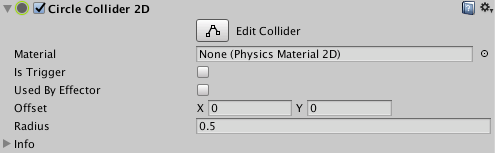

2D 圆形碰撞体 (Circle Collider 2D)
==================
__2D 圆形碰撞体__类是用于 2D 物理的碰撞体。该碰撞体的形状是圆形，在__精灵__的局部坐标空间中具有定义的位置和半径。

 

|**_属性：_** |**_功能：_** |
|:---|:---|
|__Material__ |一种物理材质，可用于确定碰撞的属性（例如摩擦和弹性）。 |
|__Is Trigger__ |如果希望 2D 圆形碰撞体作为触发器运行，请选中此框。 |
|__Used by Effector__ |如果希望 2D 圆形碰撞体由附加的 2D 效应器使用，请选中此框。 |
|__Offset__ |2D 圆形碰撞体几何形状的局部偏移。 |
|__Radius__ |圆形的半径（采用局部空间单位）。 |
