# 布料

布料 (Cloth) 组件与带蒙皮的网格渲染器 (Skinned Mesh Renderer) 协同工作，从而提供基于物理的面料模拟解决方案。此组件是专为角色服装设计的，仅对蒙皮网格有效。如果向非蒙皮网格中添加 Cloth 组件，则 Unity 会删除非蒙皮网格并添加蒙皮网格。

要将 Cloth 组件附加到蒙皮网格，请在 Editor 中选择游戏对象，在 Inspector 窗口中单击 __Add Component__ 按钮，然后选择 __Physics__ &gt; __Cloth__。Inspector 中将显示该组件。

 

属性
----------

|**_属性：_** |**_功能：_** |
|:---|:---|
|__Stretching Stiffness__ |布料的拉伸刚度。 |
|__Bending Stiffness__ |布料的弯曲刚度。 |
|__Use Tethers__ |施加约束以帮助防止移动的布料粒子离开固定粒子的距离太远。此属性有助于减少过度拉伸。 |
|__Use Gravity__ |是否应该对布料施加重力加速度？ |
|__Damping__ |运动阻尼系数。 |
|__External Acceleration__ |施加在布料上的恒定外部加速度。 |
|__Random Acceleration__ |施加在布料上的随机外部加速度。 |
|__World Velocity Scale__ |角色多大程度的世界空间移动会影响布料顶点。 |
|__World Acceleration Scale__ |角色多大的世界空间加速度会影响布料顶点。 |
|__Friction__ |布料与角色碰撞时的摩擦力。 |
|__Collision Mass Scale__ |碰撞粒子的质量增加量。 |
|__Use Continuous Collision__ |启用连续碰撞来提高碰撞稳定性。 |
|__Use Virtual Particles__ |每个三角形添加一个虚拟粒子，从而提高碰撞稳定性。 |
|__Solver Frequency__ |解算器每秒迭代次数。 |
|__Sleep Threshold__ |布料的睡眠阈值。 |
|__Capsule Colliders__ |应与此 Cloth 实例碰撞的 CapsuleCollider 的数组。 |
|__Sphere Colliders__ |应与此 Cloth 实例碰撞的 ClothSphereColliderPairs 的数组。 |

详细信息
-------

布料不响应场景中的任何碰撞体，也不会将力反射回世界。添加 Cloth 组件后，该组件完全不会响应和影响任何其他实体。因此在手动将碰撞体从世界添加到 Cloth 组件之前，布料和世界无法识别或看到彼此。即使执行了此操作，模拟仍是单向的：布料可以响应实体，但不会反向施力。

此外，只能对布料使用三种类型的碰撞体：球体、胶囊体以及使用两个球形碰撞体构造而成的圆锥胶囊碰撞体。之所以存在这么多限制是为了帮助提高性能。

###编辑约束工具

选择 __Edit__ &gt; __Constraints__ 可编辑对布料网格中每个顶点施加的约束。所有顶点都具有基于当前可视化模式的颜色，目的是显示它们各自值之间的差异。通过使用画笔在布料上绘制即可编辑布料约束。

|**_属性：_** |**_功能：_** |
|:---|:---|
|__Visualization__ |在 Scene 视图中的 Max Distance 属性值和 Surface Penetration 属性值之间切换工具的视觉外观。此外，还提供了用于操纵背面的开关。 |
|__Max Distance__ |布料粒子可从顶点位置行进的最大距离。 |
|__Surface Penetration__ |布料粒子可穿透网格的深度。 |
|__Brush Radius__ |设置用于在布料上绘制约束的画笔的半径。 |

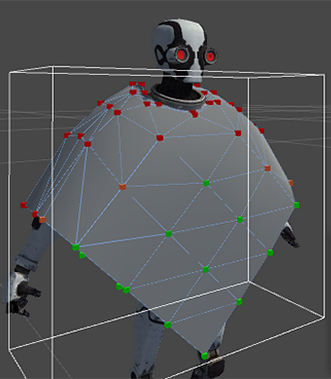

更改每个顶点的值时可使用两种模式：

* 使用__选择__模式可选择一组顶点。要这样做，请使用鼠标光标来绘制一个选框，或一次单击一个顶点。然后，即可启用 __Max Distance__ 和/或 __Surface Penetration__，并可设置一个值。

* 使用__绘画__模式可直接调整每个顶点。要这样做，请单击要调整的顶点。然后，即可启用 __Max Distance__ 和/或 __Surface Penetration__，并可设置一个值。

在这两种模式下，为 __Max Distance__ 和 __Surface Penetration__ 赋值时，Scene 视图中的可视化表示都会自动更新。

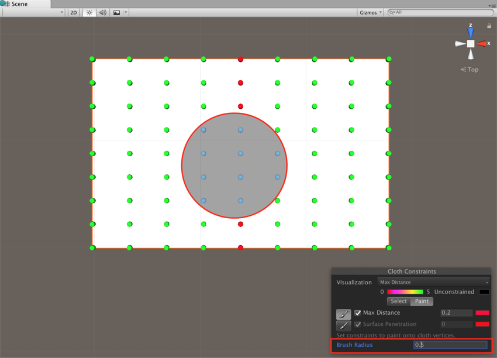

###自碰撞和互碰撞

布料碰撞使游戏中的角色服装和其他面料更加逼真。在 Unity 中，布料有几种处理碰撞的布料粒子。可将布料粒子设置为：

* 自碰撞，防止布料穿透自身。
* 互碰撞，允许布料粒子相互碰撞。

要为布料设置碰撞粒子，请在 Cloth Inspector 中选择 __Self Collision and Intercollision__ 按钮：

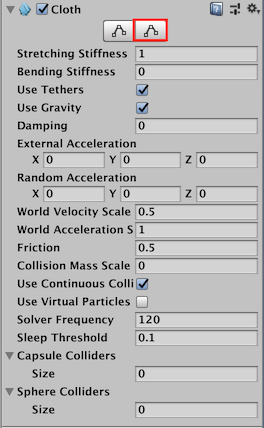

此时将在 Scene 视图中显示 __Cloth Self Collision And Intercollision__ 窗口：

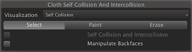

包含 Cloth 组件的蒙皮网格将自动显示布料粒子。最初没有任何布料粒子设置为使用碰撞。这些未使用的粒子显示为黑色：

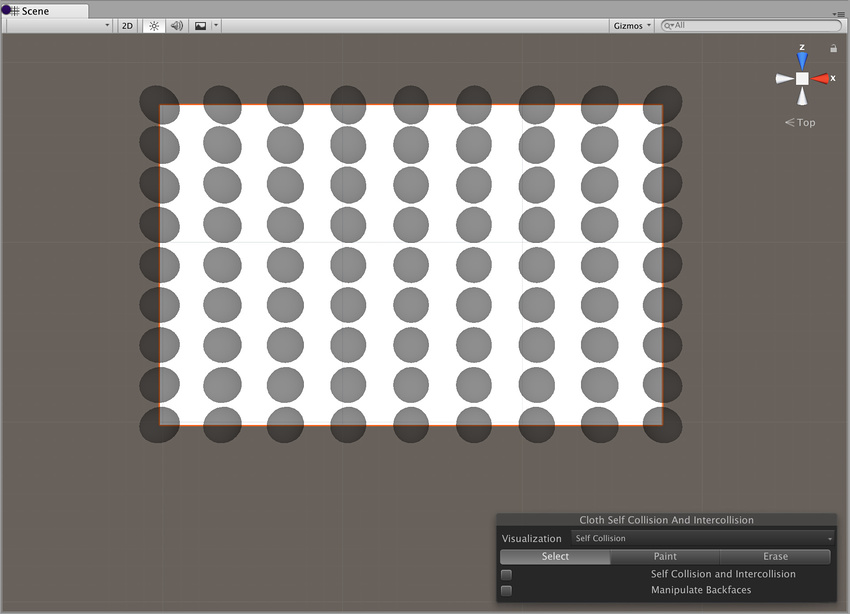

要应用自碰撞或互碰撞，必须选择一组粒子来应用碰撞。要选择一组粒子进行碰撞，请单击 __Select__ 按钮：

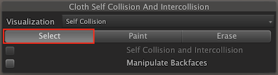

现在左键单击并拖动以便选择要应用碰撞的粒子：

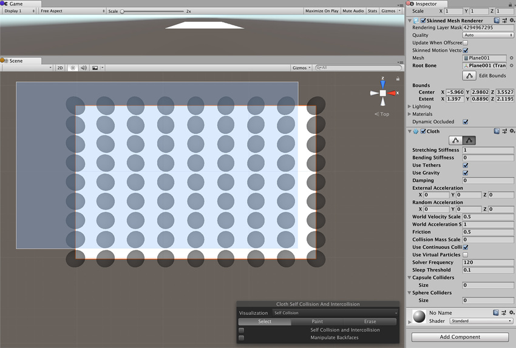

选定粒子显示为蓝色：

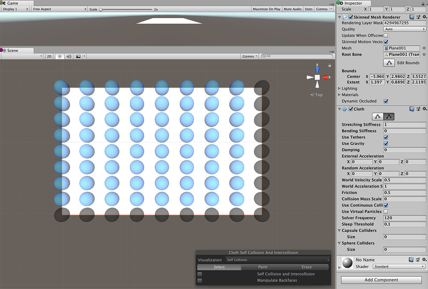

勾选 __Self Collision and Intercollision__ 复选框可将碰撞应用于选定粒子：

指定用于碰撞的粒子将显示为绿色：

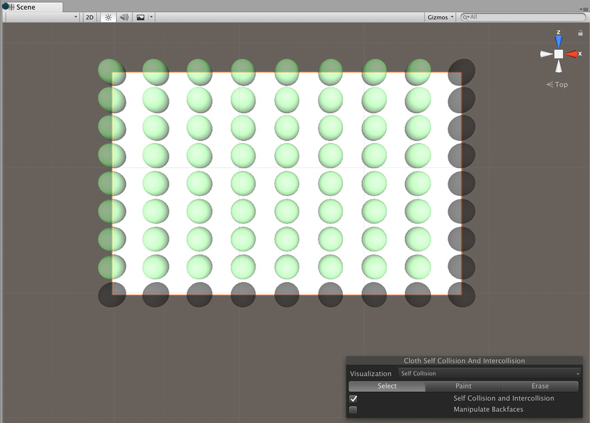

要为布料启用自碰撞行为，请选择 Cloth Inspector 窗口的 __Self Collision__ 部分，并将 __Distance__ 和 __Stiffness__ 设置为非零值：

|**_属性：_** |**_功能：_** |
|:---|:---|
|__Distance__ |每个粒子的包裹球体的直径。Unity 确保这些球体在模拟过程中不会重叠。__Distance__ 属性的值应小于配置中的两个粒子之间的最小距离。如果距离较大，则自碰撞可能违反某些距离约束并导致抖动。 |
|__Stiffness__ |粒子之间的分离冲力的强度。此值由布料解算器进行计算，应足以保持粒子分离。 |

自碰撞和互碰撞可能需要大量的总模拟时间。请考虑缩小碰撞距离并使用自碰撞索引来减少彼此碰撞的粒子数。

自碰撞使用顶点，而不是三角形，因此对于三角形远大于布料厚度的网格，不要指望碰撞能够完美运行。

__Paint__ 和 __Erase__ 模式允许通过按住鼠标左键并拖动单个布料粒子来添加或删除用于碰撞的粒子：

在 __Paint__ 或 __Erase__ 模式下，指定用于碰撞的粒子为绿色，未指定的粒子为黑色，画笔下方的粒子为蓝色：

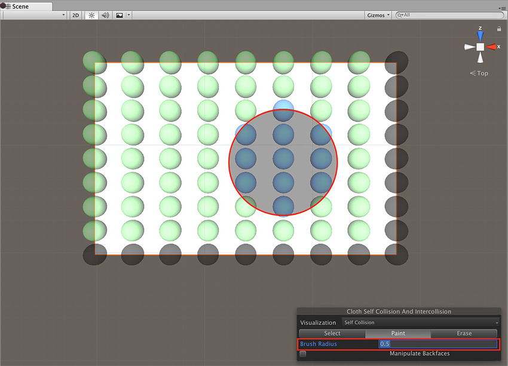

#### 布料互碰撞

可使用与指定自碰撞粒子相同的方式（如上所述）为互碰撞指定粒子。与自碰撞一样，可以指定一组用于互碰撞的粒子。

要启用互碰撞行为，请打开 PhysicsManager Inspector (__Edit__ &gt; __Project Settings__ &gt; __Physics__)，并在 __Cloth InterCollision__ 部分将 __Distance__ 和 __Stiffness__ 设置为非零值：

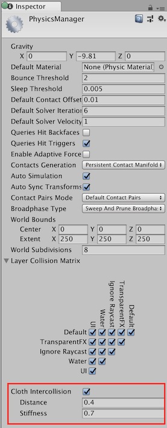

布料互碰撞的 __Distance__ 和 __Stiffness__ 属性与以上描述的自碰撞的 Distance 和 Stiffness 属性功能相同。

###碰撞体碰撞

布料无法直接与任意世界几何体碰撞，现在只会与[胶囊碰撞体](../ScriptReference/Cloth-capsuleColliders.html)或[球形碰撞体](../ScriptReference/Cloth-sphereColliders.html)数组中指定的碰撞体相互作用。

球形碰撞体数组可以包含单个有效的 [SphereCollider](../ScriptReference/SphereCollider.html) 实例（第二个为 null）或一对实例。在前一种情况下，[ClothSphereColliderPair](../ScriptReference/ClothSphereColliderPair.html) 仅表示待碰撞布料的单个球形碰撞体。在后一种情况下，它表示由两个球体以及连接这两个球体的锥体所定义的圆锥形胶囊形状。圆锥形胶囊形状在对角色的四肢进行建模时非常有用。

---
* 2017-12-05  Page amended with limited [editorial review](DocumentationEditorialReview.html)

* 在 [2017.3](https://docs.unity3d.com/2017.3/Documentation/Manual/30_search.html?q=newin20173) 版中添加了布料自碰撞和互碰撞 NewIn20173
