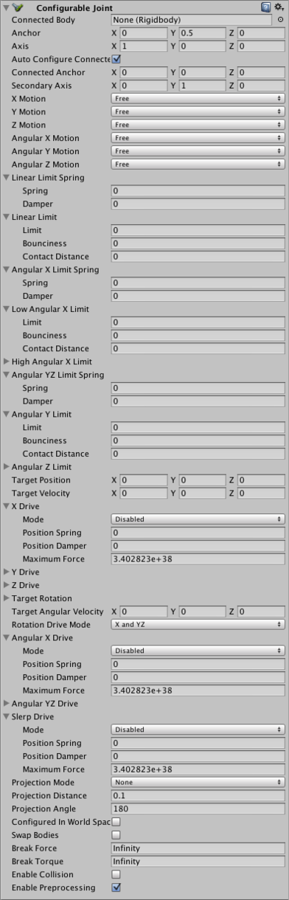
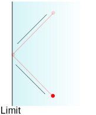
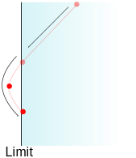

#可配置关节

__可配置关节 (Configurable Joint)__ 的可定制性极高，因为此类关节包含其他关节类型的所有功能。使用可配置关节可以创建任何关节，从现有关节的改编版到自行设计的高度专业化关节，不一而足。

##属性

 

|**_属性：_** |**_功能：_** |
|:---|:---|
|__Connected Body__ |关节连接到的另一个刚体对象。可将此属性设置为 _None_ 来表示关节连接到空间中的固定位置，而不是另一个刚体。 |
|__Anchor__ |用于定义关节中心的点。所有基于物理的模拟都将使用此点作为计算中的中心 |
|__Axis__ |用于基于物理模拟来定义对象自然旋转的局部轴 |
|__Auto Configure Connected Anchor__ |如果启用此属性，则会自动计算连接锚点 (Connected Anchor) 位置以便与锚点属性的全局位置匹配。这是默认行为。如果禁用此属性，则可以手动配置连接锚点的位置。|
|__Connected Anchor__ |手动配置连接锚点位置。 |
|__Secondary Axis__ |__Axis__ 和 __Secondary Axis__ 共同定义了关节的局部坐标系。第三个轴设置为与另外两个轴正交。 |
|__X, Y, Z Motion__ |根据以下描述的限制属性，允许沿 X、Y 或 Z 轴的移动是 _Free_、完全 _Locked_ 还是 _Limited_。 |
|__Angular X, Y, Z Motion__ |根据以下描述的限制属性，允许沿 X、Y 或 Z 轴的旋转是 _Free_、完全 _Locked_ 还是 _Limited_。  |
|__Linear Limit Spring__ |当对象超过了限制位置时要拉回对象而施加的弹簧力。 |
|&amp;#160;&amp;#160;&amp;#160;&amp;#160;&amp;#160;&amp;#160;&amp;#160;&amp;#160;__Spring__ |弹簧力。如果此值设置为零，则无法逾越限制；零以外的值将使限制变得有弹性。 |
|&amp;#160;&amp;#160;&amp;#160;&amp;#160;&amp;#160;&amp;#160;&amp;#160;&amp;#160;__Damper__ |根据关节运动的速度按比例减小弹簧力。设置为大于零的值可让关节“抑制”振荡（否则将无限期进行振荡）。 |
|__Linear Limit__ |关节线性移动的限制（即，移动距离而不是旋转），指定为距关节原点的距离。 |
|&amp;#160;&amp;#160;&amp;#160;&amp;#160;&amp;#160;&amp;#160;&amp;#160;&amp;#160;__Limit__ |从原点到限制位置的距离（采用世界单位）。 |
|&amp;#160;&amp;#160;&amp;#160;&amp;#160;&amp;#160;&amp;#160;&amp;#160;&amp;#160;__Bounciness__ |当对象达到限制距离时，要将对象拉回而施加的弹力。 |
|&amp;#160;&amp;#160;&amp;#160;&amp;#160;&amp;#160;&amp;#160;&amp;#160;&amp;#160;__Contact Distance__ |需要强制执行限制时的最小距离公差（关节位置和限制位置之间）。公差越大，对象快速移动时违反限制的可能性就越低。但是，这种情况下也需要通过更频繁进行物理模拟来考虑限制，而这往往会略微降低性能。 |
|__Angular X Limit Spring__ |当对象超过了关节的限制角度时要反向旋转对象而施加的弹簧扭矩。 |
|&amp;#160;&amp;#160;&amp;#160;&amp;#160;&amp;#160;&amp;#160;&amp;#160;&amp;#160;__Spring__ |弹簧扭矩。如果此值设置为零，则无法逾越限制；零以外的值将使限制变得有弹性。 |
|&amp;#160;&amp;#160;&amp;#160;&amp;#160;&amp;#160;&amp;#160;&amp;#160;&amp;#160;__Damper__ |根据关节旋转的速度按比例减小弹簧扭矩。设置为大于零的值可让关节“抑制”振荡（否则将无限期进行振荡）。 |
|__Low Angular X Limit__ |关节绕 X 轴旋转的下限，指定为距关节原始旋转的角度。 |
|&amp;#160;&amp;#160;&amp;#160;&amp;#160;&amp;#160;&amp;#160;&amp;#160;&amp;#160;__Limit__ |限制角度。 |
|&amp;#160;&amp;#160;&amp;#160;&amp;#160;&amp;#160;&amp;#160;&amp;#160;&amp;#160;__Bounciness__ |当对象的旋转达到限制角度时在对象上施加的反弹扭矩。 |
|&amp;#160;&amp;#160;&amp;#160;&amp;#160;&amp;#160;&amp;#160;&amp;#160;&amp;#160;__Contact Distance__ |需要强制执行限制时的最小角度公差（关节角度和限制位置之间）。公差越大，对象快速移动时违反限制的可能性就越低。但是，这种情况下也需要通过更频繁进行物理模拟来考虑限制，而这往往会略微降低性能。 |
|__High Angular XLimit__ |类似于上述 _Low Angular X Limit_ 属性，但确定的是关节旋转的角度上限，而不是下限。 |
|__Angular YZ Limit Spring__ |类似于上述 _Angular X Limit Spring_，但适用于围绕 Y 轴和 Z 轴的旋转。 |
|__Angular Y Limit__ |类似于上述 _Angular X Limit_ 属性，但适用于 Y 轴，并将角度的上限和下限视为相同。 |
|__Angular Z Limit__ |类似于上述 _Angular X Limit_ 属性，但适用于 Z 轴，并将角度的上限和下限视为相同。 |
|__Target Position__ |关节的驱动力应该关节移动到的目标位置。 |
|__Target Velocity__ |关节在驱动力下移动到_目标位置 (Target Position)_ 时应该采用的所需速度。 |
|__XDrive__ |将关节沿局部 X 轴线性移动的驱动力。 |
|&amp;#160;&amp;#160;&amp;#160;&amp;#160;&amp;#160;&amp;#160;&amp;#160;&amp;#160;__Mode__ |该模式确定关节在移动时应该达到指定__位置 (Position)__ 还是达到指定__速度 (Velocity)__，还是同时达到指定位置和指定速度。 |
|&amp;#160;&amp;#160;&amp;#160;&amp;#160;&amp;#160;&amp;#160;&amp;#160;&amp;#160;__Position Spring__ |将关节向目标位置移动的弹簧力。仅当驱动模式设置为 _Position_ 或 _Position and Velocity_ 时才会使用此属性。 |
|&amp;#160;&amp;#160;&amp;#160;&amp;#160;&amp;#160;&amp;#160;&amp;#160;&amp;#160;__Position Damper__ |根据关节运动的速度按比例减小弹簧力。设置为大于零的值可让关节“抑制”振荡（否则将无限期进行振荡）。仅当驱动模式设置为 _Position_ 或 _Position and Velocity_ 时才会使用此属性。 |
|&amp;#160;&amp;#160;&amp;#160;&amp;#160;&amp;#160;&amp;#160;&amp;#160;&amp;#160;__Maximum Force__ |将关节向目标速度加速时使用的力。仅当驱动模式设置为 _Velocity_ 或 _Position and Velocity_ 时才会使用此属性。 |
|__YDrive__ |类似于上述 _X Drive_，但适用于关节的 Y 轴。 |
|__ZDrive__ |类似于上述 _X Drive_，但适用于关节的 Z 轴。 |
|__Target Rotation__ |关节旋转驱动应朝向的方向，指定为[四元数](../ScriptReference/Quaternion.html)。 |
|__Target Angular Velocity__ |关节的旋转驱动应达到的角速度。该值指定为矢量（其长度指定旋转速度，而其方向定义旋转轴）。 |
|__Rotation Drive Mode__ |将驱动力应用于对象以将其旋转到目标方向的方式。如果该模式设置为 _X and YZ_，则将围绕这些轴施加扭矩（由如下所述的 _Angular X/YZ Drive_ 属性指定）。如果使用 __Slerp__ 模式，则 _Slerp Drive_ 属性将确定驱动扭矩。 |
|__Angular X Drive__ |此属性指定了驱动扭矩将使关节如何围绕局部 X 轴旋转。仅当上述 _Rotation Drive Mode_ 属性设置为 _X &amp; YZ_ 时，才会使用此属性。 |
|&amp;#160;&amp;#160;&amp;#160;&amp;#160;&amp;#160;&amp;#160;&amp;#160;&amp;#160;__Mode__ |该模式确定关节在移动时应该达到指定角__位置__还是达到指定角__速度__，还是同时达到指定角位置和指定角速度。 |
|&amp;#160;&amp;#160;&amp;#160;&amp;#160;&amp;#160;&amp;#160;&amp;#160;&amp;#160;__Position Spring__ |将关节向目标位置旋转的弹簧扭矩。仅当驱动模式设置为 _Position_ 或 _Position and Velocity_ 时才会使用此属性。 |
|&amp;#160;&amp;#160;&amp;#160;&amp;#160;&amp;#160;&amp;#160;&amp;#160;&amp;#160;__Position Damper__ |根据关节移动的速度按比例减小弹簧扭矩。设置为大于零的值可让关节“抑制”振荡（否则将无限期进行振荡）。仅当驱动模式设置为 _Position_ 或 _Position and Velocity_ 时才会使用此属性。 |
|&amp;#160;&amp;#160;&amp;#160;&amp;#160;&amp;#160;&amp;#160;&amp;#160;&amp;#160;__Maximum Force__ |将关节向目标速度加速时使用的扭矩。仅当驱动模式设置为 _Velocity_ 或 _Position and Velocity_ 时才会使用此属性。 |
|__Angular YZDrive__ |类似于上述 _Angular X Drive_，但适用于关节的 Y 轴和 Z 轴。 |
|__Slerp Drive__ |此属性指定了驱动扭矩将使关节如何围绕所有局部轴旋转。仅当上述 _Rotation Drive Mode_ 属性设置为 _Slerp_ 时，才会使用此属性。 |
|&amp;#160;&amp;#160;&amp;#160;&amp;#160;&amp;#160;&amp;#160;&amp;#160;&amp;#160;__Mode__ |该模式确定关节在移动时应该达到指定角__位置__还是达到指定角__速度__，还是同时达到指定角位置和指定角速度。 |
|&amp;#160;&amp;#160;&amp;#160;&amp;#160;&amp;#160;&amp;#160;&amp;#160;&amp;#160;__Position Spring__ |将关节向目标位置旋转的弹簧扭矩。仅当驱动模式设置为 _Position_ 或 _Position and Velocity_ 时才会使用此属性。 |
|&amp;#160;&amp;#160;&amp;#160;&amp;#160;&amp;#160;&amp;#160;&amp;#160;&amp;#160;__Position Damper__ |根据关节移动的速度按比例减小弹簧扭矩。设置为大于零的值可让关节“抑制”振荡（否则将无限期进行振荡）。仅当驱动模式设置为 _Position_ 或 _Position and Velocity_ 时才会使用此属性。 |
|&amp;#160;&amp;#160;&amp;#160;&amp;#160;&amp;#160;&amp;#160;&amp;#160;&amp;#160;__Maximum Force__ |将关节向目标速度加速时使用的扭矩。仅当驱动模式设置为 _Velocity_ 或 _Position and Velocity_ 时才会使用此属性。 |
|__Projection Mode__ |此属性定义了当关节意外地超过自身的约束（由于物理引擎无法协调模拟中当前的作用力组合）时如何快速恢复约束。选项为 _None_ 和 _Position and Rotation_。 |
|__Projection Distance__ |关节超过约束的距离，必须超过此距离才能让物理引擎尝试将关节拉回可接受位置。 |
|__Projection Angle__ |关节超过约束的旋转角度，必须超过此角度才能让物理引擎尝试将关节拉回可接受位置。 |
|__Configured in World Space__ |是否应该在世界空间而不是对象的局部空间中计算由各种目标和驱动属性设置的值？ |
|__Swap Bodies__ |如果启用此属性，则会使关节表现得好像组件已附加到连接的刚体（即关节的另一端）。 |
|__Break Force__ |如果通过大于该值的力推动关节超过约束，则关节将被永久“破坏”并被删除。 |
|__Break Torque__ |如果通过大于该值的扭矩旋转关节超过约束，则关节将被永久“破坏”并被删除。  |
|__Enable Collision__ |包含此关节的对象是否应能够与连接的对象碰撞（而不是仅仅相互穿过）？ |
|__Enable Preprocessing__ |如果禁用预处理，则关节某些“不可能”的配置将保持更稳定，而不会在失控状态下狂乱移动。 |

##详细信息

与其他关节一样，使用可配置关节可以限制对象的移动，而且可以使用作用力将对象驱动到目标速度或位置。但是，有许多可用的配置选项在组合使用时可能非常微妙；可能需要尝试不同的选项，才能使关节完全按照所需的方式运行。

###约束运动

可使用 _X, Y, Z Motion_ 和 _X, Y, Z Rotation_ 属性独立约束每个轴上的平移运动和旋转。如果启用 _Configured In World Space_，则运动将被约束到世界轴而不是对象的局部轴。所有这些属性都可以设置为 _Locked_、_Limited_ 或 _Free_：

* **Locked** 轴不允许任何移动。例如，世界 Y 轴中锁定的对象无法上下移动。
* **Limited** 轴允许在预定义的限制范围内自由移动，如下所述。例如，通过将炮塔的 Y 旋转限制到特定角度范围，可以给炮塔设置受限制的火弧。
* **Free** 轴允许任意移动。

可使用 _Linear Limit_ 属性限制平移运动，该属性定义了关节可从其原点移动的最大距离。（分别沿每个轴进行测量）。例如，为了能够约束空气曲棍球台的曲棍球，可让关节在 Y 轴为锁定状态（在世界空间中），在 Z 轴为自由状态，并在 X 轴为受限状态以便适应球台的宽度限制；这样，曲棍球将被限制在游戏区域内。

 

还可以使用 _Angular Limit_ 属性来限制旋转。与线性限制不同，这些属性允许为每个轴指定不同的限制值。此外，还可以为 X 轴的旋转角度定义单独的上限和下限（其他两个轴在原始旋转的两侧使用相同的角度）。例如，可使用平面构造一个“摇摆平台”，将关节约束为允许在 X 和 Z 方向轻微摇摆，同时锁定 Y 旋转。

####弹性和弹簧

默认情况下，关节只有在达到限制时才会停止移动。然而，像这样的非弹性碰撞在现实世界中是罕见的，因此向受约束的关节添加一些弹跳感会很有用。可使用线性和角度限制的 _Bounciness_ 属性使受约束的对象在达到限制后反弹。大部分的碰撞在有了少量弹性之后会显得更自然，但也可以将该属性设置为更高的值，从而模拟弹性异常大的边界，比如台球桌垫。

使用弹簧属性（用于平移的 _Linear Limit Spring_ 和用于旋转的 _Angular X/YZ Limit Spring_）可以进一步增强关节限制。如果将 _Spring_ 属性设置为大于零的值，关节达到限制时将不会突然停止移动，而是会通过弹簧力（力的强度是由 _Spring_ 值确定）被拉回到限制位置。默认情况下，弹簧具有完美的弹性，倾向于按照与碰撞相反的方向弹回关节。但是，可使用 _Damper_ 属性来减少弹性并以更温和的方式将关节恢复到限制位置。例如，可使用弹簧关节创建一个可向左或向右拉动的杠杆，然后弹回到直立位置。如果弹簧具有完美弹性，则杠杆在释放后将倾向于围绕中心点来回摆动。但是，如果添加足够的阻尼，弹簧将迅速稳定到中立位置。

###驱动力

关节不仅可以对附加的对象做出反应，而且还可以主动施加_驱动力_使对象运动。一些关节只需要保持对象以恒定速度移动，例如转动风扇叶片的旋转电机。可使用 _Target Velocity_ 和 _Target Angluar Velocity_ 属性为此类关节设置所需的速度。可能还需要通过关节将对象移动到空间（或特定方向）的特定位置；此情况下，可使用 _Target Position_ 和 _Target Rotation_ 属性来设置关节。例如，可将叉车的叉子安装在可配置关节上，然后使用脚本设置目标高度以升高叉子，即可实现叉车。

设置了目标后，使用 _X, Y, Z Drive_ 和 _Angular X/YZ Drive_（或者是 _Slerp Drive_）属性指定用于将关节推向目标的作用力。驱动的 _Mode_ 属性选择关节是否应该寻找目标位置和/或速度。在寻找目标位置时，_Position Spring_ 和 _Position Damper_ 的工作方式与关节限制相同。在速度模式下，弹簧力取决于当前速度和目标速度之间的差距；阻尼器有助于速度稳定在所选值，而不是在该值周围无限振荡。_Maximum Force_ 属性用于最终微调，无论关节距其目标有多远，均可防止弹簧施加的力超过限制值。这样可以防止远离目标的关节快速以不受控制的方式将对象拉回的情况。

请注意，对于所有三个驱动力（下面描述的 _Slerp Drive_ 除外），力都在每个轴上单独施加。因此，举例来说，可实现一个航天器，使之具有较高的向前飞行速度，但在侧向转向运动中具有相对较低的速度。

####Slerp Drive

其他驱动模式在不同的轴上施加力，但 _Slerp Drive_ 使用四元数的球面插值或“Slerp”功能来重新定向关节。Slerp 过程不会隔离单个轴，而是整体上寻找将对象从当前方向带到目标的最小总旋转，并根据需要将该旋转应用于所有轴。Slerp Drive 的配置比较简单并适合大多数用途，但不允许为 X 和 Y/Z 轴指定不同的驱动力。

要启用 Slerp Drive，应将 _Rotation Drive Mode_ 属性从 _X and YZ_ 更改为 _Slerp_。注意，模式是互斥的；关节将使用 _Angular X/YZ Drive_ 值或 _Slerp Drive_ 值，但不能同时使用两者。
