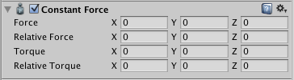

恒定力
==============

__恒定力 (Constant Force)__ 可用于快速向__刚体__添加恒定力。如果不希望某些一次性对象以较大的速度开始而是逐渐加速（比如火箭），则很适合使用恒定力。

 

属性
----------

|**_属性：_** |**_功能：_** |
|:---|:---|
|__Force__ |要在世界空间中应用的力的矢量。 |
|__Relative Force__ |要在对象的局部空间中应用的力的矢量。 |
|__Torque__ |在世界空间中应用的扭矩的矢量。对象将开始_围绕_此矢量旋转。矢量越长，旋转越快。 |
|__Relative Torque__ |在局部空间中应用的扭矩的矢量。对象将开始_围绕_此矢量旋转。矢量越长，旋转越快。 |

###详细信息

要制作一个向前加速的火箭，请将 __Relative Force__ 设定为沿正 z 轴。然后，使用刚体的 __Drag__ 属性使其不超过某个最大速度（阻力越高，最大速度越低）。在刚体中，还要确保关闭重力，以便火箭始终保持在其路径上。

提示
-----

* 要使对象向上运动，请添加具有正 Y 值 __Force__ 属性的恒定力。
* 要使对象向前飞行，请添加具有正 Z 值 __Relative Force__ 属性的恒定力。
