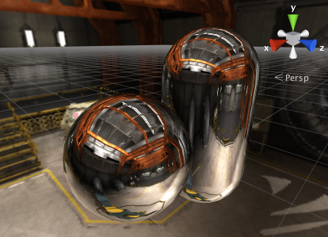
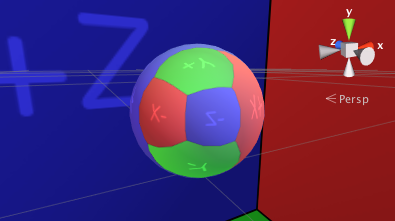
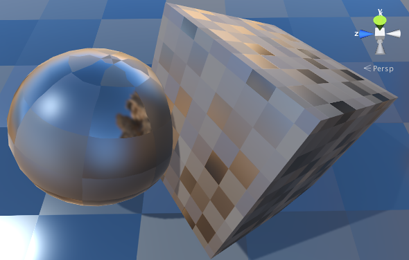
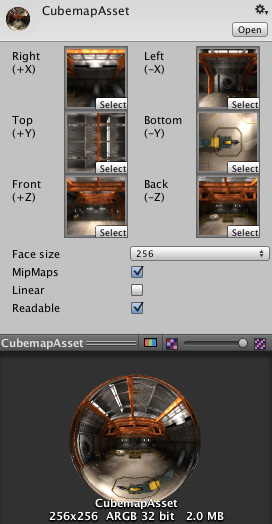

#立方体贴图

__立方体贴图__是六个正方形纹理的集合，
这些纹理代表环境中的反射。六个正方形组成一个包围着对象的虚构立方体的各面；
每个面代表沿世界轴方向（向上、向下、向左、向右、
向前和向后）的视图。

立方体贴图常用于捕获对象的反射或“周围环境”；例如
[天空盒](class-Skybox.html)和[环境反射](class-ReflectionProbe.html)通常使用立方体贴图。

## 从纹理创建立方体贴图

创建立方体贴图的最快方法是从专门布局的[纹理](class-TextureImporter.html)导入它们。
在 Project 窗口中选择纹理，从而在 Inspector 窗口中查看 Import Settings。在 Import Settings 中，将 __Texture Type__ 设置为 __Default__、__Normal Map__ 或 __Single Channel__，并将 __Texture Shape__ 设置为 __Cube__。然后，Unity 自动将纹理设置为立方体贴图。

系统支持几种常用的立方体贴图布局（在大多数情况下，Unity 会自动检测到它们）。

支持垂直和水平交叉布局以及立方体贴图面的列和行：

 

另一种常见布局是 `LatLong`（纬度/经度，有时称为圆柱形）。全景图像
常采用此布局：

 

还可以找到 `SphereMap`（球形环境贴图）图像：

 

默认情况下，Unity 会查看导入纹理的宽高比以确定上述布局中最合适的
布局。导入时，会生成一个立方体贴图，可将其用于天空盒和反射：

 

`Glossy Reflection` 选项可用于立方体贴图纹理，而这些纹理将由
[反射探针](class-ReflectionProbe.html)使用。该模式以特殊方式（镜面卷积）处理
立方体贴图 Mip 级别，然后可用于模拟不同平滑度表面的反射：

## 旧版立方体贴图资源

Unity 还支持从六个单独的[纹理](class-TextureImporter.html)创建立方体贴图。
从菜单中选择 __Assets &gt; Create &gt; Legacy &gt; Cubemap__，
然后将六个纹理拖入检视面板中的空字段内。

|**_属性：_** |**_功能：_** |
|:---|:---|
|__Right..Back__ 字段 |相应立方体贴图面的纹理。 |
|__Face Size__ |每个立方体贴图面的宽度和高度（以像素为单位）。纹理将自动缩放以适应此大小。 |
|__Mipmap__ |是否应该创建 Mipmap？ |
|__Linear__ |立方体贴图是否应该使用线性颜色？ |
|__Readable__ |立方体贴图是否应当允许脚本访问像素数据？ |

请注意，最好使用立方体贴图纹理导入类型来创建立方体贴图（见上文），
这样就可以压缩立方体贴图纹理数据；可进行边缘修正和光泽反射卷积；
并支持 HDR 立方体贴图。

## 其他技巧

另一种有用的技巧是使用脚本从 Unity 场景的内容生成立方体贴图。
[Camera.RenderToCubemap](../ScriptReference/Camera.RenderToCubemap.html) 函数可从场景中的
任何所需位置记录六个面图像；该函数的脚本参考页面上的代码示例
添加了一条菜单命令来简化此任务。

---

 2018-01-31  Page amended with limited [editorial review](DocumentationEditorialReview.html)

