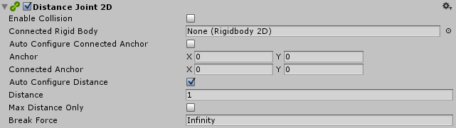

#2D 距离关节 (Distance Joint 2D)

__2D 距离关节__是一种 2D 关节，它连接由 __2D 刚体__物理组件控制的两个游戏对象，使这两个对象保持一定距离。

 

|**_属性：_** |**_功能：_** |
|:---|:---|
|__Enable Collision__ |选中此框可允许两个连接的游戏对象之间发生碰撞。 |
|__Connected Rigid Body__ |使用此字段来指定该 2D 距离关节连接到的另一个游戏对象。如果将此字段保留为 __None (Rigidbody 2D)__，2D 距离关节的另一端将固定到空间中由 __Connected Anchor__ 设置所定义的点。选择字段右侧的圆圈可查看要连接到的游戏对象的列表。|
|__Auto Configure Connected Anchor__ | 选中此框可为该 2D 距离关节连接到的另一个游戏对象自动设置锚点位置。如果启用此选项，则无需填写 __Connected Anchor__ 字段。 |
|__Anchor__ |定义 2D 距离关节的端点连接到此游戏对象的位置（以 __2D 刚体__上的 x、y 坐标表示）。 |
|__Connected Anchor__ |定义 2D 距离关节的端点连接到另一游戏对象的位置（以 __2D 刚体__上的 x、y 坐标表示）。 |
|__Auto Configure Distance__ |选中此框可自动检测两个游戏对象之间的当前距离，并将该距离设置为 2D 距离关节在两个游戏对象之间保持的距离。如果启用此选项，则无需填写 __Distance__ 字段。 |
|__Distance__ |指定 2D 距离关节在两个游戏对象之间保持的距离。 |
|__Max Distance Only__ |如果启用此选项，则 2D 距离关节仅强制执行最大距离，因此连接的游戏对象仍然可以彼此靠近，但不能超出 __Distance__ 字段定义的距离。如果未启用，则游戏对象之间的距离为固定距离。 |
|__Break Force__ |指定破坏并进而删除 2D 距离关节所需的作用力水平。__Infinity__ 表示关节牢不可破。 |

##注意

此 2D 关节的目的是保持两点之间的距离。这两个点可以是两个 2D 刚体组件，或一个 2D 刚体组件和世界中的一个固定位置。
要将 __2D 刚体__组件连接到世界中的固定位置，请将 __Connected Rigidbody__ 字段设置为 None。

此 2D 关节不施加扭矩和旋转。但会对两个连接点施加线性力，使用非常刚性的模拟弹簧来保持距离。该弹簧不可配置。

此 2D 关节具有可选的约束：

* 约束 A：在两个刚体上的两个锚点之间维持固定距离（取消选中 __Max Distance Only__ 时）。
* 约束 B：在两个刚体上的两个锚点之间仅维持最大距离（选中 __Max Distance Only__ 时）。

使用此 2D 关节构建的物理对象就好像是通过可旋转的刚性连接方式相连一样。

* 可以使用约束 A（取消选中 __Max Distance Only__）来创建固定长度的连接，例如自行车上的两个车轮。
* 可以使用约束 B（选中 __Max Distance Only__）来创建受限长度的连接，例如向着和远离手移动的溜溜球。

请参阅 [2D 关节](Joints2D.html)中的*详情和提示*以了解所有 2D 关节的有用背景信息。
