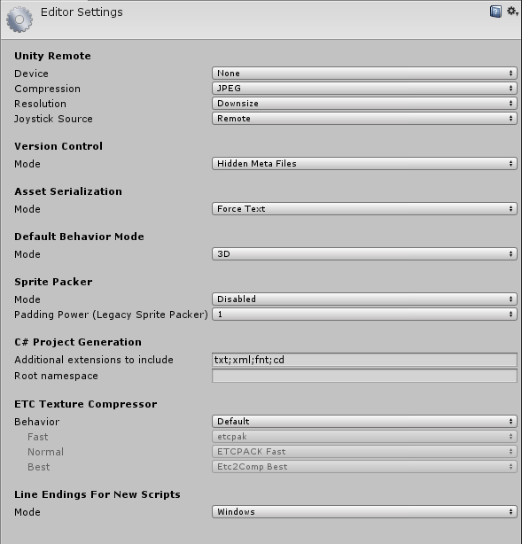

# Editor Settings

 

## 属性

|| 属性： | 功能： |
|:---|:---|:---| 
| __Unity Remote__||| 
| __设备__|| [Unity Remote](UnityRemote5.html) 是可下载的应用程序，旨在帮助进行 Android、iOS 和 tvOS 开发。使用下拉选单选择要用于 Unity Remote 测试的设备类型。 |
| __Compression__|| 使用下拉选单选择 Unity 在通过 Unity Remote 将游戏屏幕传输到设备时使用的图像压缩类型。默认设置为 __JPEG__。 |
|| JPEG | JPEG 通常提供更高压缩比和性能，但图形质量稍低。这是默认选项。 |
|| PNG | PNG 可以更准确地体现游戏显示效果，但可能会降低性能。 |
| __Resolution__|| 使用下拉选单选择游戏应在 Unity Remote 上运行的分辨率。默认设置为 __Downsize__。 |
|| Downsize | 选择 __Downsize__ 将以较低分辨率显示游戏。这样可以获得更高的性能，但图形精度降低。这是默认选项。 |
|| Normal | 选择 __Normal__ 将以正常分辨率显示游戏。这样可以获得更高的图形精度，但性能降低。 |
| __Joystick Source__|| 使用下拉选单选择所使用的游戏杆的连接源。默认设置为 __Remote__。 |
|| Remote | 选择 __Remote__ 可使用连接到运行 Unity Remote 的设备的游戏杆。这是默认选项。  |
|| Local | 选择 __Local__ 可使用连接到运行 Editor 的计算机的游戏杆。 |
| __Version Control__|||
| __Mode__|| 可以将 Unity 与最常用的版本控制工具结合使用，包括 Perforce 和 PlasticSCM。有关更多信息，请参阅[版本控制](VersionControl.html)文档。 使用下拉选单选择元文件的可见性。有关不同系统可用的不同选项，请参阅[版本控制](VersionControl.html)文档。默认设置为 __Hidden Meta Files__。有关显示或隐藏元文件的更多信息，请参阅 Unity Answers 页面[可见或隐藏的元文件 (Visible or hidden meta files)](http://answers.unity3d.com/questions/932348/visible-or-hidden-meta-files-with-git.html)。 |
|| Hidden Meta Files | 将 Unity 设置为隐藏元文件。这是默认选项。 |
|| Visible Meta Files | 将 Unity 设置为显示元文件。这在使用版本控制时很有用，因为此选项允许其他用户和计算机查看这些元文件。 |
| __Asset Serialization__|||
| __Mode__|| Unity 使用[序列化技术](script-Serialization-BuiltInUse.html)从计算机的硬盘驱动器加载和保存资源和 AssetBundle。为了帮助进行版本控制合并，Unity 可以采用基于文本的格式来存储场景文件（有关更多详细信息，请参阅[文本场景格式](TextSceneFormat.html)文档）。如果未执行场景合并，Unity 可以采用更节省空间的二进制格式来存储场景，或允许文本和二进制场景文件同时存在。 使用下拉选单选择 Unity 应使用哪种格式来存储序列化资源。默认设置为 __Force Text __。 |
|| Mixed | 二进制模式下的资源保持二进制模式，文本模式下的资源保持文本模式。默认情况下，Unity 对新资源使用二进制模式。 |
|| Force Binary | 此选项可将所有资源转换为二进制模式，并且 Unity 对新资源使用二进制模式。 |
|| Force Text | 此选项可将所有资源转换为文本模式，并且 Unity 对新资源使用文本模式。这是默认选项。 |
| __Default Behavior Mode__|||
| __Mode__|| Unity 允许在 2D 或 3D 开发之间进行选择，并根据选择的开发方式来设置某些默认行为，以便于开发。有关使用此设置时更改的特定行为的更多信息，请参阅有关 [2D 和 3D 模式设置](2DAnd3DModeSettings.html)的文档。 使用下拉选单选择 Unity 的默认行为。默认设置为 __3D__。 |
|| 3D | 选择 __3D__ 可将 Unity 设置为 3D 开发。这是默认选项。 |
|| 2D | 选择 __2D__ 可将 Unity 设置为 2D 开发。  |
| __Sprite Packer__|||
| __Mode__|| Unity 提供了一个 [Sprite Packer](SpritePacker.html) 工具来自动执行从各个精灵纹理生成图集的过程。请使用下列设置来配置 Sprite Packer。使用下拉选单选择 Sprite Packer 模式。默认设置为 __Disabled__。有关更多信息，请参阅[精灵图集](SpriteAtlas.html)文档。 |
|| Disabled | Unity 不会打包图集。这是默认设置。 |
|| Enabled For Builds (Legacy Sprite Packer) | Unity 仅对构建打包图集，在 Editor 内部播放模式下不会打包。此 __Legacy Sprite Packer__ 选项是指 Sprite Packer 的基于标签的版本，而不是精灵图集版本。 |
|| Always Enabled (Legacy Sprite Packer) | Unity 为构建打包图集，并且是进入 Editor 内部播放模式之前进行。此 __Legacy Sprite Packer__ 选项是指基于标签的版本，而不是精灵图集版本。 |
|| Enabled For Builds | Unity 仅对构建打包图集，在 Editor 内部播放模式下不会打包。 |
|| Always Enabled | Unity 为构建打包图集，并且是进入 Editor 内部播放模式之前进行。 |
| __Padding Power (Legacy Sprite Packer)__|| 使用 __Padding Power__ 可设置打包算法在计算打包的精灵之间以及精灵与生成的图集边缘之间分配的空间量（即“填充”）时使用的值。 |
|| 1 | 这表示值 2^1。使用此设置在打包的精灵和图集边缘之间分配 2 个像素。这是默认设置。 |
|| 2 | 这表示值 2^2。使用此设置在打包的精灵和图集边缘之间分配 4 个像素。 |
|| 3 | 这表示值 2^3。使用此设置在打包的精灵和图集边缘之间分配 8 个像素。 |
| __C# Project Generation__|||
| __Additional extensions to include__|| 使用此文本字段来包含要添加到 C# 项目的其他文件类型的列表。用分号分隔每个文件类型。默认情况下，此字段包含 `txt;xml;fnt;cd`。 |
| __Root namespace__|| 使用此文本字段填充要用于 C# 项目 `RootNamespace` 属性的命名空间。有关更多信息，请参阅关于[常见 MSBuild 项目属性 (Common MSBuild Project Properties)](https://msdn.microsoft.com/en-us/library/bb629394.aspx) 的 Microsoft 开发者文档。默认情况下，此字段为空。 |
| __ETC Texture Compressor__|||
| __Behavior__|| Unity 允许指定用于 ETC 纹理的不同压缩质量的压缩工具。__Fast__、__Normal__ 和 __Best__ 属性定义压缩质量。这些属性映射到受支持平台的[纹理导入器 (Texture Importer)](class-TextureImporter.html) 中的 __Compressor Quality__ 设置。可用的压缩工具包括 [etcpak](https://bitbucket.org/wolfpld/etcpak/wiki/Home)、[ETCPACK](https://github.com/Ericsson/ETCPACK) 和 [Etc2Comp](https://github.com/google/etc2comp)。它们都是第三方压缩工具库。 |
|| Legacy | 选择 __Legacy__ 可使用在 ETC 纹理压缩变为可配置之前可用的配置。这将设置以下属性：  - __Fast__：ETCPACK Fast   - __Normal__：ETCPACK Fast   - __Best__：ETCPACK Best |
|| Default | 选择 __Default__ 可使用 Unity 的默认配置。这将设置以下属性：  - __Fast__：etcpack   - __Normal__：ETCPACK Fast   - __Best__：Etc2Comp Best |
|| Custom | 选择 __Custom__ 可自定义 ETC 纹理压缩配置。  |
| __Line Endings For New Scripts__|||
| __Mode__|| 使用下拉选单来配置文件行尾以应用于在 Editor 中创建的新脚本。请注意，配置这些设置不会转换现有脚本。  |
|| OS Native | 选择 __OS Native__ 可根据运行 Editor 的操作系统来应用行尾。 |
|| Unix | 选择 __Unix__ 可根据 Unix 操作系统来应用行尾。 |
|| Windows | 选择 __Windows__ 可根据 Windows 操作系统来应用行尾。 |

---

* 2017-11-03 对文档更新以反映自 5.6 版以来的多项更改

*  2017-11-03  Page amended with [editorial review](DocumentationEditorialReview.html)

