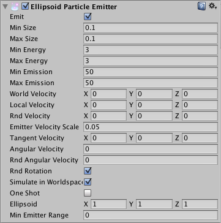
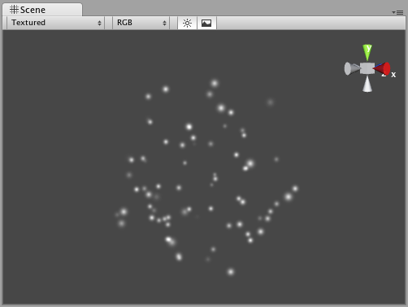

#椭圆粒子发射器 (Ellipsoid Particle Emitter)（旧版）

__椭圆粒子发射器 (Ellipsoid Particle Emitter)__ 在球体内生成粒子。使用下面的 __Ellipsoid__ 属性可缩放和拉伸球体。

 

##属性

|**_属性：_** |**_功能：_** |
|:---|:---|
|__Emit__ |如果启用此属性，发射器将发射粒子。 |
|__Min Size__ |每个粒子在生成时的最小大小。 |
|__Max Size__ |每个粒子在生成时的最大大小。 |
|__Min Energy__ |每个粒子的最短生命周期，以秒为单位。 |
|__Max Energy__ |每个粒子的最长生命周期，以秒为单位。 |
|__Min Emission__ |每秒产生的最少粒子数。 |
|__Max Emission__ |每秒产生的最多粒子数。 |
|__World Velocity__ |粒子在世界空间中沿 X、Y 和 Z 方向的起始速度。 |
|__Local Velocity__ |以对象的方向测量，粒子沿 X、Y 和 Z 方向的起始速度。 |
|__Rnd Velocity__ |为速度增加的沿 X、Y 和 Z 方向的随机速度。 |
|__Emitter Velocity Scale__ |粒子继承的发射器速度大小。 |
|__Tangent Velocity__ |在发射器的表面上，粒子沿 X、Y 和 Z 方向的起始速度。 |
|__Angular Velocity__ |新粒子的角速度，以度/秒为单位。|
|__Rnd Angular Velocity__ |新粒子的随机角速度修改器。|
|__Rnd Rotation__ |如果启用此属性，则会随机旋转生成粒子。|
|__Simulate In World Space__ |如果启用此属性，则在发射器移动时粒子不会移动。如果设置为 false（不选中），当移动发射器时，粒子会跟随它移动。 |
|__One Shot__ |如果启用此属性，则会一次性全部生成由最小和最大发射参数指定的粒子数。如果禁用此属性，则以一长串的形式生成粒子。 |
|__Ellipsoid__ |球体（粒子在此球体内生成）沿 X、Y 和 Z 方向的比例。 |
|__MinEmitterRange__ |确定球体中心的一个空白区域；使用此区域使粒子出现在球体的边缘。 |

##详细信息

椭圆粒子发射器 (EPE) 是基本的发射器，当您选择通过 __Components &gt; Particles &gt; Particle System__ 向场景中添加__粒子系统 (Particle System)__ 时，便会包含这些发射器。您可以定义要生成的粒子的边界，并为粒子提供初始速度。从此处，可使用[粒子动画器 (Particle Animator)](class-ParticleAnimator.html) 来操控粒子随时间变化的方式，从而获得有趣的效果。

粒子发射器与[粒子动画器](class-ParticleAnimator.html)和[粒子渲染器](class-ParticleRenderer.html)配合使用，从而创建、操控和显示粒子系统。要确保粒子行为正确，所有这三个组件都必须存在于对象上。发射粒子时，所有不同的速度将累加在一起以产生最终速度。

###生成属性

在尝试实现不同效果时，诸如 __Size__、__Energy__、__Emission__ 和 __Velocity__ 之类的生成属性将为粒子系统赋予鲜明的个性。使用较小的 __Size__ 可以模拟天空中的萤火虫或星星。较大的 __Size__ 可以模拟布满灰尘的老建筑中的尘埃云团。

__Energy__ 和 __Emission__ 将控制粒子在屏幕上停留的时间以及可在任何时刻出现的粒子数量。例如，火箭可能需要较高的 __Emission__ 值来模拟烟雾密度，并通过较高的 __Energy__ 值模拟烟雾缓慢消散到空气中的状态。

__Velocity__ 将控制粒子的移动方式。您可能希望在脚本中更改 __Velocity__ 以获得有趣的效果，或者如果要模诸如风之类的恒定效果，请设置 X 和 Z __Velocity__ 来实现粒子被吹走的效果。

###Simulate in World Space

如果禁用此选项，则每个粒子的位置将始终相对于发射器的__位置 (Position)__ 移动。当发射器移动时，粒子将随之移动。如果启用 __Simulate in World Space__，粒子不会受到发射器移动的影响。例如，如果一个火球喷出上升的火焰，当火球越来越远时，产生的火焰将漂浮在太空中。如果禁用 __Simulate in World Space__，则同样的火焰将随着火球一起在屏幕上移动。

###Emitter Velocity Scale

仅当启用了 __Simulate in World Space__ 时，此属性才适用。

如果此属性设置为 1，则粒子将在生成时严格继承发射器的移动速度。如果设置为 2，则粒子将在生成时继承发射器的双倍移动速度。设置为 3 则为三倍移动速度，依此类推。

###One Shot

__One Shot__ 发射器将一次性创建完 __Emission__ 属性指定的所有粒子，随后便停止发射粒子。以下提供了 __One Shot__ 为__启用__或__禁用__状态时不同粒子系统用途的一些示例：

__启用__：

* 爆炸
* 水溅
* 魔法

__禁用__：

* 枪管烟雾
* 风效
* 瀑布

###Min Emitter Range

__Min Emitter Range__ 决定了椭球内可生成粒子的深度。将此属性设置为 0 将允许从椭球的中间核心到最外面范围的任何位置生成粒子。将此属性设置为 1 将把生成位置限制为椭球的最外面范围。

##提示

* 使用许多大型粒子时应小心。这会严重影响低端机器的性能。始终应尝试使用最少数量的粒子来达到所需效果。
* __Emit__ 属性与粒子动画器的 __AutoDestruct__ 属性结合使用。通过脚本可停止发射器的发射，然后 __AutoDestruct__ 将自动销毁粒子系统及其附加到的游戏对象。

