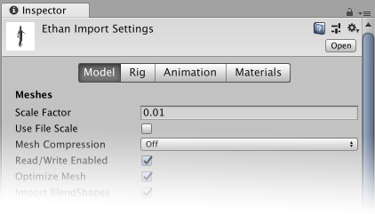

# Model Import Settings 窗口

将模型文件放在 Unity 项目下的 Assets 文件夹中时，Unity 会自动导入这些文件并将它们存储为 Unity 资源。要在 __Inspector__ 中查看导入设置，请在 __Project__ 窗口中单击该文件。通过在此窗口的四个选项卡上设置相应属性可以自定义 Unity 导入所选文件的方式：

 一个 3D [模型](FBXImporter-Model.html)可表示角色、建筑物或家具。在这些情况下，Unity 从单个模型文件创建多个资源。在 Project 窗口中，主导入对象是模型__预制件__。通常，该模型预制件还会引用多个__网格__对象。

 一个[骨架 (Rig)](FBXImporter-Rig.html)（有时称为 _skeleton（骨骼框架）_）包含一组以层级视图排列的变形体 (deformer)，这些变形体在 3D 建模应用程序（如 3ds Max 或 Maya）中创建的一个或多个模型上对网格（有时称为_皮肤_）进行动画化。对于__人形 (Humanoid)__ 和__通用 (Generic)__（非人形）模型，Unity 会创建 __Avatar__ 来使导入的骨架与 Unity __游戏对象 (GameObject)__ 协调。

 可以定义一组帧上发生的任何不同姿势（例如行走、奔跑甚至空闲状态（从一只脚移动到另一只脚））的序列作为[动画剪辑](class-AnimationClip.html)。可以对任何具有相同骨架的模型重用剪辑。通常，单个文件包含多个不同的动作，可将每个动作定义为特定的__动画剪辑__。

 可以提取[材质和纹理](FBXImporter-Materials.html)或将它们嵌入模型中。还可以调整材质在模型中的贴图方式。

### 另请参阅

* [模型导入工作流程](ImportingModelFiles.html)：有关导入模型文件的概述
* [模型文件格式](3D-formats.html)：Unity 支持的文件格式（包括专有和通用格式）以及各种 3D 建模软件应用程序特有的问题
* [从其他应用程序导出](HOWTO-exportFBX.html)：有关如何从 3D 建模应用程序导出 FBX 文件（和专有文件）的一般准则

---

*  2018-04-25  Page amended with limited [editorial review](DocumentationEditorialReview.html)

