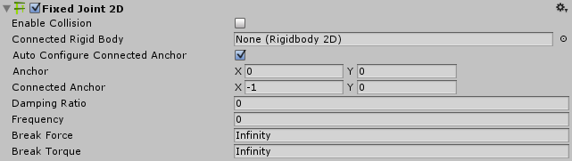

#2D 固定关节 (Fixed Joint 2D)

通过将此组件应用于由 2D 刚体物理组件控制的两个游戏对象，可使这些对象保持相对于彼此的位置，确保游戏对象始终以给定位置和角度偏移。这是一种 2D 弹簧式关节，但无需为其设置最大力。可以将弹簧设置为刚性或柔性。

请参阅下文的 *2D 固定关节和 2D 相对关节*进一步了解 __2D 固定关节__和 __2D 相对关节__之间的区别。

 

|**_属性：_** |**_功能：_** |
|:---|:---|
|__Enable Collision__ |选中此框可允许两个连接的游戏对象相互碰撞。|
|__Connected Rigid Body__ |指定此 2D 固定关节连接到的另一个游戏对象。将此属性保留为 __None__ 可将 2D 固定关节的另一端固定到空间中由 __Connected Anchor__ 设置所定义的点。选择字段右侧的圆圈可查看要连接到的游戏对象的列表。|
|__Auto Configure Connected Anchor__ | 选中此框可为该 2D 固定关节连接到的另一个游戏对象自动设置锚点位置。如果选中此框，则无需填写 __Connected Anchor__ 字段。 |    
|__Anchor__ |关节端点连接到*此*对象的位置（以 __2D 刚体__上的 x、y 坐标表示）。 |
|__Connected Anchor__ |2D 固定关节端点连接到另一游戏对象的位置（以 __2D 刚体__上的 x、y 坐标表示）。 |
|__Damping Ratio__ | 定义想要抑制弹簧振荡的程度：介于 0 到 1 之间，值越大，移动越少。 |
|__Frequency__ |游戏对象接近所需的间隔距离时弹簧振荡的频率（以每秒周期数表示）。频率值介于 1 到 1,000,000 范围内，值越高，弹簧越硬。请注意，如果频率设置为 0，则弹簧完全僵硬。 |
|__Break Force__ |指定破坏并进而删除关节所需的作用力水平。__Infinity__ 表示关节牢不可破。 |
|__Break Torque__ |指定破坏并进而删除关节所需的扭矩水平。__Infinity__ 表示关节牢不可破。 |

##注意

此关节的目的是保持两点之间的相对线性偏移和角度偏移。这两个点可以是两个 __2D 刚体__组件，或一个 __2D 刚体__组件和世界中的一个固定位置。（将 __Connected Rigidbody__ 设置为 None，即可连接到世界中的固定位置）。

线性偏移和角度偏移基于两个连接点的相对位置和方向，因此可以通过在 Scene 视图中移动连接的游戏对象来更改这些偏移。

此关节对连接的 2D 刚体游戏对象施加线性力和扭力。此关节使用的模拟弹簧已预先配置为模拟所能提供的最大刚度。可使用 __Frequency__ 设置来更改弹簧的值，从而降低其刚度。

弹簧在游戏对象之间施力时，往往会超过对象之间的期望距离，然后反复反弹，导致连续振荡。阻尼比率决定了振荡减弱并使游戏对象停止的速度。频率是弹簧在目标距离任一侧进行振荡的速率；频率越高，弹簧刚度越大。

2D 固定关节同时有两个约束：

* 保持两个 2D 刚体游戏对象上的两个锚点之间的线性偏移。
* 保持两个 2D 刚体游戏对象上的两个锚点之间的角度偏移。

使用此关节构建的物理游戏对象就好像是通过刚性连接方式相连一样。游戏对象不能彼此远离，不能相互靠近，也不能相对于彼此旋转，例如桥梁的各个部分采用刚性连接。

还可以使用此关节来创建刚度稍低的柔性连接，例如桥梁的各个部分略带柔性。

##2D 固定关节和 2D 相对关节
了解 2D 固定关节与 2D 相对关节之间的主要区别是非常重要的：

* __2D 固定关节__是一种弹簧式关节。__2D 相对关节__是具有最大力和/或扭矩的电机型关节。
* __2D 固定关节__使用弹簧来保持相对的线性偏移和角度偏移。__2D 相对关节__则使用电机。可配置关节的弹簧或电机。
* __2D 固定关节__使用锚点（此关节派生自脚本 __Anchored Joint 2D__）；在锚点之间保持相对的线性偏移和角度偏移。__2D 相对关节__没有锚点（此关节直接派生自脚本 __Joint 2D__）。
* __2D 固定关节__无法实时修改相对的线性偏移和角度偏移。__2D 相对关节__则可以进行此类修改。

请参阅 [2D 关节](Joints2D.html)中的*详情和提示*以了解所有 2D 关节的有用背景信息。

