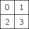
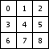
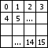

光晕
=====

__光晕 (Flare)__ 对象是[镜头光晕 (Lens Flare) 组件](class-LensFlare.html)使用的源资源。光晕本身集合了纹理文件和确定光晕行为方式的特定信息。然后，当希望在__场景__中使用光晕时，需要从附加到__游戏对象__的 __LensFlare__ __组件__内部引用特定光晕。

[标准资源](AssetTypes.html#Standard)包中提供一些示例光晕。如果要将其中一个光晕添加到场景中，请将[镜头光晕 (Lens Flare)](class-LensFlare.html) 组件附加到游戏对象，然后将要使用的光晕拖动到 Lens Flare 的 __Flare__ 属性中，操作方法就像将__材质 (Material)__ 分配给__网格渲染器 (Mesh Renderer)__ 一样。

光晕需要包含单个__纹理__上的多个光晕__元素__。在光晕中，可从任何纹理选取要包含的__元素__。

属性
----------

|**_属性：_** |**_功能：_** |
|:---|:---|
|__Elements__ |光晕中包含的光晕图像数量。 |
|&amp;#160;&amp;#160;&amp;#160;&amp;#160;&amp;#160;&amp;#160;&amp;#160;&amp;#160;__Image Index__ |从 __Flare Texture__ 为此元素使用哪个光晕图像。请参阅下面的_光晕纹理_部分以了解更多信息。 |
|&amp;#160;&amp;#160;&amp;#160;&amp;#160;&amp;#160;&amp;#160;&amp;#160;&amp;#160;__Position__ |元素沿着从所属游戏对象的位置到屏幕中心的线路上的偏移量。0 = 游戏对象位置，1 = 屏幕中心。 |
|&amp;#160;&amp;#160;&amp;#160;&amp;#160;&amp;#160;&amp;#160;&amp;#160;&amp;#160;__Size__ |元素的大小。 |
|&amp;#160;&amp;#160;&amp;#160;&amp;#160;&amp;#160;&amp;#160;&amp;#160;&amp;#160;__Color__ |元素的颜色色调。 |
|&amp;#160;&amp;#160;&amp;#160;&amp;#160;&amp;#160;&amp;#160;&amp;#160;&amp;#160;__Use Light Color__ |如果光晕附加在光源上，启用此功能会使用光源的颜色为光晕着色。 |
|&amp;#160;&amp;#160;&amp;#160;&amp;#160;&amp;#160;&amp;#160;&amp;#160;&amp;#160;__Rotate__ |如果启用此属性，元素的底部将始终面向屏幕的中心，使元素随着镜头光晕在屏幕上移动而旋转。 |
|&amp;#160;&amp;#160;&amp;#160;&amp;#160;&amp;#160;&amp;#160;&amp;#160;&amp;#160;__Zoom__ |如果启用此属性，元素将在可见时扩大，而在不可见时再次缩小。 |
|&amp;#160;&amp;#160;&amp;#160;&amp;#160;&amp;#160;&amp;#160;&amp;#160;&amp;#160;__Fade__ |如果启用此属性，元素将在可见时淡入至最高强度，而在不可见时淡出。 |
|__Flare Texture__ |此纹理包含该光晕的__元素__使用的图像。必须根据 __TextureLayout__ 选项之一进行排列。 |
|__Texture Layout__ |如何在__光晕纹理 (Flare Texture)__ 中布置各个光晕元素图像（有关详细信息，请参阅下面的_纹理布局_）。|
|__Use Fog__ |如果启用此属性，光晕将伴随着距离雾效消失。此属性通常用于小光晕。 |

详细信息
-------

光晕由多个__元素__组成，沿着一条线排列。这条线是通过比较包含镜头光晕的游戏对象的位置与屏幕的中心来计算得出的。这条线会延伸到所属游戏对象和屏幕中心之外。所有光晕__元素__都在这条线上排成一行。

光晕纹理
--------------

出于性能原因，一个光晕的所有__元素__必须共享相同的纹理。此纹理包含一组不同的图像，这些图像可用作单个光晕中的元素。__Texture Layout__ 定义了__元素__在__光晕纹理__中的布局。

纹理布局
---------------

下面提供了不同光晕__纹理布局__的选项。图像中的数字对应于每个__元素__的 __Image Index__ 属性。

###1 大 4 小

 

专为类似于太阳的大型光晕而设计，这种情况下需要其中一个__元素__比其他元素具有更高的保真度。此布局适用于高度是宽度两倍的纹理。

###1 大 2 中 8 小

 

专为需要 1 个高清图像、2 个中等大小图像和 8 个小图像的复杂光晕而设计。此布局用于标准资源“50mm Zoom Flare”（50mm 缩放光晕），其中有两个中等大小的元素表示彩虹色圆圈。此布局适用于高度是宽度两倍的纹理。
###1 个纹理

 

单个图像。

2x2 网格
--------

 

一个简单的 2x2 网格。

###3x3 网格

 

一个简单的 3x3 网格。

###4x4 网格

 

一个简单的 4x4 网格。

提示
-----

* 如果使用许多不同的光晕，使用包含所有__元素__的单个__光晕纹理__将带来最佳的渲染性能。
* 镜头光晕会被__碰撞体__阻挡。光晕游戏对象和摄像机之间的碰撞体即使没有__网格渲染器__，也会隐藏光晕。如果中间碰撞体被标记为触发器 (Trigger)，当且仅当 __Physics.queriesHitTriggers__ 为 true 时，该碰撞体才会阻挡光晕。
* 要覆盖用于光晕的着色器，请打开[图形设置 (Graphics Settings)](class-GraphicsSettings.html) 并将 __Lens Flares__ 设置为要用作覆盖的着色器。
