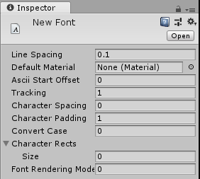
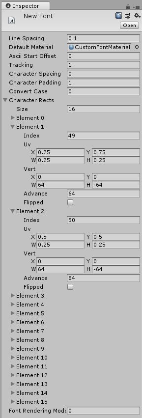

#字体

可创建或导入__字体__以便在 [GUI 文本 (GUI Text)](class-GUIText.html) 或[文本网格 (Text Mesh)](class-TextMesh.html) __组件__中使用。

##导入字体文件

要在项目中添加字体，必须将字体文件放在 Assets 文件夹中。然后，Unity 会自动将其导入。支持的字体格式为 TrueType 字体（.ttf 文件）和 OpenType 字体（.otf 文件）。

要更改字体的__大小 (Size)__，请在 __Project 视图__中突出显示该字体，随后将在 __Inspector__ 的__导入设置 (Import Settings)__ 中提供多个选项。

|**_属性：_** |**_功能：_** |
|:---|:---|
|__Font Size__ |字体的大小，基于文字处理程序中设置的大小。|
|__Rendering mode__ |字体渲染模式，告诉 Unity 如何对字形应用平滑。 |
|__Character__ |要导入字体纹理的字体的字符集 |
| |将此模式设置为 Dynamic 会导致 Unity 嵌入字体数据本身并在运行时渲染字体字形（见下文）。|

_特定于动态字体的导入设置_

|**_属性：_** |**_功能：_** |
|:---|:---|
|__Include Font Data__ |与动态 (Dynamic) 字体属性一起使用时，此设置可控制字体的打包。选中复选框后，TTF 将包含在构建的输出中。如果未选中复选框，则假定最终用户将在自己的计算机上安装该字体。请注意，字体受版权保护，因此您只应当包含已获得许可或自己创建的字体。 |
|__Font Names__ |当字体或字符不可用时使用的后备字体列表（见下文）。 |

导入字体后，可在 Project 视图中展开字体，查看其已自动生成的某些资源。导入期间创建两个资源：“字体材质”和“字体纹理”。与您可能熟悉的许多应用程序不同，Unity 中的字体会转换为纹理，并且显示的字形将使用纹理四边形进行渲染。有效调整字体大小会更改此生成的纹理中每个字形使用的像素数。文本网格资源便是使用这些自动生成的字体纹理进行纹理化的 3D 几何体。您需要改变字体的大小以使这些资源看起来清晰。

##动态字体

在 Import Settings 中将 __Characters__ 下拉选单设置为 __Dynamic__ 时，Unity 将不会预先生成包含所有字体字符的纹理。取而代之的做法是，它将使用 FreeType 字体渲染引擎来即时创建纹理。这样做的好处是它可以节省下载流量和纹理内存，特别是使用通常包含在用户系统中的字体时（这种情况下不必包含字体数据），或者需要支持亚洲语言或大型字体大小时（这种情况下使用普通字体纹理可能使字体纹理非常大）。

当 Unity 尝试使用动态字体渲染文本但无法找到字体时（因为未选择 __Include Font Data__，并且用户计算机上未安装该字体），或者字体不包含请求的字形时（例如尝试使用拉丁字体在东亚脚本中渲染文本时，或者使用粗体/斜体字形文本时），它将尝试 __Font Names__ 字段中列出的每种字体，从而查看是否可以找到与项目中的字体名称匹配的字体（包含字体数据）或者用户计算机上安装的字体是否具有请求的字形。如果找不到列出的后备字体或者这些字体不具有所请求的字形，Unity 将回退到硬编码的全局后备字体列表，其中包含当前运行时平台上通常安装的各种国际字体。

请注意，有些目标平台（WebGL 和有些游戏主机）没有可供 Unity 访问以渲染文本的操作系统默认字体。对于这些平台，将忽略 __Include Font Data__ 设置，并会始终包含字体数据。所有要用作后备字体的字体都必须包含在项目中，因此如果需要渲染国际文本或是字体的粗体/斜体版本，则需要在项目中添加一个具有所需字符的字体文件，并在其他字体的 __Font Names__ 列表中设置该字体，这样应该就会将该字体用作后备字体。如果字体设置正确，则后备字体将在字体导入器 (Font Importer) 检视面板中列出，显示在 _References to other fonts in project_ 下。

##默认字体资源

默认字体资源是动态字体，设置为使用 [Arial](https://en.wikipedia.org/wiki/Arial)。如果 Unity 无法在计算机上找到 Arial 字体（例如，如果没有安装该字体），则将回退到 Unity 捆绑的字体，名为 [Liberation Sans](https://en.wikipedia.org/wiki/Liberation_fonts)。

Liberation Sans 看起来很像 Arial，但它不包括粗体和斜体字体样式，并且只有基本的拉丁字符集，所以带样式的文本或非拉丁字符可能会回退到其他字体或无法渲染出来。但是该字体有许可证，因此允许在播放器构建中包含该字体。

##自定义字体

要创建自定义字体，请从 Project 窗口中选择“Create > Custom Font”。随后将在项目库中添加自定义的字体资源。

 

**Ascii Start Offset** 字段是一个十进制数，用于定义您希望作为 **Character Rects** 索引起点的 Ascii 索引。例如，如果 Ascii Start Offset 设置为 0，则大写字母 A 将位于索引 65 处，但如果 Ascii Start Offset 设置为 65，则字母 A 将位于索引 0 处。您可以在[这里](http://ascii.cl/)查阅 Ascii 表，但应记住，自定义字体使用十进制 Ascii 编号系统。

通过 **Tracking** 设置可修改每个字符与同一行下一个字符的接近程度，而通过 **Line spacing** 设置可定义每行与下一行的接近程度。

要创建字体材质，您需要将字体作为纹理导入，然后将该纹理应用于材质，再将字体材质拖到 **Default Material** 部分。

**Character Rects** 部分可定义字体的每个字符。

 

**Size** 字段用于定义字体中的字符数。

在每个 **Element** 中，有一个用于字符 Ascii 索引的索引 (Index) 字段。此值将是一个整数，表示该元素中的字符。

要计算 **UV** 值，您需要弄清楚字符在 0 到 1 范围内的位置。为此，应将 1 除以尺寸上的字符数。例如，如果有一个字体，该字体上的图像尺寸为 256x128，横向 4 个字符，纵向 2 个字符（所以为 64x64），那么 UV 宽度将是 0.25，UV 高度将是 0.5。

对于 UV X 和 Y，只需要确定所需的字符，然后将宽度或高度值乘以字母的列/行。

**Vert** 大小基于字符的像素大小，例如，如果每个字符均为 128x128，则将 128 和 -128 填入垂直 (Vert) 宽度 (W) 和高度 (H) 将得出正确比例的字母。Vert Y 必须为负。

**Advance** 将是从该字符的原点到下一个字符的原点所需的水平距离（以像素为单位）。在计算实际距离时，应将其乘以 **Tracking**。

##Unicode 支持

Unity 拥有完整的 Unicode 支持。Unicode 文本允许您显示 ASCII 字符集通常不支持的德语、法语、丹麦语或日语字符。如果您的字体支持，还可以输入许多不同的特殊用途字符，如箭头符号或 Option 键符号。

要使用 Unicode 字符，请从 Import Settings 中的 __Characters__ 下拉选单中选择 __Unicode__ 或 __Dynamic__。现在便可使用此字体显示 Unicode 字符。如果要使用 __GUIText__ 或__文本网格 (Text Mesh)__，可在该组件的 Inspector 的 __Text__ 字段中输入 Unicode 字符。

如果要通过脚本设置显示的文本，也可以使用 Unicode 字符。Javascript 和 C# 编译器完全支持基于 Unicode 的脚本。必须使用 UTF-16 编码来保存脚本。现在即可将 Unicode 字符添加到脚本中的字符串，然后它们便会在 __UnityGUI__、GUIText 或文本网格 (Text Mesh) 中按预期显示。

请注意，不支持代理项对。

##更改字体颜色

根据字体的使用方式，可通过多种方法更改显示字体的颜色。

###GUIText 和文本网格 (Text Mesh)

如果使用 GUIText 或文本网格 (Text Mesh)，可通过该字体的自定义__材质 (Material)__ 更改其颜色。在 Project 视图中，单击 __Create &gt; Material__，然后在 __Inspector__ 中选择并设置新创建的材质。确保将字体资源中的纹理指定给该材质。如果对字体材质使用内置的 __GUI/Text Shader__ 着色器，则可在材质的 __Text Color__ 属性中选择颜色。

###UnityGUI

如果使用 UnityGUI 脚本来显示字体，则可在不同情况下更好地控制字体的颜色。要更改字体的颜色，请通过 __Assets &gt; Create &gt; GUI Skin__ 创建 __GUISkin__，然后定义特定控制状态的颜色，例如：__Label &gt; Normal &gt; Text Color__。有关更多详细信息，请阅读 [GUI 皮肤 (GUI Skin) 页面](class-GUISkin.html)。

##提示

* 要显示导入的字体，请选择字体并选择 __GameObject &gt; Create Other &gt; 3D Text__。
* 可通过仅使用小写或大写字符来减小生成的字体纹理大小。

