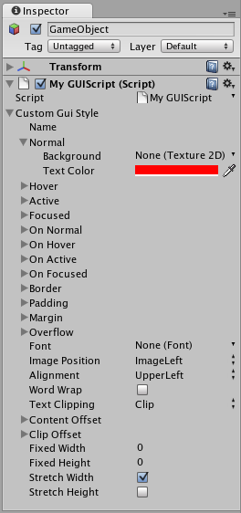

GUI Style（IMGUI 系统）
=========


__GUI Style__ 是与 __UnityGUI__ 结合使用的自定义属性的集合。单个 GUI Style 定义了单个 UnityGUI __控件__的外观。


如果要将样式添加到多个控件，请使用 [GUI Skin](class-GUISkin.html) 而不是 GUI Style。有关 UnityGUI 的更多信息，请阅读 [GUI 脚本指南](GUIScriptingGuide.html)。

**请注意**：本页面适用于 [IMGUI](GUIScriptingGuide.html) 系统的一部分；该系统是一个*仅限于脚本*的 UI 系统。Unity 有一个完整的基于游戏对象的 UI 系统，您可能更希望使用该系统。该系统允许在 Scene 视图中以可见对象的形式设计和编辑用户界面元素。请参阅 [UI 系统手册](UISystem.html)以了解更多信息。


属性
----------


|**_属性：_** |**_功能：_** |
|:---|:---|
|__Name__ |可用于指代此特定样式的文本字符串 |
|__Normal__ |控件在默认状态下显示的背景图像和文本颜色 |
|__Hover__ |当鼠标位于控件上方时显示的背景图像和文本颜色 |
|__Active__ |当鼠标主动单击控件时显示的背景图像和文本颜色 |
|__Focused__ |控件获得键盘焦点时显示的背景图像和文本颜色 |
|__On Normal__ |控件在启用状态下显示的背景图像和文本颜色 |
|__On Hover__ |当鼠标位于已启用的控件上方时显示的背景图像和文本颜色 |
|__On Active__ |当鼠标主动单击已启用的控件时显示的属性 |
|__On Focused__ |已启用的控件获得键盘焦点时显示的背景图像和文本颜色 |
|__Border__ |__背景__图像每条边的像素数（不受控件形状比例影响） |
|__Padding__ |从控件每个边缘到内容起始位置的空间（以像素为单位）。 |
|__Margin__ |以此样式渲染的元素与任何其他 GUI 控件之间的边距。 |
|__Overflow__ |要添加到背景图像的额外空间。 |
|__Font__ |用于此样式中所有文本的字体 |
|__Image Position__ |背景图像和文本的组合方式。 |
|__Alignment__ |标准文本对齐选项。 |
|__Word Wrap__ |如果启用此属性，到达控件边界的文本将换到下一行 |
|__Text Clipping__ |如果启用了 __Word Wrap__，选择超出控件边界的文本的处理方式 |
|&amp;#160;&amp;#160;&amp;#160;&amp;#160;&amp;#160;&amp;#160;&amp;#160;&amp;#160;__Overflow__ |任何超出控件边界的文本都将继续超出边界 |
|&amp;#160;&amp;#160;&amp;#160;&amp;#160;&amp;#160;&amp;#160;&amp;#160;&amp;#160;__Clip__ |任何超出控件边界的文本都将隐藏起来 |
|__Content Offset__ |除了所有其他属性之外，内容在 X 和 Y 轴上移位的像素数 |
|&amp;#160;&amp;#160;&amp;#160;&amp;#160;&amp;#160;&amp;#160;&amp;#160;&amp;#160;__X__ |左/右偏移 |
|&amp;#160;&amp;#160;&amp;#160;&amp;#160;&amp;#160;&amp;#160;&amp;#160;&amp;#160;__Y__ |上/下偏移 |
|__Fixed Width__ |控件宽度的像素数，此值将覆盖任何提供的 __Rect()__ 值 |
|__Fixed Height__ |控件高度的像素数，此值将覆盖任何提供的 __Rect()__ 值 |
|__Stretch Width__ |如果启用此属性，则可以水平拉伸使用此样式的控件来改善布局。 |
|__Stretch Height__ |如果启用此属性，则可以垂直拉伸使用此样式的控件来改善布局。 |


详细信息
-------


GUIStyle 在脚本中进行声明并基于每个实例进行修改。如果要使用具有自定义样式的单个或几个控件，可在脚本中声明此自定义样式，并将此样式作为控件函数的参数。这样就会以定义的样式显示这些控件。

首先，必须在脚本中声明 GUI Style。


````
/* 声明 GUI Style */
var customGuiStyle : GUIStyle;

...


````

将此脚本附加到游戏对象时，__Inspector__ 中将显示可修改的自定义样式。




现在，希望特定的控件使用此样式时，可将此样式的名称作为控件函数中的最后一个参数。


````
...

function OnGUI () {
	// 提供样式的名称作为最后一个参数以便使用该样式
	GUILayout.Button ("I am a custom-styled Button", customGuiStyle);

	// 如果不想应用该样式，请不要提供名称
	GUILayout.Button ("I am a normal UnityGUI Button without custom style");
}


````


有关使用 UnityGUI 的更多信息，请阅读 [GUI 脚本指南](GUIScriptingGuide.html)。
