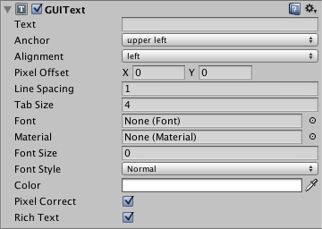

GUI Text（旧版 UI 组件）
========

__GUI Text（GUI 文本）__在屏幕坐标中显示导入的任何字体的文本。

 

**请注意：***该组件涉及将 UI 纹理和图像绘制到屏幕的传统方法。您应改用 Unity 的最新 [UI 系统](UISystem.html)。此外，这与 [IMGUI 系统](GUIScriptingGuide.html)无关。*

属性
----------

|**_属性：_** |**_功能：_** |
|:---|:---|
|__Text__ |要显示的字符串。 |
|__Anchor__ |__Text__ 共享 __Transform__ 位置的点。 |
|__Alignment__ |__GUIText__ 内的多行对齐方式。 |
|__Pixel Offset__ |文本在屏幕中相对于 GUIText 位置的偏移。|
|__Line Spacing__ |__Text__ 的行间距。 |
|__Tab Size__ |为制表符 ('&amp;#92;t') 字符插入的空格数。作为空格字符偏移的倍数。 |
|__Font__ |渲染文本时使用的[字体](class-Font.html)。 |
|__Material__ |引用包含要绘制的字符的__材质__。如果设置此属性，将覆盖[字符](class-Font.html)资源中的值。 |
|__Font Size__ |要使用的字体大小。设置为 0 将使用默认字体大小。仅适用于动态字体。 |
|__Font Style__ |要使用的字形，包括正常 (Normal)、粗体 (Bold)、斜体 (Italic) 或粗斜体 (Bold and Italic)。仅适用于动态字体。 |
|__Pixel Correct__ |如果启用此选项，则所有 __Text__ 字符将以导入的字体纹理的大小绘制。如果禁用此选项，字符将根据 Transform 的 __Scale__ 调整大小。 |
|__Rich Text__ |如果启用此选项，则允许使用 HTML 样式的标签进行文本格式设置。 |

详细信息
-------

GUI 文本用于在 2D 模式下将文本打印到屏幕上。__摄像机__必须连接 [GUI 层](class-GUILayer.html)才能渲染文本。摄像机在默认情况下包含 GUI 层，因此如果要显示 GUI 文本，请不要将其删除。GUI 文本仅使用 X 和 Y 轴定位。GUI 文本不位于世界坐标中，而是位于屏幕坐标中，其中 (0,0) 表示屏幕的左下角，(1,1) 表示右上角。要在 Unity 5.0 中添加 GUIText 组件，应首先使用 __GameObject > Create Empty__ 创建一个空的游戏对象，然后使用 __Component > Rendering > GUIText__ 选项将 GUIText 组件添加到新创建的游戏对象。如果按 Play 时文本不可见，请检查变换组件是否具有合适的位置，通常为 (0.5, 0.5, 0.0)。

要导入字体，请参阅[字体页面](class-Font.html)。

要使用富文本 (Rich Text)，请参阅[富文本页面](StyledText.html)。

###Pixel Correct

默认情况下，GUI 文本在启用 __Pixel Correct__ 的情况下渲染。因此，文本看起来很清晰，且无论屏幕分辨率如何，它们都将保持相同的像素大小。

提示
-----

* 在 __Text__ 属性中输入文本时，可通过按住 __Alt__ 的同时按 __Return__ 进行换行。
* 如果要编辑__Text__ 属性，可通过在字符串中插入转义字符“&amp;#92;n”添加换行。
* 可从 [1001freefonts.com](http://www.1001freefonts.com/fonts/afonts.htm) 下载免费的 TrueType 字体（可下载 Windows 字体，因为其中包含 TrueType 字体）。
