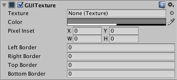
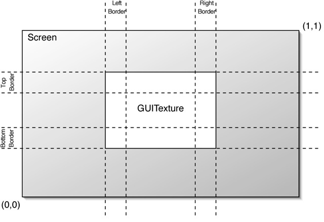
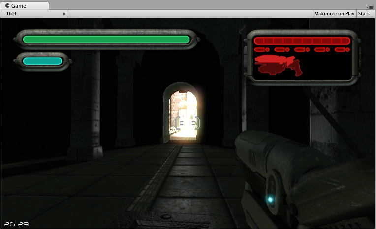

GUI 纹理（旧版 UI 组件）
===========

**请注意：***该组件涉及将 UI 纹理和图像绘制到屏幕的传统方法。您应改用 Unity 的最新 [UI 系统](UISystem.html)。此外，这与 [IMGUI 系统](GUIScriptingGuide.html)无关。*

__GUI 纹理__在 2D 模式下显示为平面图像。这些纹理专门用于用户界面元素、按钮或装饰。纹理的定位和缩放仅沿 x 轴和 y 轴执行，并且这两个轴在__屏幕坐标__中而不是在__世界坐标__中测量。

 

属性
----------

|**_属性：_** |**_功能：_** |
|:---|:---|
|__Texture__ |引用将用作纹理显示效果的[纹理](class-TextureImporter.html)。 |
|__Color__ |将为屏幕上绘制的__纹理__着色的颜色。 |
|__Pixel Inset__ |用于 GUI 纹理的缩放和定位的像素级控制。所有值都是相对于 GUI 纹理 __Transform__ 位置的测量值。 |
|&amp;#160;&amp;#160;&amp;#160;&amp;#160;&amp;#160;&amp;#160;&amp;#160;&amp;#160;__X__ |纹理的最左侧像素位置。 |
|&amp;#160;&amp;#160;&amp;#160;&amp;#160;&amp;#160;&amp;#160;&amp;#160;&amp;#160;__Y__ |纹理的最底部像素位置。 |
|&amp;#160;&amp;#160;&amp;#160;&amp;#160;&amp;#160;&amp;#160;&amp;#160;&amp;#160;__Width__ |纹理的最右侧像素位置。 |
|&amp;#160;&amp;#160;&amp;#160;&amp;#160;&amp;#160;&amp;#160;&amp;#160;&amp;#160;__Height__ |纹理的最顶部像素位置。 |
|__Left Border__ |左侧不受缩放比例影响的像素数。 |
|__Right Border__ |右侧不受缩放比例影响的像素数。 |
|__Top Border__ |顶部不受缩放比例影响的像素数。 |
|__Bottom Border__ |底部不受缩放比例影响的像素数。 |

详细信息
-------

要创建 GUITexture，请执行以下操作：

1.在 __Project 视图__中选择一个纹理
1.从菜单栏中选择 __GameObject &gt; Create General &gt; GUI Texture__

GUI 纹理非常适合向玩家呈现游戏界面背景、按钮或其他元素。通过编写脚本，您可以轻松地为纹理的不同“状态”（例如，鼠标悬停在纹理上时，或者主动单击它时）提供视觉反馈。以下是 GUI 纹理计算原理的基本细节：

###边框

边框是图像每个边缘的区域（由像素宽度指定），在缩放纹理的其余部分时，并不会缩放边框。您很少知道游戏运行的分辨率，您的 GUI 很可能会缩放。有些 GUI 纹理在边缘处的边框需要具有确切像素数。为了实现此目的，请设置边框大小以匹配纹理中的大小值。

###Pixel Inset

__Pixel Inset__ 的目的是防止纹理随屏幕分辨率缩放，将它们保持在固定的像素大小。此功能允许您在渲染纹理时不进行任何缩放。这意味着以较高分辨率运行游戏的玩家将在屏幕的较小区域内看到您的纹理，从而为您的游戏画面留出更多屏幕空间。

为了有效地使用它，您需要将 GUI 纹理的 Transform 的缩放比例设置为 (0, 0, 0)。现在，__Pixel Inset__ 将完全控制纹理的大小，而您可以将 __Pixel Inset__ 值设置为纹理的确切像素大小。

提示
-----

* 每个分层 GUI 纹理的深度由其各自 Z 变换位置确定，而不是由全局 Z 位置确定。
* GUI 纹理非常适合制作菜单屏幕或暂停/退出菜单屏幕。
* 对于希望宽度和高度具有特定像素数的 GUI 纹理，应使用 __Pixel Inset__。
