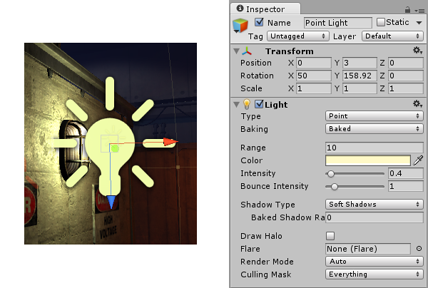
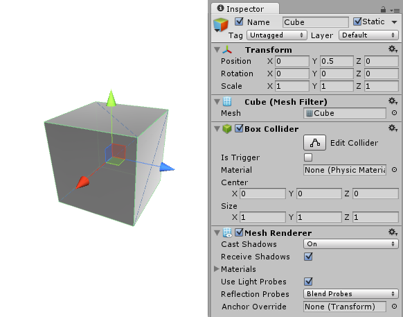

#游戏对象

__游戏对象__是 Unity 中的基础对象，表示角色、道具和景物。它们本身并没有取得多大作为，但它们充当__组件__的容器，而组件可实现真正的功能。

例如，通过将[光源](class-Light.html)组件附加到游戏对象来创建光源对象。

实体立方体对象具有网格过滤器 (Mesh Filter) 和网格渲染器 (Mesh Renderer) 组件（用于绘制立方体的表面）以及盒型碰撞体 (Box Collider) 组件（用于根据物理特性表示对象的实体体积）。

##详细信息

游戏对象始终附加一个[变换](class-Transform.html)组件（表示位置和方向），并且无法删除此组件。可以使用 Editor 的 __Component__ 菜单或通过脚本来添加为对象提供功能的其他组件。__GameObject &gt; 3D Object__ 菜单上也有许多有用的预构建对象（原始形状、摄像机等），请参阅[原始对象](PrimitiveObjects.html)。

由于游戏对象是 Unity 中非常重要的组成部分，因此本手册中提供了[游戏对象](GameObjects.html)部分，其中包含有关游戏对象的详细介绍。可以在[游戏对象脚本参考页面](../ScriptReference/GameObject.html)上找到有关通过脚本控制游戏对象的更多信息。
