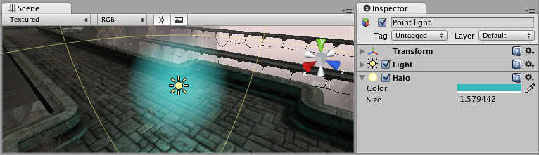

#光环 (Halo)

__光环__是光源周围的亮区，用于给人留下空气中小尘粒的印象。

##属性
 

|**_属性：_** |**_功能：_** |
|:---|:---|
|__Color__ |光环的颜色。 |
|__Size__ |光环的大小。 |

##详细信息

您可以将 Halo 组件添加到[光源 (Light)](class-Light.html) 对象，然后设置其大小和颜色属性以提供所需的发光效果。此外，也可将 Light 组件设置为在没有单独 Halo 组件情况下显示光环，为此需启用其 _Draw Halo_ 属性。

##提示

* 要在 Scene 视图中查看光环，请在 __Scene 视图__工具栏中选中 __Fx__ 按钮。
* 要覆盖用于光晕的着色器，请打开[图形设置 (Graphics Settings)](class-GraphicsSettings.html) 并将 __Light Halo__ 设置为要用作覆盖的着色器。

