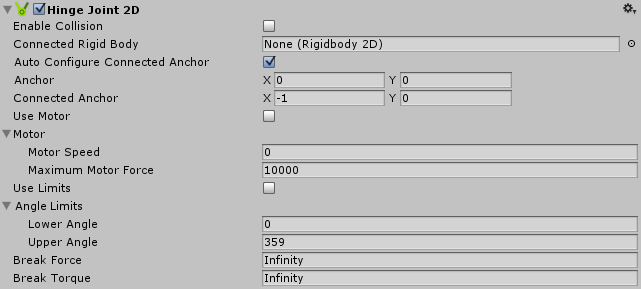

#2D 铰链关节 (Hinge Joint 2D)

__2D 铰链关节__组件允许由 2D 刚体物理组件控制的游戏对象连接到空间中的一个点，使游戏对象可围绕该点旋转。可以让旋转被动发生（例如，对碰撞做出反应），也可通过 2D 关节本身提供的电机扭矩来主动为旋转提供动力。此外，还可以设置限制来防止铰链完全旋转或进行多次旋转。

##属性

 

|**_属性：_** |**_功能：_** |
|:---|:---|
|__Enable Collision__ |选中此框可允许两个连接的游戏对象之间发生碰撞。|
|__Connected Rigid Body__ |指定此 2D 铰链关节连接到的另一个游戏对象。如果将此属性保留为 __None__，2D 铰链关节的另一端将固定到空间中由 __Connected Anchor__ 设置所定义的点。选择字段右侧的圆圈可查看要连接到的游戏对象的列表。|
|__Auto Configure Connected Anchor__ | 选中此框可为该 2D 铰链关节连接到的另一个游戏对象自动设置锚点位置。如果选中此框，则无需填写 __Connected Anchor__ 字段。 |    
|__Anchor__ |定义 2D 摩擦关节的端点连接到此游戏对象的位置（以 __2D 刚体__上的 x、y 坐标表示）。 |
|__Connected Anchor__ |定义 2D 摩擦关节的端点连接到另一游戏对象的位置（以 __2D 刚体__上的 x、y 坐标表示）。 |
|__Motor__|此属性用于更改电机设置。|
|__Use Motor__ |选中此框可启用铰链电机。 |
|__Motor Speed__ |设置目标电机速度（度/秒）。 |
|__Maximum Motor Force__ |设置在尝试达到目标速度时电机可以施加的最大扭矩（或旋转）。 |
|__Use Limits__ |选中此框可限制旋转角度 |
|__Angle Limits__ | 如果已启用 __Use Limits__，则可使用这些设置来设定限制。 |
|__Lower Angle__ |设置此限制允许的旋转弧的下限。 |
|__Upper Angle__ |设置此限制允许的旋转弧的上限。 |
|__Break Force__ |指定破坏并进而删除关节所需的线性（或直线）力水平。__Infinity__ 表示关节牢不可破。 |
|__Break Torque__ |指定破坏并进而删除关节所需的角度（或旋转）水平。__Infinity__ 表示关节牢不可破。 |

##注意

2D 铰链关节的名称让人联想到门铰链。此关节既可以用作门铰链，也可以用作围绕特定点旋转的任何对象，例如：机器零件、动轮和钟摆。

可以使用此关节来让两个点重叠。这两个点可以是两个 __2D 刚体__组件，或一个 __2D 刚体__组件和世界中的一个固定位置。将 __Connected Rigid Body__ 设置为 None，即可将 2D 铰链关节连接到世界中的固定位置。此关节对两个连接的 2D 刚体游戏对象施加线性力。

2D 铰链关节具有可开启和关闭的模拟旋转电机。设置 __Maximum Motor Speed__ 和 __Maximum Motor Force__ 可以控制角速度 (__Torque__) 并使两个 2D 刚体游戏对象相对于彼此进行弧形旋转。可使用 __Lower Angle__ 和 __Upper Angle__ 来设置弧度限制。

###约束

2D 铰链关节同时有三个约束。所有约束均为可选约束：

* 将两个 2D 刚体游戏对象上的两个锚点之间的相对线性距离保持为零。
* 保持两个 2D 刚体游戏对象上的两个锚点之间的角速度（受到 __Maximum Motor Force __ 中的最大扭矩所限制）。
* 将角度保持在指定弧度内。

使用此关节构建的物理游戏对象就好像是通过旋转枢轴相连一样。例如：

* 一个将水平部分连接到底部的跷跷板枢轴。使用此关节的 __Angle Limits__ 可以模拟跷跷板运动的最高点和最低点。
* 一把通过铰链枢轴进行连接的剪刀。使用此关节的 __Angle Limits__ 可以模拟剪刀的闭合和最大张开角度。
* 一个连接到汽车车身的简单车轮（通过枢轴将车轮中心连接到汽车上）。在此示例中，可以使用 2D 铰链关节的电机来旋转车轮。

请参阅 [2D 关节](Joints2D.html)中的*详情和提示*以了解所有 2D 关节的有用背景信息。
