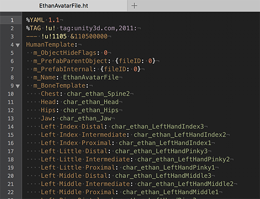
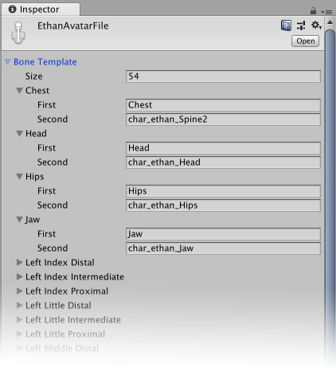

# Human Template 窗口

__人体模板 (Human Template)__ 文件 (`*.ht`) 以 YAML 格式存储[保存在 Avatar 窗口中](class-Avatar.html#HumanTemplate)的模型的人形骨骼映射：

__Human Template__ 窗口将人体模板文件的内容显示为标准 Unity 文本框。

每个分组代表 YAML 文件中的一个条目，其中骨骼映射目标的名称标记为 __First__，而模型文件中的骨骼名称标记为 __Second__。

可以使用此属性编辑该文件中的大部分值，但 Unity 会立即更新对文件执行的所有更改。不过，可以在此窗口处于活动状态时撤消任何更改。

---

*  2018-04-25  Page amended with limited [editorial review](DocumentationEditorialReview.html)

