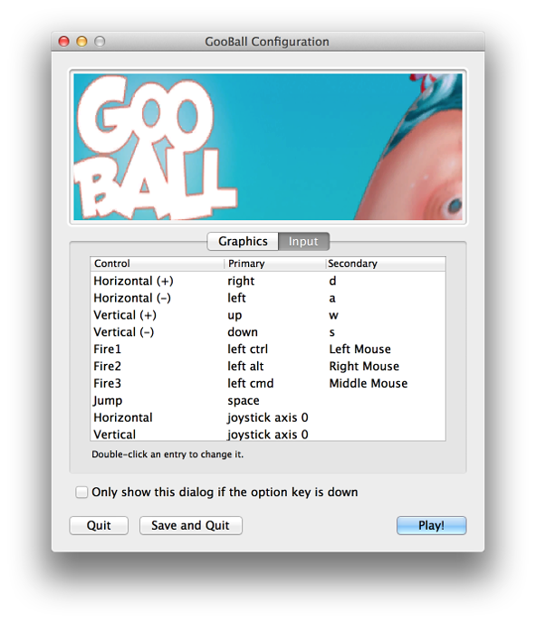

#Input Manager

在 __Input Manager__ 中可以定义项目的所有不同输入轴和游戏操作。

要查看 Input Manager，请选择：__Edit &gt; Project Settings &gt; Input__。

##属性

|**_属性：_** |**_功能：_** |
|:---|:---|
|__Axes__ |包含当前项目所有已定义的输入轴：__Size__ 是此项目中不同输入轴的数量，__Element 0, 1, ...__ 是要修改的特定轴。 |
|__Name__ |指代游戏启动器中的轴并通过脚本引用的字符串。 |
|__Descriptive Name__ |游戏启动器中显示的 __Positive Button__ 功能的详细定义。 |
|__Descriptive Negative Name__ |游戏启动器中显示的 __Negative Button__ 功能的详细定义。 |
|__Negative Button__ |向轴发送负值的按钮。 |
|__Positive Button__ |向轴发送正值的按钮。 |
|__Alt Negative Button__ |向轴发送负值的辅助按钮。 |
|__Alt Positive Button__ |向轴发送正值的辅助按钮。 |
|__Gravity__ |输入重新居中的速度。仅当 __Type__ 为 __key / mouse button__ 时使用。 |
|__Dead__ |任何小于此数字的正值或负值都将视为零。适用于游戏杆。 |
|__Sensitivity__ |对于键盘输入，值越大，响应越快。较低的值将更加平滑。对于鼠标增量，该值将缩放实际鼠标增量。 |
|__Snap__ |如果启用，则在接收相反输入后，轴值将立即重置为零。仅当 __Type__ 为 __key / mouse button__ 时使用。 |
|__Invert__ |如果启用，正值按钮将向轴发送负值，反之亦然。 |
|__Type__ |对于任何类型的按钮，使用__Key / Mouse Button__；对于鼠标增量和滚轮，使用 Mouse Movement；对于模拟游戏杆轴，使用 __Joystick Axis__；对于用户晃动窗口时的情况，使用 __Window Movement__。 |
|__Axis__ |来自设备（游戏杆、鼠标，游戏手柄等）的输入轴 |
|__Joy Num__ |应该使用哪个游戏杆。默认情况下，此选项设置为从所有游戏杆检索输入。这仅用于输入轴而不是按钮。 |

##详细信息

在 Input Manager 中设置的所有轴都有两个用途：

* 允许在脚本中按轴名称引用输入
* 允许游戏玩家根据自己的喜好自定义控制方式

所有已定义的轴将在游戏启动器中呈现给玩家，他们将在其中看到其名称、详细说明和默认按钮。在此处，他们可以选择更改轴中定义的任何按钮。因此，最好使用轴（而不是单个按钮）来编写脚本，因为玩家可能希望自定义游戏按钮。

另请参阅：[输入](Input.html)。
