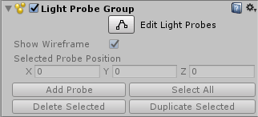
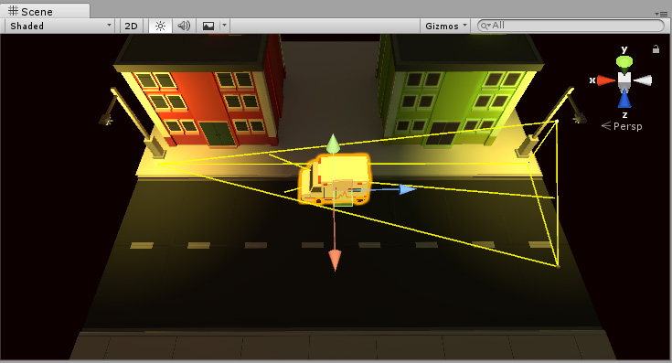

# 放置光照探针

要将光照探针置于场景中，必须使用已附加__光照探针组 (Light Probe Group)__ 组件的游戏对象。可从菜单 __Component > Rendering > Light Probe Group__ 添加“光照探针组”组件。

可将“光照探针组”组件添加到场景中的任何对象，但最好将其添加到新的空游戏对象。

光照探针组有自己的__编辑模式 (Edit Mode)__，可开启或关闭此模式。要添加、移动或删除光照探针，必须按 __Edit Light Probes__ 按钮来开启光照探针组的编辑模式：

使用编辑光照探针 (Edit Light Probes) 模式时，可按照与游戏对象类似的方式来操作单个光照探针，但是单个探针不是游戏对象，它们作为一组点存储在“光照探针组”组件中。

开始编辑新的光照探针组时，将从一个立方体中排列的八个探针的默认编队开始，如下所示：

现在可以使用光照探针组 (Light Probe Group) 检视面板中的控件向该组添加新的探针位置。探针在场景中显示为黄色球体，这些球体可按照与游戏对象相同的方式定位。还可以使用常规的“复制”键盘快捷键 (ctrl+d/cmd+d) 来选择和复制单个探针或按组进行这些操作。

完成探针的编辑后，__关闭__光照探针组编辑模式，否则无法移动或操作常规对象！

## 选择光照探针位置

与通常在对象表面具有连续分辨率的光照贴图不同，光照探针信息的分辨率完全由放置探针的紧密程度决定。

为了优化光照探针存储的数据量以及游戏在进行时完成的计算量，通常应尝试尽可能少量放置光照探针。但是，在可以接受的范围内，建议放置足够多的探针记录一个空间到另一空间的光线变化。这意味着，在具有复杂或高对比度光线的区域周围可提高光照探针的放置密度，而在光线没有显著变化的区域可降低它们的放置密度。

在以上示例中，建筑物附近和之间的对比度和颜色变化较大，因此探针放置得较密集，而沿着道路的光照没有显著变化，因此放置密度较小。

定位探针的最简单方法是将它们排列成常规 3D 网格图案。虽然此设置简单有效，但可能会消耗不必要的内存，并可能有大量冗余的探针。例如，在以上场景中，如果沿着道路放置大量探针，将会浪费资源。光照沿着道路的长度不会发生太大变化，因此许多探针将大多数相同的光照数据存储到相邻探针中。在此类情况下，通过在稀疏探针之间插入此光照数据，效率会高得多。

光照探针不会单独存储大量信息。从技术角度来看，每个探针都是来自采样点的球形全景 HDR 图像，使用存储为 27 个浮点值的球谐函数 L2 进行编码。然而，在具有数百个探针的大型场景中，这些探针可以累加，而设置密集度过高的探针可能导致游戏中大量内存浪费。

## 创建体积

即使游戏位于 2D 平面上（例如，在路面上行驶的汽车），光照探针也必须形成 3D 体积。

这意味着探针组中至少应有两个垂直“层”的点。

在以下示例中，在左侧看到探针仅排列在地面上。因为光照探针系统无法从探针计算明显的四面体体积，所以这种排列方式__不会产生良好光照__。

在右侧，探针排列为两层，一些低至地面，另一些高于地面，因此它们一起形成由大量单个四面体组成的一个 3D 体积。这是一种__良好__的布局。

## 放置光照探针以实现动态 GI

Unity 的实时 GI 允许移动光源针对__静态__景物投射动态反射光。但是，使用光照探针时，还可从__移动游戏对象__上的移动光源接收动态反射光。

因此，光照探针执行两个非常相似但不同的功能：它们存储静态烘焙光源，并在运行时代表动态实时全局光照（GI 或反射光）的采样点来影响移动对象上的光照。

所以，如果要使用动态移动光源，并希望移动游戏对象上有实时反射光，这可能会影响放置光照探针的位置以及将它们分组的密集程度。

在这种情况下要考虑的要点是，对于大面积范围内相对不变的*静态光源*，因为光照不会在大面积范围内变化，只需放置少数几个探针。但是，如果计划在此区域内使用*移动光源*，并且希望移动对象用来接收反射光，则需要在该区域内建立更密集的光照探针网络，以便有足够高的准确度来匹配光源的范围和样式。

放置探针需要的密集程度因光源的大小和范围、其移动速度以及希望接收反射光的移动对象的大小而异。

## 光照探针放置问题

对光照探针位置的选择必须考虑到光照将在探针组之间进行插值的情况。如果探针不能充分适应场景中光照的变化，可能会出现问题。

以下示例显示了一个夜间场景，两侧有两个明亮街灯，中间有一个暗区。如果光照探针仅放置在街灯附近，而在暗区中没有放置，则街灯的光照将跨越黑暗间隙“渗透”到移动对象上。这是因为光照会从一个亮点插入到另一亮点，而没有关于暗区的信息。

如果使用实时或混合光源，此问题可能不太明显，因为只有_间接_光才会跨越间隙渗透。如果使用完全烘焙光源，问题会更明显，因为此情况下也会从光照探针插入移动对象上的直射光。在此示例场景中会烘焙两个街灯，因此移动对象从光照探针获得直射光。在下图中，可看到结果：一个移动对象（救护车）在穿过暗区时仍然获得明亮光照，这不是想要的效果。黄色线框四面体显示出，插值发生在街道明亮光照的一端与另一端之间。

 

这是不想要的效果：救护车在穿过暗区时仍然获得明亮光照，因为在暗区中没有放置光照探针。

要解决此问题，应该在暗区中放置更多探针，如下所示：

 

现在场景的暗区中也有了探针。因此，移动的救护车从场景的一侧移动到另一侧时，救护车上的光照更暗。

 

现在，救护车在场景中心时，车上的光照更暗，这符合要求。

---

*  2017-06-08  Page published with no [editorial review](DocumentationEditorialReview.html)

* 在 5.6 版更新了光照探针
