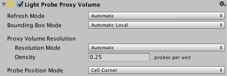
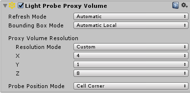
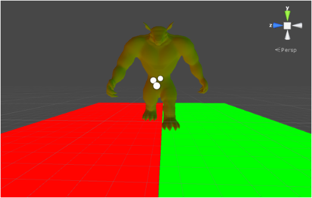

#光照探针代理体 (Light Probe Proxy Volume) 组件

 

__光照探针代理体__ (LPPV) 组件允许不能使用烘焙光照贴图的大型动态游戏对象（例如，大型粒子系统或蒙皮网格）使用更多光照信息。

默认情况下，探针光照渲染器从插入于场景内周围光照探针之间的单个[光照探针](LightProbes.html)接受光照。因此，游戏对象在整个表面上具有恒定的环境光照。此光照使用球谐函数，因此具有旋转渐变，但没有空间渐变。在更大的游戏对象或粒子系统上，这一点更明显。游戏对象上的光照与锚点处的光照相匹配，如果游戏对象跨越光照渐变，游戏对象的某些部分可能看起来不正确。

__光照探针代理体__组件在包围体内生成插值光照探针的 3D 网格。可以在该组件的 UI 中指定此网格的分辨率。插值光照探针的球谐函数 (SH) 系数将上传到 3D 纹理中。随后在渲染时会对包含 SH 系数的 3D 纹理进行采样以便计算对漫射环境光照的影响。这会向探针光照游戏对象添加空间渐变。

[标准着色器](shader-StandardShader.html)支持此功能。为了将此功能添加到自定义着色器，请使用 `ShadeSHPerPixel` 函数。要了解如何实现此函数，请参阅本页底部的[粒子系统示例着色器](#SampleShader)代码示例。

##何时使用该组件

Unity 中的大多数渲染器组件都包含光照探针。光照探针有三个选项：

* __Off__：渲染器不使用任何插值光照探针。

* __Blend Probes__（默认值）：渲染器使用一个插值光照探针。

* __Use Proxy Volume__：渲染器使用插值光照探针的 3D 网格。

将 __Light Probes__ 属性设置为 __Use Proxy Volume__ 时，游戏对象必须已连接__光照探针代理体__ (LPPV) 组件。可以在同一游戏对象上添加 LPPV 组件，也可通过 __Proxy Volume Override__ 属性使用（借用）来自另一个游戏对象的 LPPV 组件。如果 Unity 无法在当前游戏对象或 Proxy Volume Override 游戏对象中找到 LPPV 组件，则会在渲染器的底部显示一条警告消息。

 

###示例


在以上场景中，地板上有两个平面使用发出大量光线的材质。请注意：

* 使用 LPPV 组件时，环境光会在几何体上发生变化。应使用一个插值光照探针在几何体的每一侧创建一个恒定颜色。

* 几何体没有使用静态光照贴图，球体表示插值光照探针。它们是 __Gizmo Renderer__ 的一部分。

###如何使用该组件

生成插值光照探针 3D 网格的区域受 __Bounding Box Mode__ 属性的影响。

 

有三个可用选项：

| **Bounding Box Mode：**| **功能：** |
|:---|:---|
| __Automatic Local__（默认值）| 此模式下将计算局部空间包围盒。在此包围盒内生成插值光照探针位置。如果渲染器组件未附加到游戏对象，则会生成默认包围盒。包围盒计算围绕当前渲染器进行，并将沿着层级视图往下的所有渲染器的 __Light Probes__ 属性设置为 __Use Proxy Volume__。 |
| __Automatic World__ | 此模式下围绕当前渲染器计算包围盒，且沿着层级视图往下的所有渲染器的 __Light Probes__ 属性均设置为 __Use Proxy Volume__。该包围盒采用世界空间。 |
| __Custom__ | 此模式下使用自定义包围盒。在游戏对象的局部空间中指定包围盒。提供了包围盒编辑工具。可以修改 UI 中的 __Size__ 和 __Origin__ 值来手动编辑包围体。 |


 

__Automatic Local__ 与 __Automatic World__ 之间的主要区别在于，在 __Automatic Local__ 中，大型层级视图中的游戏对象使用来自父游戏对象的相同 LPPV 组件时，包围盒的计算需要耗费更多资源。然而，生成的包围盒大小可能更小，这意味着光照数据更紧凑。

包围体内的插值光照探针的数量受 __Proxy Volume Resolution__ 属性的影响。有两个选项：

* __Automatic__（默认值）- 使用指定的单位面积的插值光照探针数量以及包围盒大小来计算每个轴上的分辨率。

* __Custom__ - 允许在每个轴上指定不同分辨率（见下文）。

 

**注意：**每个轴上的最终分辨率必须是 2 的幂，并且分辨率的最大值为 32。

__Probe Position Mode__ 指定插值光照探针相对于单元格中心的位置。在某些插值光照探针穿过墙壁或其他几何体并导致光照泄漏时，此选项可能很有用。以下示例使用 4x4 网格分辨率来显示 2D 视图中的 __Cell Corner__ 与 __Cell Center__ 之间的区别：

 


##比较图像

1.使用标准着色器的简单网格渲染器：

    

    

2.使用标准着色器的带蒙皮的网格渲染器：

    

    

<a name="SampleShader"></a> 
	
##使用 ShadeSHPerPixel 函数的粒子系统示例着色器

````
Shader "Particles/AdditiveLPPV" {
Properties {
    _MainTex ("Particle Texture", 2D) = "white" {}
    _TintColor ("Tint Color", Color) = (0.5,0.5,0.5,0.5)
}

Category {
    Tags { "Queue"="Transparent" "IgnoreProjector"="True" "RenderType"="Transparent" }
    Blend SrcAlpha One
    ColorMask RGB
    Cull Off Lighting Off ZWrite Off
    
    SubShader {
        Pass {
        
            CGPROGRAM
            #pragma vertex vert
            #pragma fragment frag
            #pragma multi_compile_particles
            #pragma multi_compile_fog

            // 指定目标
            #pragma target 3.0
            
            #include "UnityCG.cginc"
            
            // 必须包含此头才能访问 ShadeSHPerPixel
            #include "UnityStandardUtils.cginc"
                        
            fixed4 _TintColor;
            sampler2D _MainTex;
            
            struct appdata_t {
                float4 vertex : POSITION;
                float3 normal : NORMAL;
                fixed4 color : COLOR;
                float2 texcoord : TEXCOORD0;                
            };

            struct v2f {
                float4 vertex : SV_POSITION;
                fixed4 color : COLOR;
                float2 texcoord : TEXCOORD0;
                UNITY_FOG_COORDS(1)
                float3 worldPos : TEXCOORD2;
                float3 worldNormal : TEXCOORD3;
            };
            
            float4 _MainTex_ST;

            v2f vert (appdata_t v)
            {
                v2f o;
                o.vertex = UnityObjectToClipPos(v.vertex);
                o.worldNormal = UnityObjectToWorldNormal(v.normal);
                o.worldPos = mul(unity_ObjectToWorld, v.vertex).xyz;
                o.color = v.color;
                o.texcoord = TRANSFORM_TEX(v.texcoord,_MainTex);
                UNITY_TRANSFER_FOG(o,o.vertex);
                return o;
            }
            
            fixed4 frag (v2f i) : SV_Target
            {           
                half3 currentAmbient = half3(0, 0, 0);
                half3 ambient = ShadeSHPerPixel(i.worldNormal, currentAmbient, i.worldPos);
                fixed4 col = _TintColor * i.color * tex2D(_MainTex, i.texcoord);
                col.xyz += ambient;
                UNITY_APPLY_FOG_COLOR(i.fogCoord, col, fixed4(0,0,0,0)); // 根据混合模式，雾效变为黑色
                return col;
            }
            ENDCG 
        }
    }   
}
}

````

##硬件要求

该组件至少需要 Shader Model 4 图形硬件和 API 支持，包括对具有 32 位浮点格式和线性过滤的 3D 纹理的支持。

要正常工作，场景需要通过__光照探针组__组件来包含光照探针。如果未满足要求，则渲染器或光照探针代理体组件检视面板将显示一条警告消息。
