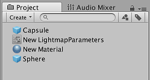
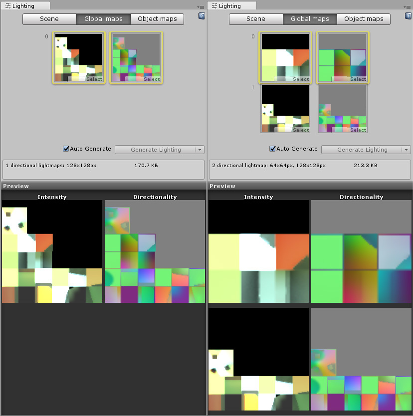
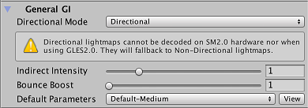

# 光照贴图参数

光照贴图参数资源存储了一组用于控制 Unity [全局光照](GIIntro.html) (GI) 功能的参数值。这些资源允许定义和保存不同的光照值集合，以便用于不同的情况。

要创建新的光照贴图参数资源，请在 Project 窗口中右键单击，然后选择 __Create__ &gt; __New Parameters Asset__。Unity 将此资源存储在 Project 文件夹中。

光照贴图参数资源可以用来为不同类型的游戏对象或为不同平台和不同场景类型（例如，室内或室外场景）创建优化的预设。

在 Project 窗口中单击某个光照贴图参数资源时，Inspector 窗口将显示该资源中定义的值。下表中列出了参数及其描述。

 

## Precomputed Realtime GI

| __属性__| __功能__ | 
|:---|:---|
| __Resolution__| 该值在 Lighting 窗口的 Scene 选项卡中缩放 __Realtime Resolution__ 值（菜单：__Window__ &gt; __Lighting__ &gt; __Scene__）以提供光照贴图的最终分辨率（纹理像素/距离单位）。 | 
| __Cluster Resolution__| 聚类分辨率（内部计算光反射的分辨率）与最终光照贴图分辨率的比率。请参阅有关 [Scene 视图中的 GI 可视化](GIVis.html)的文档以了解更多信息。 | 
| __Irradiance Budget__| 此值确定用于照射光照贴图中每个纹理像素的入射光数据的精度。从纹理像素的位置对场景的“视图”采样来获得每个纹理像素的光照。较低的辐照度预算值会导致样本更模糊。值越高，样本的清晰度越高。较高的辐照度预算会改善光照，但这会增大运行时内存使用量并可能增大 CPU 使用率。 | 
| __Irradiance Quality__| 使用滑动条来定义投射的射线数量，并计算影响给定输出光照贴图纹理像素的集合。较高的值可在光照贴图中实现视觉改善，但会增加 Unity Editor 中的预计算时间。该值不会影响运行时性能。 | 
| __Modelling Tolerance__| 此值控制网格几何体中允许光线通过的间隙的最小大小。降低此值可允许光线穿过环境中更小的间隙。 | 
| __Edge Stitching__| 如果启用此属性，则表示光照贴图中的 UV 图表应无缝连接在一起，从而避免不必要的视觉瑕疵。 | 
| __Is Transparent__| 如果启用此属性，在全局光照计算期间，对象显示将为透明。背面对这些计算没有影响，光线将穿过表面。这可用于不可见的发光表面。 | 
| __System Tag__| 光照贴图纹理组合在同一个光照贴图图集内的一组对象称为“系统”。如果无法将所有对象放入单个图集中，Unity Editor 会自动定义其他系统及其附带的图集。但是，有时自己定义单独的系统会非常有用（例如，确保不同房间内的对象分组到每个房间的一个系统中）。更改 __System Tag__ 号可强制创建新的系统和光照贴图。标签的确切数字序列值不重要。 | 

## Baked GI

| __属性__| __功能__ |  |
|:---|:---|:---| 
| | __Enlighten__ | __渐进光照贴图 (Progressive Lightmapper)__ |
| __Blur Radius__| 后期处理过程中应用于直接光照的模糊过滤器的半径（单位：纹理像素）。此半径基本上是相邻纹理像素的平均距离。半径越大，效果越模糊。较高的模糊度往往会减少视觉瑕疵，但也会软化阴影的边缘。 | 使用渐进光照贴图时，__Blur Radius__ 不可用。 |
| __Anti-aliasing Samples__| 应用的抗锯齿程度（减少“块状”瑕疵）。数字越大，质量越高且烘焙时间越长。 | 对纹理像素进行超级采样以减少锯齿的次数。采样次数为 [1;3] 将禁用超级采样，采样次数为 [4;8] 将提供 2x 超级采样，而采样次数为 [9;256] 提供 4x 超级采样。此设置主要影响用于位置和法线缓冲区的内存量（2x 使用 4 倍的内存量，4x 使用 16 倍的内存量）。 |
| __Direct Light Quality__| 用于评估直接光照的光线数量。较高数量的光线往往会产生更准确的柔和阴影，但会增加烘焙时间。 | 使用渐进光照贴图时，__Direct Light Quality__ 不可用。 |
| __Backface Tolerance__| 网格的结构有时会导致某些纹理像素含有背面带有几何体的“视图”。来自背面的入射光在任何场景中都无意义。因此，此属性用于选择有多少光量（百分比阈值）来自正面几何体才能将纹理像素视为有效。无效纹理像素的光照值通过相邻纹理像素的值估算得出。降低此值可以解决由背面入射光引起的光照问题。 | 必须照射到正面才会被视为可用的输出纹理像素发射光线的百分比。如果从纹理像素投射的太多光线照射到背面（纹理像素在某个几何体内），纹理像素无效处理。这种情况下通过从周围纹理像素克隆有效值来避免瑕疵。例如，如果 Backface Tolerance 为 0.0，则仅在纹理像素只能看到背面的情况下才会拒绝该纹理像素。如果此设置为 1.0，即使射线原点有一条射线照射到背面，也会拒绝该原点。在“Baked Texel Validity”Scene 视图模式中，一个箱子可看到有效（绿色）和无效（红色）纹理像素。如果场景中有单面网格，可能需要通过将值设置为零来禁用此功能。稍后将在 Editor 中添加双面标志以解决此问题。 |
| __Baked Tag__| 与上文的 __System Tag__ 属性相似，此数字表示单独的烘焙光照贴图将特定对象集组合在一起。与 System Tag 一样，确切的数值并不重要。具有不同 Baked Tag 值的对象绝不会放在同一图集中；但是，也无法保证具有相同标签的对象最终处于同一图集中，因为这些对象可能不一定适合放入同一个光照贴图（有关此情况的示例，请参阅以下的图像 A）。使用多场景烘焙 API 时不必设置此项，因为分组是自动完成的（使用 __Baked Tag__ 来复制 __Lock Atlas__ 选项的某些行为）。请参阅下文的[烘焙标签 (Baked Tags)：详细信息](#BakedTags)以了解更多信息。 ||
| __Pushoff__| 开始在建模单元中跟踪射线之前从表面几何体推离的距离。此属性适用于所有烘焙光照贴图，因此会影响直射光、间接光和 AO。__Pushoff__ 可用于摆脱不必要的 AO 或阴影。使用此设置可解决对象表面自身阴影遮挡问题，该问题会导致斑点阴影图案出现在表面上而找不到明显来源。也可以使用此设置去除巨型对象上不必要的瑕疵（这种情况下的浮点精度不够高，无法准确地对精细细节进行射线追踪）。 | 在建模单元中沿着射线追踪的法线将射线原点从几何体推离的量。此属性适用于所有烘焙光照贴图，因此会影响直射光、间接光和环境光遮挡。可用于摆脱不必要的遮挡/阴影。 |

 

### 烘焙标签 (Baked Tags)：详细信息

 

上图显示同一场景的两个视图：

1.__左：__一切都在一个图集内，因为所有的游戏对象都有相同的__烘焙标签__。

2.__右：__向一个游戏对象分配了其他__烘焙标签__，并强制其进入第二个光照贴图。

## Baked AO

| __属性__| __功能__ |
|:---|:---|
| __Quality__| 评估环境光遮挡 (AO) 时投射的射线数量。射线数量越多，AO 质量越高，但烘焙时间也越长。|
| __Anti-aliasing Samples__| 进行 AO 抗锯齿时要采集的样本数。样本数量越多，AO 质量越高，但烘焙时间也越长。|

## General GI

| __属性__| __功能__ |
|:---|:---|
| __Backface Tolerance__| 必须照射到光照系统正面才会被视为可用的输出纹理像素发射光线的百分比。如果从纹理像素投射的太多光线照射到背面（例如，如果纹理像素在某个几何体内），此设置允许 Unity 让纹理像素无效。光照系统从周围纹理像素克隆有效值来避免意外的瑕疵。  如果 __Backface Tolerance__ 设置为 0.0，则光照系统仅在纹理像素只能看到背面的情况下才会拒绝该纹理像素。如果此设置为 1.0，即使射线原点有一条射线照射到背面，光照系统也会拒绝该原点。 |

## 分配光照贴图参数资源

### 场景

要将光照贴图参数资源分配到整个场景，请打开 [Lighting 窗口](GlobalIllumination.html) (__Window__ &gt; __Lighting__)，单击 __Scene__ 选项卡，然后导航到 __General GI__ 设置。

 

使用 __Default Parameters__ 下拉选单来分配默认的光照贴图参数资源。此下拉选单会列出所有可用的光照贴图参数资源。

 

### 游戏对象

要将光照贴图参数资源分配给单个游戏对象，请确保游戏对象已附加网格渲染器 (Mesh Renderer) 或地形 (Terrain) 组件。

 

要将光照贴图参数资源分配给网格渲染器，请勾选该组件的 __Lightmap Static__ 复选框，然后从 __Lightmap Settings__ 下的 __Lightmap Parameters __ 中选择一个选项。选择 __Scene Default Parameter__ 即可使用分配给整个场景的同一光照贴图参数资源。

 

要将光照贴图参数资源分配给地形，请勾选该地形的 __Lightmap Static__ 复选框，然后从 __Advanced Parameters__ 中选择一个选项。选择 __Scene Default Parameters__ 即可使用分配给整个场景的同一光照贴图参数资源。

---

 2018-03-28  Page amended with limited [editorial review](DocumentationEditorialReview.html)

在 [2018.1](https://docs.unity3d.com/2018.1/Documentation/Manual/30_search.html?q=newin20181) 版中添加了渐进光照贴图 NewIn20181
