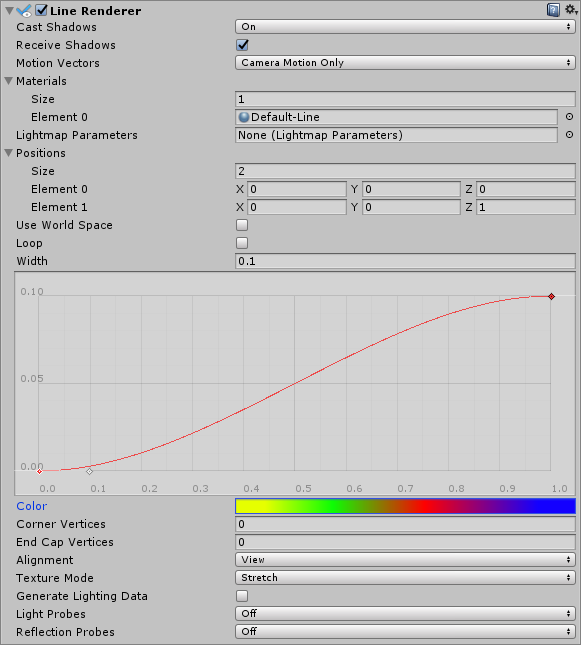

#线渲染器 (Line Renderer)

__线渲染器 (Line Renderer)__ 组件采用 3D 空间中两个或多个点的数组，在每个点之间绘制一条直线。因此，单个线渲染器组件可用于绘制从简单直线到复杂螺旋线的任何线条。这条线始终是连续的；如果需要绘制两条或更多完全独立的线，则应使用多个游戏对象，每个游戏对象都要有自己的线渲染器。

线渲染器不渲染一个像素宽的线。此渲染器将渲染宽度采用世界单位且可纹理化的公告牌线（总是面向摄像机的多边形）。线渲染器使用与[轨迹渲染器 (Trail Renderer)](class-TrailRenderer.html) 相同的线渲染算法。

 

##属性

|**_属性_** |**_功能_** |
|:---|:---|
|__Cast Shadows__ |确定线是否投射阴影，是应从线的一侧还是两侧投射阴影，或线是否应仅投射阴影而不以其他方式进行绘制。请参阅脚本 API 参考文档中的 [Renderer.shadowCastingMode](../ScriptReference/Renderer-shadowCastingMode.html) 以了解更多信息。 |
|__Receive Shadows__ |如果启用此属性，线将接受阴影。 |
|__Motion Vectors__ |选择要用于此线渲染器的运动矢量 (Motion Vector) 类型。请参阅脚本 API 参考文档中的 [Renderer.motionVectorGenerationMode](../ScriptReference/Renderer-motionVectorGenerationMode.html) 以了解更多信息。 |
|__Materials__ |这些属性描述了用于渲染线的材质数组。对于数组中的每种材质，该线将被绘制一次。 |
|__Light Parameters__ |Reference a [Lightmap Parameters](class-LightmapParameters.html) Asset here to enable the line to interact with the global illumination system.|
|__Positions__ |这些属性描述了要连接的 Vector3 点数组。 |
|__Use World Space__ |如果启用此属性，这些点将视为世界空间坐标，而不受此组件附加到的游戏对象的变换所影响。 |
|__Loop__ |启用此属性可连接线的第一个和最后一个位置。这样会形成闭环。 |
|__Width__ |定义宽度值和曲线以控制线在其开始和结束之间的各个点处的宽度。曲线仅在每个顶点处采样，因此其精度受到线中存在的顶点数量的限制。线的总宽度由宽度值控制。 |
|__Color__ |定义一个渐变来控制线沿其长度的颜色。 |
|__Corner Vertices__ |此属性指示在绘制线中的角时使用多少个额外顶点。增加此值可使线的角显得更圆。 |
|__End Cap Vertices__ |此属性指示使用多少个额外顶点在线上创建端盖。增加此值可使线的端盖显得更圆。 |
|__Alignment__ |设置为 __View__ 可使线面向摄像机，或设置为 __Local__ 根据线的变换组件的方向对齐。 |
|__Texture Mode__ |控制如何将纹理应用于线。使用 __Stretch__ 可沿着线的整个长度应用纹理贴图，或使用 __Wrap__ 使纹理沿着线的长度重复。应使用材质 (Material) 中的 Tiling 参数来控制重复率。 |
| __Generate Lighting Data__| 如果启用此属性（选中复选框），则在构建线几何体时包含法线和切线。这样允许它使用具有场景光照的材质，例如通过标准着色器，或通过使用自定义着色器。 |
|__Light Probes__ |基于探针的光照插值模式。|
|__Reflection Probes__ |如果启用此属性，并且场景中存在反射探针，则会为此线渲染器拾取反射纹理，并将此纹理设置为内置的着色器 uniform 变量。|

##详细信息

要创建线渲染器，请执行以下操作：

1.在 Unity 菜单栏中，选择 __GameObject__ > __Create Empty__
1.在 Unity 菜单栏中，选择 __Component__ > __Effects__ > __Line Renderer__
1.将纹理或材质拖到线渲染器上。如果在材质中使用粒子着色器，则效果最佳。

##提示

* 线渲染器对于需要在一帧中布置所有顶点的效果非常有用。
* 移动摄像机时，线可能会随之旋转。这是 __Alignment__ 设置为 __View__ 时的预期效果。将 __Alignment__ 设置为 __Local__ 即可禁用此功能。
* 线渲染器应该是游戏对象上的唯一渲染器。
* Unity 在每个顶点处从颜色渐变 (Color Gradient) 中采样颜色。在每个顶点之间，Unity 对颜色应用线性插值。向线渲染器添加更多顶点可能会更接近详细的颜色渐变。

##线渲染器示例设置

 

  

---------
*  2017-05-31  Page amended with [editorial review](DocumentationEditorialReview.html)

* 在 Unity [2017.1](../Manual/30_search.html?q=newin20171) 中添加了一些属性 NewIn20171

