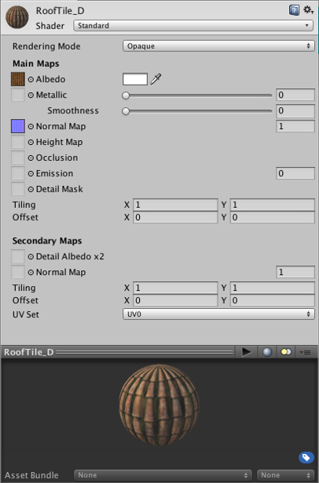

#材质

材质与 Unity 中的[网格渲染器](class-MeshRenderer.html)、[粒子系统](class-ParticleSystem.html)和其他渲染组件结合使用。材质对于定义对象的显示方式起着至关重要的作用。

##属性

材质检视面板显示的属性由材质使用的__着色器__确定。着色器是一种特殊类型的图形程序，用于确定如何组合纹理和光照信息以生成屏幕上渲染对象的像素。请参阅有关[着色器](Shaders.html)的手册部分以深入了解如何在 Unity 项目中使用它们。
