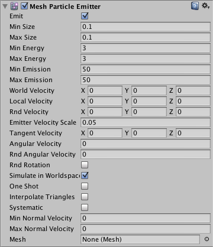
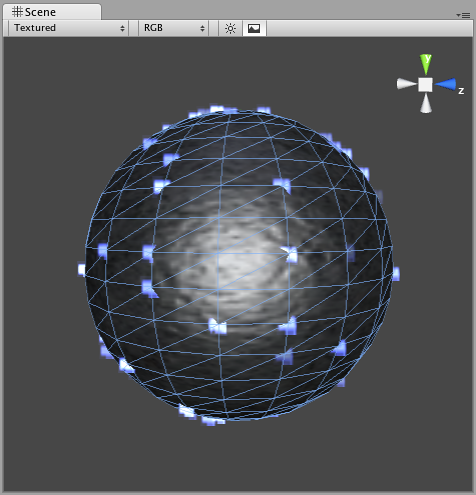
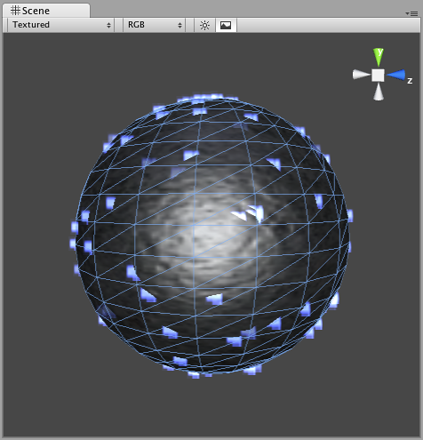
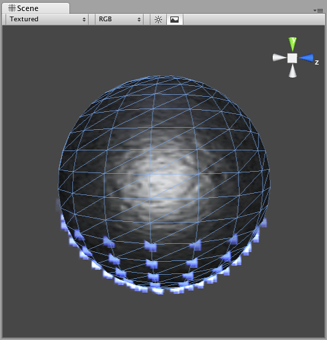

#网格粒子发射器 (Mesh Particle Emitter)（旧版）

__网格粒子发射器 (Mesh Particle Emitter)__ 在网格周围发射粒子。粒子从网格表面生成；当您想让粒子以一种复杂的方式与对象相互作用时，这可能是必要的。

 

##属性

|**_属性：_** |**_功能：_** |
|:---|:---|
|__Emit__ |如果启用此属性，发射器将发射粒子。 |
|__Min Size__ |每个粒子在生成时的最小大小。 |
|__Max Size__ |每个粒子在生成时的最大大小。 |
|__Min Energy__ |每个粒子的最短生命周期，以秒为单位。 |
|__Max Energy__ |每个粒子的最长生命周期，以秒为单位。 |
|__Min Emission__ |每秒产生的最少粒子数。 |
|__Max Emission__ |每秒产生的最多粒子数。 |
|__World Velocity__ |粒子在世界空间中沿 X、Y 和 Z 方向的起始速度。 |
|__Local Velocity__ |以对象的方向测量，粒子沿 X、Y 和 Z 方向的起始速度。 |
|__Rnd Velocity__ |为速度增加的沿 X、Y 和 Z 方向的随机速度。 |
|__Emitter Velocity Scale__ |粒子继承的发射器速度大小。 |
|__Tangent Velocity__ |在发射器的表面上，粒子沿 X、Y 和 Z 方向的起始速度。 |
|__Angular Velocity__ |新粒子的角速度，以度/秒为单位。|
|__Rnd Angular Velocity__ |新粒子的随机角速度修改器。|
|__Rnd Rotation__ |如果启用此属性，则会随机旋转生成粒子。|
|__Simulate In World Space__ |如果启用此属性，则在发射器移动时粒子不会移动。如果设置为 false（不选中），当移动发射器时，粒子会跟随它移动。 |
|__One Shot__ |如果启用此属性，则会一次性全部生成由最小和最大发射参数指定的粒子数。如果禁用此属性，则以一长串的形式生成粒子。 |
|__Interpolate Triangles__ |如果启用此属性，则会在整个网格表面上生成粒子。如果禁用此属性，则仅从网格顶点生成粒子。 |
|__Systematic__ |如果启用此属性，则按网格中定义的顶点顺序生成粒子。虽然很少能直接控制网格中的顶点顺序，但大多数 3D 建模应用程序在使用基元时都有非常系统的设置。为了让此属性发挥作用，网格不得包含面，这一点很重要。 |
|__Min Normal Velocity__ |从网格抛出的最少粒子数量。 |
|__Max Normal Velocity__ |从网格抛出的最多粒子数量。 |

##详细信息

如果希望比更简单的__椭圆粒子发射器 (Ellipsoid Particle Emitter)__ 能更精确地控制粒子的生成位置和方向，应使用网格粒子发射器 (MPE)。使用网格粒子发射器可创建高级效果。

MPE 在附着网格的顶点发射粒子。因此，多边形更密集的网格区域将发射更密集的粒子。

粒子发射器与[粒子动画器](class-ParticleAnimator.html)和[粒子渲染器](class-ParticleRenderer.html)配合使用，从而创建、操控和显示粒子系统。要确保粒子行为正确，所有这三个组件都必须存在于对象上。发射粒子时，所有不同的速度将累加在一起以产生最终速度。

###生成属性

在尝试实现不同效果时，诸如 __Size__、__Energy__、__Emission__ 和 __Velocity__ 之类的生成属性将为粒子系统赋予鲜明的个性。使用较小的 __Size__ 可以模拟天空中的萤火虫或星星。较大的 __Size__ 可以模拟布满灰尘的老建筑中的尘埃云团。

__Energy__ 和 __Emission__ 将控制粒子在屏幕上停留的时间以及可在任何时刻出现的粒子数量。例如，火箭可能需要较高的 __Emission__ 值来模拟烟雾密度，并通过较高的 __Energy__ 值模拟烟雾缓慢消散到空气中的状态。

__Velocity__ 将控制粒子的移动方式。您可能希望在脚本中更改 __Velocity__ 以获得有趣的效果，或者如果要模诸如风之类的恒定效果，请设置 X 和 Z __Velocity__ 来实现粒子被吹走的效果。

###Simulate in World Space

如果禁用此选项，则每个粒子的位置将始终相对于发射器的__位置 (Position)__ 移动。当发射器移动时，粒子将随之移动。如果启用 __Simulate in World Space__，粒子不会受到发射器移动的影响。例如，如果一个火球喷出上升的火焰，当火球越来越远时，产生的火焰将漂浮在太空中。如果禁用 __Simulate in World Space__，则同样的火焰将随着火球一起在屏幕上移动。

###Emitter Velocity Scale

仅当启用了 __Simulate in World Space__ 时，此属性才适用。

如果此属性设置为 1，则粒子将在生成时严格继承发射器的移动速度。如果设置为 2，则粒子将在生成时继承发射器的双倍移动速度。设置为 3 则为三倍移动速度，依此类推。

###One Shot

__One Shot__ 发射器将一次性创建完 __Emission__ 属性指定的所有粒子，随后便停止发射粒子。以下提供了 __One Shot__ 为__启用__或__禁用__状态时不同粒子系统用途的一些示例：

__启用__：

* 爆炸
* 水溅
* 魔法

__禁用__：

* 枪管烟雾
* 风效
* 瀑布

##Interpolate Triangles

为发射器启用 __Interpolate Triangles__ 将允许在网格的顶点之间生成粒子。默认情况下，此选项处于关闭状态，因此粒子将仅在顶点处生成。

启用此选项将在顶点处和顶点之间生成粒子，基本上在整个网格表面都会生成粒子（如下所示）。

需要重申的是，即使启用了 __Interpolate Triangles__，仍会在多边形更密集的网格区域生成更密集的粒子。

Systematic
----------

启用 __Systematic__ 会使粒子以网格的顶点顺序生成。顶点顺序由 3D 建模应用程序设置。

Normal Velocity
---------------

__Normal Velocity__ 可控制粒子从生成位置沿着法线发射的速度。

例如，创建一个网格粒子系统，使用立方体网格作为发射器，启用 __Interpolate Triangles__，并将 __Normal Velocity Min__ 和 __Max__ 设置为 1。现在，您将看到粒子从立方体的各个面以直线发射。

另请参阅
--------

* [如何创建网格粒子发射器](HOWTO-MeshParticleEmitter.html)

提示
-----

* 使用许多大型粒子时应小心。这会严重影响低端机器的性能。始终应尝试使用最少数量的粒子来达到所需效果。
* __Emit__ 属性与粒子动画器的 __AutoDestruct__ 属性结合使用。通过脚本可停止发射器的发射，然后 __AutoDestruct__ 将自动销毁粒子系统及其附加到的游戏对象。
* MPE 还可用于使放置在场景中的许多灯发光。只需在每个灯的中心创建仅有一个顶点的网格，然后在此基础上使用光环材质构建 MPE。此效果非常适合邪恶的科幻世界。
