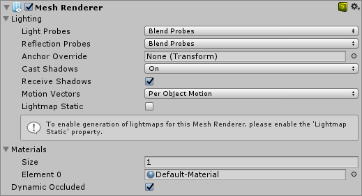

# 网格渲染器 (Mesh Renderer)

网格渲染器从[网格过滤器 (Mesh Filter)](class-MeshFilter.html)获取几何体，然后在对象的[变换](class-Transform.html)组件所定义的位置渲染该几何体。

 

在 Inspector 窗口中显示的网格渲染器 (Mesh Renderer) 游戏对象组件

## __属性__

| **属性：** | **功能：** |
|:---|:---| 
| __Light Probes__| 基于探针的光照插值模式。 |
|&nbsp;&nbsp;&nbsp;&nbsp;Off| 渲染器不使用任何插值光照探针。 |
|&nbsp;&nbsp;&nbsp;&nbsp;Blend Probes| 渲染器使用一个插值光照探针。这是默认选项。 |
|&nbsp;&nbsp;&nbsp;&nbsp;Use Proxy Volume| 渲染器使用插值光照探针的 3D 网格。 |
| __Reflection Probes__| 指定对象如何受场景中的反射影响。不能在延迟渲染模式下禁用此属性。|
|&nbsp;&nbsp;&nbsp;&nbsp;Off| 禁用反射探针，将天空盒用于反射。 |
|&nbsp;&nbsp;&nbsp;&nbsp;Blend Probes| 启用反射探针。混合仅发生在探针之间，在室内环境中非常有用。如果附近没有反射探针，则渲染器将使用默认反射，但默认反射和探针之间不会发生混合。 |
|&nbsp;&nbsp;&nbsp;&nbsp;Blend Probes and Skybox| 启用反射探针。混合发生在探针之间或探针与默认反射之间，对于室外环境非常有用。 |
|&nbsp;&nbsp;&nbsp;&nbsp;Simple| 启用反射探针，但当存在两个重叠的探针体积时，探针之间不会发生混合。 |
| __Anchor Override__| 使用[光照探针](https://docs.unity3d.com/Manual/LightProbes.html)或反射探针系统时用变换来确定插值位置。 |
| __Cast Shadows__|  |
| &nbsp;&nbsp;&nbsp;&nbsp;On | 阴影投射光源照在网格上时将投射阴影 |
| &nbsp;&nbsp;&nbsp;&nbsp;Off | 网格不会投射阴影 |
| &nbsp;&nbsp;&nbsp;&nbsp;Two Sided | 从网格的任一侧投射双面阴影。Enlighten 和渐进光照贴图 (Progressive Lightmapper) 不支持双面阴影。|
| &nbsp;&nbsp;&nbsp;&nbsp;Shadows Only | 网格的阴影将可见，但网格本身不可见 |
| __Receive Shadows__| 启用此复选框可使网格显示任何投射在网格上的阴影。仅当使用渐进光照贴图时才支持 Review Shadows 选项|
| __Motion Vectors__| 如果启用此属性，则线会将运动矢量渲染到摄像机运动矢量纹理中。请参阅脚本 API 参考文档中的 [Renderer.motionVectorGenerationMode](../ScriptReference/Renderer-motionVectorGenerationMode.html) 以了解更多信息。 |
| __Lightmap Static__| 启用此复选框可向 Unity 指示该对象的位置是固定的并将参与全局光照计算。如果某个对象未标记为 Lightmap Static，则仍可使用[光照探针](LightProbes.html)为该对象提供光照。 |
| __Materials__| 用于渲染模型的材质列表。 |
| __Dynamic Occluded__| 启用此复选框可向 Unity 指示即使该对象未标记为静态，仍应该对该对象执行遮挡剔除。

勾选 Lightmap Static 复选框可在 Inspector 中显示 MeshRenderer Lightmap 信息（另请参阅游戏对象的 __Static__ 复选框）。

 

 

## UV Charting Control

| **属性：** | **功能：** |
|:---|:---| 
| __Optimize Realtime Uvs__| 指定创作的网格 UV 是否针对实时全局光照 (Realtime Global Illumination) 进行优化。启用此属性后，便会对创作的 UV 进行合并、缩放和打包以实现优化。 禁用此属性后，会对创作的 UV 进行缩放和打包，但不合并。 请注意，优化机制有时会对原始 UV 贴图中的不连续性产生误判。例如，有意锐利的边缘可能被误解为连续表面。 |
| __Max Distance__| 指定用于简化 UV 图表的最大世界空间距离。如果图表在此距离之内，它们将被简化。 |
| __Max Angle__| 指定共享 UV 边缘的面之间的最大角度（以度为单位）。如果面之间的角度小于此值，则将简化 UV 图表。  |
| __Ignore normal__| 选中此复选框可防止在实时全局光照的预计算过程中拆分 UV 图表。 |
| __Min chart size__| 指定用于 UV 图表的最小纹理像素大小。如果需要拼接，则值 4 将创建一个 4x4 纹理像素的图表来存储光照和方向性。如果不需要拼接，则值 2 将降低纹理像素密度并提供更好的光照构建时间和游戏性能。  |

## Lightmap settings

| **属性：** | **功能：** |
|:---|:---| 
| __Scale in Lightmap__| 此值指定了对象的 UV 在光照贴图中的相对大小。值为 0 将使对象不进行光照贴图，但仍然有助于为场景中的其他对象提供光照。大于 1.0 的值会增加用于此对象的像素数（即光照贴图分辨率），而小于 1.0 的值会减小该像素数。您可以使用此属性来优化光照贴图，从而更精确地为重要和高度细节化的区域提供光照。例如：一幢具有平坦黑暗墙壁的隔离建筑物将使用低光照贴图比例（小于 1.0），而一组靠近在一起显示的彩色摩托车则需要高比例值。
| __Prioritize illumination__| 选中此复选框可告知 Unity 始终在光照计算中包含此对象。对于发射强光的对象非常有用，可确保此对象照亮其他对象。 |
| __Lightmap Parameters__| Allows you to choose or create a set of [Lightmap Parameters](class-LightmapParameters.html) for the this object. |

##详细信息

从 3D 包导入的网格可使用多个[材质](Materials.html)。网格渲染器使用的所有材质都保存在__材质__列表中。每个子网格使用材质列表中的一个材质。如果为网格渲染器分配的材质多于网格中的子网格，则第一个子网格将用剩余的每个材质逐一渲染，一个材质加在下一个材质之上。这样就能在该子网格上设置多个渲染通道，但请注意，这可能会影响运行时的性能。另外，请注意完全不透明的材质，这种材质只是覆盖以前的层，导致性能下降却没有任何好处。

根据 __Use Light Probes__ 和 __Use Reflection Probes__ 选项的设置，网格可接受来自[光照探针](LightProbes.html)系统的光照和来自[反射探针](class-ReflectionProbe.html)系统的反射。这两种类型的探针使用同一个点作为网格的名义位置探针插值。默认情况下，此位置点是网格包围盒的中心，但可通过将[变换 (Transform)](class-Transform.html) 拖动到 __Anchor Override__ 属性来更改此值（Anchor Override 会同时影响这两种类型的探针）。

在游戏对象包含两个相邻网格的情况下，设置锚点可能很有用；由于每个网格都有一个单独的包围盒，因此默认情况下两者在连接处的光照不是连续的。但是，如果将两个网格设置为使用相同的锚点，则它们将获得连续光照。默认情况下，探针光照渲染器从插入于场景内周围光照探针之间的单个光照探针接受光照。因此，游戏对象在整个表面上具有恒定的环境光照。该光照使用球谐函数，因此具有旋转渐变，但没有空间渐变。在更大的对象或粒子系统上，这一点更明显。游戏对象上的光照与锚点处的光照相匹配，如果游戏对象跨越光照渐变，游戏对象的某些部分将看起来不正确。

为了缓解这种问题，请将 __Light Probes__ 属性设置为 __Use Proxy Volume__，使用附加的[光照探针代理体 (Light Probe Proxy Volume)](class-LightProbeProxyVolume.html) 组件。这样就能在包围体内生成插值光照探针的 3D 网格，这种情况下的网格分辨率可由用户指定。插值光照探针的球谐函数系数会更新到 3D 纹理中；在渲染时将对这些纹理进行采样以便计算对漫射环境光照的影响。这会向探针光照游戏对象添加空间渐变。

---

*  2017-06-08  Page published with limited [editorial review](DocumentationEditorialReview.html)

* 更新了双面阴影 (Two Sided shadows) 和接受阴影 (Recieve shadows) 所支持的光照后端。

* 在 5.6 版中更新了 Mesh Renderer UI
