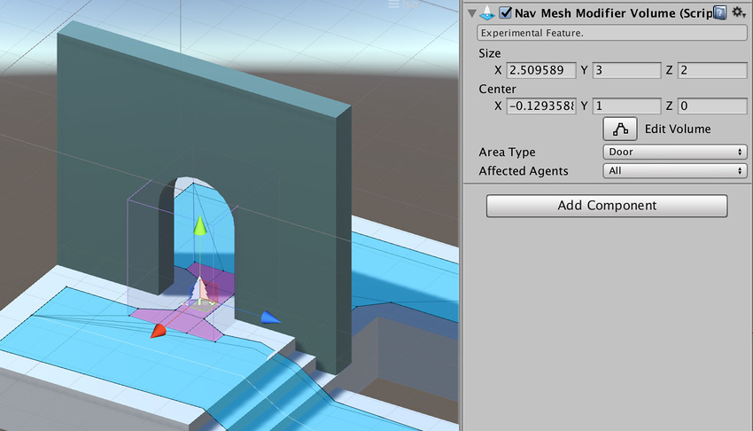

# 导航网格修改器体积 (NavMesh Modifier Volume)

导航网格修改器体积 (NavMesh Modifier Volume) 组件不在 Unity 标准安装中；有关如何访问该组件的信息，请参阅[高级导航网格构建组件](NavMesh-BuildingComponents.html)的文档。

导航网格修改器体积会将一个已定义的区域标记为特定类型（例如，__Lava__ 或 __Door__）。而[导航网格修改器](class-NavMeshModifier.html)会将某些游戏对象标记为某种区域类型。导航网格修改器体积允许您在本地根据特定体积更改区域类型。

要使用导航网格修改器体积组件，请导航至 __GameObject__ > __AI__ > __NavMesh Modifier Volume__。

导航网格修改器体积用于标记不能表示为单独几何体的可行走表面的某些区域，例如危险区域。此组件也可用于使某些区域不可行走。

导航网格修改器体积也会影响导航网格生成过程，这意味着必须更新导航网格以反映对导航网格修改器体积的任何更改。

| __属性__| __功能__ |
|:---|:---| 
| __Size__| 导航网格修改器体积的尺寸，由 XYZ 测量值定义。  |
| __Center__| 相对于游戏对象中心的导航网格修改器体积的中心，由 XYZ 测量值定义。 |
| __Area Type__| 描述导航网格修改器体积适用的区域类型。 - __Walkable__（这是默认选项）  - __Not Walkable__  - __Jump__ |
| __Affected Agents__| 导航网格修改器体积影响的一系列代理 (Agent)。例如，可选择仅针对特定代理类型将选定的导航网格修改器体积标记为危险区域。 - __None__  - __All__（这是默认选项）  - __Humanoid__  - __Ogre__ |

   

---

*  2017-05-26  Page published with limited [editorial review](DocumentationEditorialReview.html)

* 5.6 中的新功能
