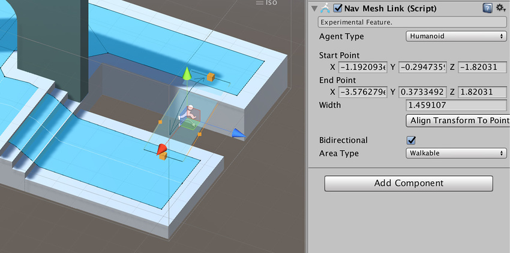
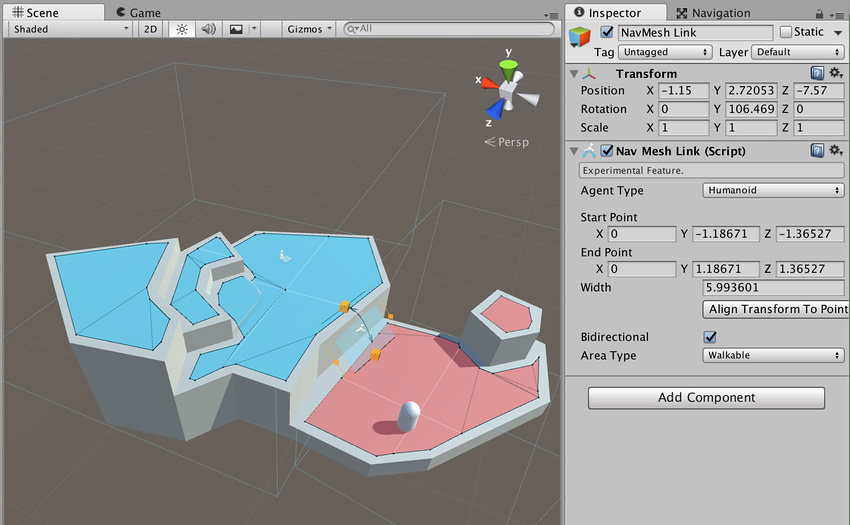

# 导航网格链接 (NavMesh Link)

导航网格链接 (NavMesh Link) 组件不在 Unity 标准安装中；有关如何访问该组件的信息，请参阅[高级导航网格构建组件](NavMesh-BuildingComponents.html)的文档。

导航网格链接在使用导航网格的两个位置之间创建可导航的链接。

此链接可以是点到点，也可以跨越间隙，在后一种情况下，代理 (Agent) 使用沿着入口边缘的最近位置来跨越链接。

必须使用导航网格链接来连接不同的导航网格表面。

要使用导航网格链接组件，请导航至 __GameObject__ > __AI__ > __NavMesh Link__。

| __属性__| __功能__ |
|:---|:---| 
| __Agent Type__| 可使用该链接的代理类型。 - __Humanoid__  - __Ogre__ |
| __Start Point__| 链接起点（相对于游戏对象）。由 XYZ 测量值定义。 |
| __End Point__| 链接终点（相对于游戏对象）。由 XYZ 测量值定义。 |
| __Align Transform To Points__| 单击此按钮可将游戏对象移到链接的中心点，并将变换的前向轴与终点对齐。 |
| __Bidirectional__| 选中此复选框时，导航网格代理 (NavMesh Agent) 会双向遍历导航网格链接（从起点到终点，再从终点回到起点）。 取消选中此复选框时，导航网格链接仅单向运行（仅从起点到终点）。 |
| __Area Type__| 导航网格链接的区域类型（这会影响寻路成本）。  - __Walkable__（这是默认选项）  - __Not Walkable__   - __Jump__ |

## 将多个导航网格表面连接在一起

如果希望代理在场景中的多个导航网格表面之间移动，必须使用导航网格链接连接它们。

在上面的示例场景中，蓝色和红色导航网格在不同的导航网格表面中定义，并使用导航网格链接连接它们。

注意在连接导航网格表面时：

* 可使用多个导航网格链接来连接导航网格表面。

* 导航网格表面和导航网格链接都必须具有相同的代理类型。

* 导航网格链接的起点和终点只能在一个导航网格表面上；如果在同一位置有多个导航网格，请务必小心。

* 如果要加载第二个导航网格表面，并在第一个场景中有未连接的导航网格链接，请确保它们未连接到任何不需要的导航网格表面。

   

---

*  2017-05-26  Page published with limited [editorial review](DocumentationEditorialReview.html)

* 5.6 中的新功能
