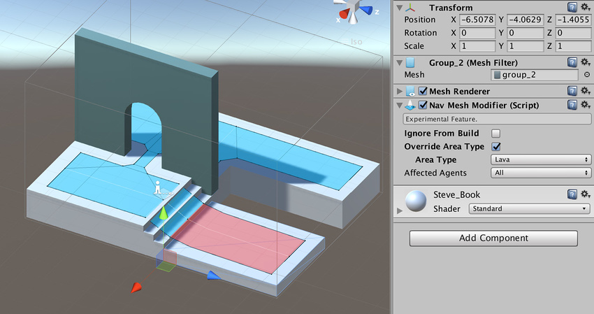

# 导航网格修改器 (NavMesh Modifier)

导航网格修改器 (NavMesh Modifier) 可在运行时调整特定游戏对象在导航网格烘焙期间的行为方式。导航网格修改器不在 Unity 标准安装中；有关如何访问这些组件的信息，请参阅[高级导航网格构建组件](NavMesh-BuildingComponents.html)的文档。

要使用导航网格修改器组件，请导航至 __GameObject__ > __AI__ > __NavMesh Modifier__。

在下图中，右下方的平台附加了一个修改器，用于将其 __Area Type__ 设置为 __Lava__。

导航网格修改器在整个层级视图上影响游戏对象，这意味着该组件附加到的游戏对象及其所有子项都受到影响。此外，如果在变换层级视图的下层找到另一个导航网格修改器，则新的导航网格修改器将覆盖层级视图上层的导航网格修改器。

导航网格修改器也会影响导航网格生成过程，这意味着必须更新导航网格以反映对导航网格修改器的任何更改。

|**属性：** |**功能：** |
|:---|:---|
| __Ignore From Build__| 选中此复选框可从构建过程中排除游戏对象及其所有子项。 |
| __Override Area Type__| 选中此复选框可更改包含修改器的游戏对象及其所有子项的区域类型。 |
| __Area Type__| 从下拉菜单中选择要应用的新区域类型。 |
| __Affected Agents__| 修改器影响的一系列代理 (Agent)。例如，可选择为特定代理排除某些障碍物。  |

   

---

*  2017-05-26  Page published with limited [editorial review](DocumentationEditorialReview.html)

* 5.6 中的新功能
