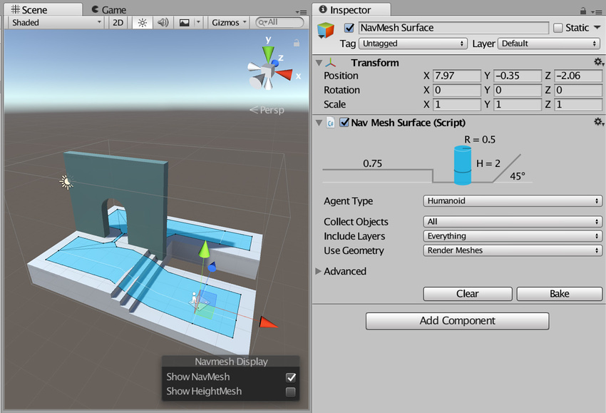

# 导航网格表面 (NavMesh Surface)

导航网格表面 (NavMesh Surface) 组件表示特定[导航网格代理 (NavMesh Agent)](class-NavMeshAgent.html) 类型的可行走区域，并定义应构建导航网格的场景部分。

导航网格表面组件不在 Unity 标准安装中；有关如何访问该组件的信息，请参阅[高级导航网格构建组件](NavMesh-BuildingComponents.html)的文档。

要使用导航网格表面组件，请导航至 __GameObject__ > __AI__ > __NavMesh Surface__。此操作会创建一个附加了导航网格表面组件的空游戏对象。一个场景可以包含多个导航网格表面。

您可以将导航网格表面组件添加到任何游戏对象。当您想要使用游戏对象管控[层级视图](Hierarchy.html)来定义哪些游戏对象对导航网格有影响时，这非常有用。

| __属性__| __功能__ |
|:---|:---| 
| __Agent Type__| 使用导航网格表面的[导航网格代理](nav-CreateNavMeshAgent.html)类型。用于烘焙设置以及在寻路期间将导航网格代理与正确的表面相匹配。 - Humanoid - Ogre |
| __Collect Objects__| 定义要用于烘焙的游戏对象。 - __All__ – 使用所有激活的游戏对象（这是默认选项）。 - __Volume__ – 使用与包围体重叠的所有激活状态游戏对象。 - __Children__ – 使用所有充当导航网格表面组件的子项的激活状态游戏对象。 |
| __Include Layers__| 定义要将哪些层上的游戏对象包含在[烘焙](nav-BuildingNavMesh.html)中。除了 __Collect Objects__ 之外，此属性还允许从烘焙中进一步排除特定的游戏对象（例如，效果或动画角色）。 此属性在默认情况下设置为 __Everything__，但您可以单独对以下选项进行开关切换（由选中标记表示）： - __Nothing__（自动取消勾选所有其他选项，将它们关闭） - __Everything__（自动勾选所有其他选项，将它们打开） - __Default__  - __TransparentFX__  - __Ignore [Raycast](Raycasters.html)__  - __Water__   - __UI__ |
| __Use Geometry__| 选择用于烘焙的几何体。 - __Render Meshes__ – 使用渲染网格和[地形](terrain-UsingTerrains.html)中的几何体。 – __Physics [Colliders](CollidersOverview.html)__ – 使用碰撞体和地形中的几何体。此选项与 __Render Meshes__ 选项相比，代理可以移动到更接近环境物理边界的边缘。 |

使用导航网格表面组件的主要设置可以大范围过滤输入几何体。使用[导航网格修改器 (NavMesh Modifier) 组件](class-NavMeshModifier.html)可以微调 Unity 针对每个游戏对象处理输入几何体的方式。

烘焙过程会自动排除具有导航网格代理 (NavMesh Agent) 或导航网格障碍物 (NavMesh Obstacle) 的游戏对象。这些游戏对象是导航网格的动态用户，因此不参与导航网格构建。

## Advanced 设置

在 Advanced 设置部分可自定义以下附加参数：

| __属性__| __功能__ |
|:---|:---| 
| __Default Area__ | 定义构建导航网格时生成的区域类型。 - __Walkable__（这是默认选项）  - __Not Walkable__  - __Jump__   使用[导航网格修改器](class-NavMeshModifier.html)组件可以更详细地修改区域类型。 |
| __Override Voxel Size__ | 控制 Unity 处理导航网格烘焙的输入几何体的准确程度（这是速度和准确度之间的权衡）。选中复选框可启用该属性。默认情况下会取消选中该复选框（禁用）。 每个代理半径 3 个体素（每个直径 6 个）允许捕获狭窄的通道（例如门），同时保持快速烘焙。对于大型开放区域，每个半径使用 1 或 2 个体素可加快烘焙速度。室内的密集点更适合较小的体素，例如每个半径 4 到 6 个体素。每个半径超过 8 个体素通常不会进一步带来好处。 |
| __Override Tile Size__ | 为了使烘焙过程并行执行且提高内存效率，场景将分区进行烘焙。导航网格上可见的白线是区块边界。 默认区块大小为 256 个体素，这种大小在内存使用和导航网格碎片之间提供了良好的折衷。 要更改此默认区块大小，请选中此复选框，然后在 __Tile Size__ 字段中输入您希望 Tile Size 包含的体素数。 区块越小，导航网格就越碎片化。这种情况下有时会导致非最佳路径。导航网格雕刻也基于区块进行。如果有很多障碍物，通常可以通过减小区块大小（例如大约 64 到 128 个体素）来加速雕刻。如果您计划在运行时烘焙导航网格，请使用较小的区块大小以使最高内存使用率处于较低水平。 |
| __Build Height Mesh__| 不支持。 |

## 高级调试可视化

使用 __Debug Visualization__ 部分中的设置可诊断导航网格构建过程中遇到的任何问题。不同的复选框显示了导航网格构建过程的每个步骤，包括输入场景体素化 (__Input Geometry__)、区域分割 (__Regions__)、轮廓生成 (__Contours__) 和导航网格多边形 (__Polygon Meshes__)。

---

*  2017-09-14  Page published with limited [editorial review](DocumentationEditorialReview.html)

* 5.6 中的新功能

* 在 [2017.2](https://docs.unity3d.com/2017.2/Documentation/Manual/30_search.html?q=newin20172) 版中添加了新的高级调试可视化 (Debug Visualization) NewIn20172
