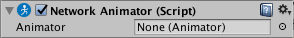

# Network Animator

Network Animator 组件可以同步联网对象的动画状态。此组件可同步 [AnimatorController](class-AnimatorController.html) 中的状态和参数。

请注意，如果在空游戏对象上创建 Network Animator 组件，那么 Unity 还会在该游戏对象上创建 [Network Identity](class-NetworkIdentity.html) 组件和 [Animator](class-Animator.html) 组件。

|**属性**|**功能**|
|:---|:---|
|__Animator__|使用此字段可定义希望与 Network Animator 同步的 Animator 组件。|

## 详细信息

Network Animator 可确保在网络上同步游戏对象动画，这意味着所有玩家都能同时看到出现的动画。联网动画有两种类型的授权（有关授权的更多信息，请参阅[网络系统概念](UNetConcepts.html)文档）：

* 如果游戏对象在客户端上具有授权，则应在拥有此游戏对象的客户端本地对游戏对象进行动画化。该客户端将动画状态信息发送到服务器，服务器再将此信息广播到所有其他客户端。例如，这种授权方式适合于玩家角色。

* 如果游戏对象在服务器上具有授权，那么应该在服务器上对游戏对象动画化。然后，服务器将状态信息发送到所有客户端。这种授权方式对于与特定客户端无关的动画化游戏对象（如非玩家角色）很常见。

Network Animator 将同步在 Inspector 窗口中选中的动画参数。该组件不会自动同步动画触发器。具有授权的游戏对象可以使用函数 [SetTrigger](../ScriptReference/Animator.SetTrigger.html) 在其他客户端上触发动画触发器。

可使用 [GetParameterAutoSend](../ScriptReference/Networking.NetworkAnimator.GetParameterAutoSend.html) 和 [SetParameterAutoSend](../ScriptReference/Networking.NetworkAnimator.SetParameterAutoSend.html) 函数来控制应自动同步的各个动画器参数。
