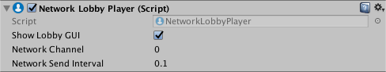

#Network Lobby Player

Network Lobby Player 可存储在大厅内时每个玩家在 Network Lobby Manager 中的状态。使用此组件时，需要编写一个脚本，让玩家表明已准备好开始游戏，此情况下将设置 [readyToBegin](../ScriptReference/Networking.NetworkLobbyPlayer-readyToBegin.html) 属性。请参阅有关 [Network Lobby Manager](class-NetworkLobbyManager.html) 的文档以了解关于如何使用此组件的完整详细信息。

具有 Network Lobby Player 组件的游戏对象还必须具有 [Network Identity](class-NetworkIdentity.html) 组件。在某个游戏对象上创建 Network Lobby Player 组件时，Unity 还将在该游戏对象上创建 Network Identity 组件（如果还没有此组件）。

|**属性**|**功能**|
|:---|:---|
|**Show Lobby GUI**|启用此属性可显示大厅内玩家的开发者 GUI。该 UI 仅用于方便开发。默认情况下会启用此属性。|
|Network Channel|Network Lobby Player 使用的[网络通道](../ScriptReference/Networking.Channels.html)|
|Network Send Interval|信息从 Network Lobby Player 发送到服务器时的速率。请参阅 [GetNetworkSendInterval()](../ScriptReference/Networking.NetworkBehaviour.GetNetworkSendInterval.html)|

