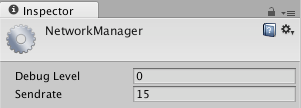

Network Manager
===============

（此类属于旧网络系统，已弃用。请参阅 [NetworkManager](../ScriptReference/Networking.NetworkManager.html) 以了解新网络系统）。

__Network Manager__ 包含两个非常重要的属性，用于制作联网的多人游戏。

可以通过从菜单栏中选择 __Edit &gt; Project Settings &gt; Network__ 来访问 Network Manager。

属性
----------

|**_属性：_** |**_功能：_** |
|:---|:---|
|__Debug Level__ |输出到控制台的消息级别 |
|__Sendrate__ |通过网络每秒发送数据的次数 |

详细信息
-------

调整 Debug Level 对于微调或调试游戏的网络行为非常有用。此设置为 **0** 时，仅将网络中的错误输出到控制台。

以 __Sendrate__ 间隔（1 秒 / __Sendrate__ = 间隔）发送的数据将根据每个广播对象的 __Network View__ 属性而变化。如果 Network View 使用的是 __Unreliable__，则按照每次间隔发送数据。如果 Network View 使用的是 __Reliable Delta Compressed__，则 Unity 将检查自上次间隔以来所监视的对象是否已更改。如果对象已更改，则将发送数据。
