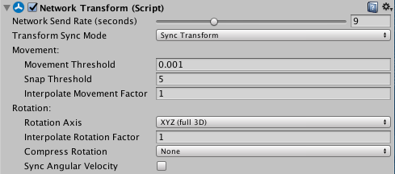

# Network Transform

Network Transform 组件在网络中同步游戏对象的移动和旋转。请注意，Network Transform 组件仅同步已生成的联网游戏对象。

|**属性**|**功能**|
|:---|:---|
|**Network Send Rate (seconds)**|设置每秒的网络更新数。对于在创建后不需要更新的游戏对象，比如玩家生成的非交互式效果（例如，玩家身后的无法交互的尘埃云团），可以将此滑动条设置为 0。|
|**Transform Sync Mode**|选择此游戏对象上应发生的同步类型。|
|**&nbsp;&nbsp;&nbsp;&nbsp;Sync None**|不同步。|
|**&nbsp;&nbsp;&nbsp;&nbsp;Sync Transform**|使用游戏对象的变换组件进行同步。如果物理系统不控制此游戏对象（即，通过脚本或动画移动游戏对象的情况下），请使用此选项。这是默认选项。|
|**&nbsp;&nbsp;&nbsp;&nbsp;Sync Rigidbody 2D**|使用 Rigidbody2D 组件进行同步。如果 2D 物理系统控制此游戏对象，请使用此选项。|
|**&nbsp;&nbsp;&nbsp;&nbsp;Sync Rigidbody 3D**|使用 Rigidbody 组件进行同步。如果 3D 物理系统控制此游戏对象，请使用此选项。|
|**&nbsp;&nbsp;&nbsp;&nbsp;Sync Character Controller**|使用 Character Controller 组件进行同步。仅当使用 Character Controller 时才选择此选项。|
|**Movement：**||
|**&nbsp;&nbsp;&nbsp;&nbsp;Movement Threshold**|设置在不发送移动同步更新的情况下游戏对象可以移动的距离。|
|**&nbsp;&nbsp;&nbsp;&nbsp;Snap Threshold**|设置阈值，在此阈值处，如果移动更新使游戏对象远离其当前位置，则游戏对象贴靠到该位置而不是平滑移动。|
|**&nbsp;&nbsp;&nbsp;&nbsp;Interpolate Movement Factor**|使用此属性可启用和控制同步运动的插值。该数字越大，游戏对象插入到目标位置的速度越快。如果将其设置为 0，则游戏对象将贴靠到新位置。|
|**Rotation：**||
|**&nbsp;&nbsp;&nbsp;&nbsp;Rotation Axis**|定义应同步的一个或多个旋转轴。默认设置为 XYZ（全 3D）。|
|**&nbsp;&nbsp;&nbsp;&nbsp;Interpolate Rotation Factor**|使用此属性可启用和控制同步旋转的插值。该数字越大，游戏对象插入到目标旋转的速度越快。如果将其设置为 0，则游戏对象将贴靠到新旋转。|
|**&nbsp;&nbsp;&nbsp;&nbsp;Compress Rotation**|如果压缩旋转数据，则发送的数据量较低，旋转同步的精度较低。|
|&nbsp;&nbsp;&nbsp;&nbsp;&nbsp;&nbsp;&nbsp;&nbsp;None|选择此选项将不对旋转同步应用任何压缩。这是默认选项。|
|&nbsp;&nbsp;&nbsp;&nbsp;&nbsp;&nbsp;&nbsp;&nbsp;Low|选择此选项可对旋转同步应用低压缩量。此选项可减少为旋转数据发送的信息量。|
|&nbsp;&nbsp;&nbsp;&nbsp;&nbsp;&nbsp;&nbsp;&nbsp;High|选择此选项可对旋转同步应用高压缩量。此选项为旋转数据发送最少的信息。|
|&nbsp;&nbsp;&nbsp;&nbsp;Sync Angular Velocity|勾选此复选框可同步所连接的刚体组件的角速度。|

此组件会考虑授权，因此本地玩家游戏对象（具有本地授权）将自身位置从客户端同步到服务器，然后同步到其他客户端。其他游戏对象（具有服务器授权）将自身位置从服务器同步到客户端。

具有 Network Transform 组件的游戏对象还必须具有 [Network Identity](https://docs.unity3d.com/Manual/class-NetworkIdentity.html) 组件。在某个游戏对象上创建 Network Transform 组件时，Unity 还将在该游戏对象上创建 Network Identity 组件（如果还没有此组件）。

请注意，[Network Transform Visualizer](https://docs.unity3d.com/Manual/class-NetworkTransformVisualizer.html) 组件是用于调试 Network Transform 组件的有用工具。
