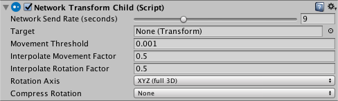

# Network Transform Child

Network Transform Child 组件可将游戏对象的子游戏对象的位置和旋转与 [Network Transform](class-NetworkTransform.html) 组件同步。如果需要同步某个联网游戏对象的独立运动子对象，则应使用此组件。

要使用 Network Transform Child 组件，请将其与 Network Transform 附加到同一个父游戏对象，然后使用 **Target** 字段来定义要将组件设置应用到的子游戏对象。在一个父游戏对象上可以设置多个 Network Transform Child 组件。

|**属性**|**功能**|
|:---|:---|
|**Network Send Rate (seconds)**|**|Set the number of network updates per second. You can set this slider to 0 for GameObjects that do not need to update after being created, like non-interactive effects generated by a player (for example, a dust cloud left behind that the player cannot interact with).|
|**Target**|**|Child transform to be synchronized. (Remember, this component goes on the *parent*, not the child - so you specify the child object using this field).|
|**Movement Threshold**|**|Set the distance that a GameObject can move without sending a movement synchronization update.|
|**Interpolate Movement Factor**|**|Use this to enable and control interpolation of the synchronized movement. The larger this number is, the faster the GameObject interpolates to the target position. If this is set to 0, the GameObject snaps to the new position.|
|**Interpolate Rotation Factor**|**|Use this to enable and control interpolation of the synchronized rotation. The larger this number is, the faster the GameObject interpolates to the target rotation. If this is set to 0, the GameObject snaps to the new rotation.|
|**Rotation Axis**|**|Define which rotation axis or axes should synchronize. This is set to XYZ (full 3D) by default.|
|**Compress Rotation**|**|If you compress rotation data, the amount of data sent is lower, and the accuracy of the rotation synchronization is lower.|
|&nbsp;&nbsp;&nbsp;&nbsp;None|**|Choose this to apply no compression to the rotation synchronization. This is the default option.|
|&nbsp;&nbsp;&nbsp;&nbsp;Low|**|Choose this to apply a low amount of compression to the rotation synchronization. This option lessens the amount of information sent for rotation data.|
|&nbsp;&nbsp;&nbsp;&nbsp;High|**|Choose this to apply a high amount of compression to the rotation synchronization. This option sends the least amount of information possible for rotation data.|

此组件不使用物理系统，可同步子游戏对象的位置和旋转，并向更新后的值进行插值。使用 **Interpolate Movement Factor** 和 **Interpolate Rotation Factor** 可自定义插值的速率。

具有 Network Transform Child 组件的游戏对象还必须具有 [Network Identity](class-NetworkIdentity.html) 组件。在某个游戏对象上创建 Network Transform Child 组件时，Unity 还将在该游戏对象上创建 Network Identity 组件（如果还没有此组件）。
