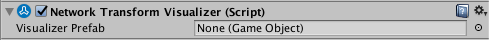
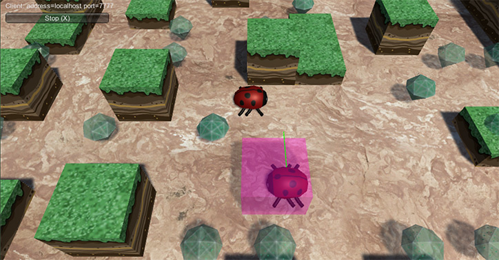

# Network Transform Visualizer

Network Transform Visualizer 是一个实用程序组件，用于可视化使用 [Network Transform](../ScriptReference/Networking.NetworkTransform.html) 组件的游戏对象的插值。要使用此组件，请将其添加到已具有 Network Transform 组件的游戏对象，并在 Inspector 中分配一个预制件。该预制件可以是所选的任何项，它将用作游戏对象的传入变换数据的直观表示。

具有[本地授权](UNetAuthority.html)的游戏对象（例如本地玩家）不进行插值，因此不会显示可视化工具游戏对象。可视化工具仅会显示由网络上的其他计算机控制的其他联网游戏对象（例如其他玩家）。

Inspector 窗口中的 Network Transform Visualizer 组件

|**属性**|**功能**|
|:---|:---|
|**Visualizer Prefab**|定义用于可视化网络变换目标位置的预制件。|

正在运行游戏时，预制件被实例化为“可视化工具”游戏对象。当 Network Transform 游戏对象移动时，可视化工具游戏对象会显示在 Network Transform 的目标位置。

可以选择任何所需的可视化工具预制件。下面的示例中使用了半透明的洋红色立方体。

该组件在移动时通常看起来比 Network Transform 游戏对象略微靠前，但流畅度更低。这是因为该组件显示的是直接来自网络的原始位置数据，而不是使用插值来平滑地到达每个新的目标位置。

具有 Network Transform Visualizer 组件的游戏对象必须还必须具有 [Network Identity](class-NetworkIdentity.html) 组件。在某个游戏对象上创建 Network Transform Visualizer 组件时，Unity 还将在该游戏对象上创建 Network Transform 组件和 Network Identity 组件（如果还没有这些组件）。

**注意：**确保选择用作可视化游戏对象的预制件没有附加碰撞体，或任何其他可能影响游戏运行的组件！
