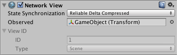

网络视图 (Network View)
============

（此类属于旧网络系统，已弃用。请参阅 [NetworkIdentity](../ScriptReference/Networking.NetworkIdentity.html) 以了解新网络系统）。

__网络视图__是在 Unity 中创建联网多人游戏的门户。它们易于使用，但功能非常强大。因此，在开始尝试使用网络视图之前，建议您了解网络背后的基本概念。您可以在[网络参考指南](NetworkReferenceGuide.html)中学习和探索这些基本概念。


 

为了使用任何网络功能，包括__状态同步 (State Synchronization)__ 或__远程过程调用 (Remote Procedure Calls)__，您的__游戏对象__必须连接网络视图。


属性
----------


|**_属性：_** |**_功能：_** |
|:---|:---|
|__State Synchronization__ |此网络视图使用的[状态同步 (State Synchronization)](net-StateSynchronization.html) 类型 |
|&amp;#160;&amp;#160;&amp;#160;&amp;#160;&amp;#160;&amp;#160;&amp;#160;&amp;#160;__Off__ |不使用状态同步 (State Synchronization)。如果您只想发送 [RPC](net-RPCDetails.html)，那么这是最佳选项 |
|&amp;#160;&amp;#160;&amp;#160;&amp;#160;&amp;#160;&amp;#160;&amp;#160;&amp;#160;__Reliable Delta Compressed__ |仅发送上次状态和当前状态之间的差异，如果没有任何改变，则不发送任何内容。此模式是有序的。在丢包的情况下，自动重新发送丢失的数据包 |
|&amp;#160;&amp;#160;&amp;#160;&amp;#160;&amp;#160;&amp;#160;&amp;#160;&amp;#160;__Unreliable__ |发送完整状态。这种情况会占用更多带宽，但最大限度降低了丢包的影响 |
|__Observed__ |通过网络发送的__组件__数据 |
|__View ID__ |此网络视图的唯一标识符。这些值在检视面板中为只读值 |
|&amp;#160;&amp;#160;&amp;#160;&amp;#160;&amp;#160;&amp;#160;&amp;#160;&amp;#160;__Scene ID__ |网络视图在此特定场景中的数字 ID |
|&amp;#160;&amp;#160;&amp;#160;&amp;#160;&amp;#160;&amp;#160;&amp;#160;&amp;#160;__Type__ |在运行时保存到 __Scene__ 或 __Allocated__ |


详细信息
-------


将网络视图添加到游戏对象时，必须决定两件事


1.您希望网络视图发送哪种数据
1.您希望如何发送该数据


###选择要发送的数据

网络视图的 __Observed__ 属性可包含单个组件。此组件可以是 __Transform__、__Animation__、__RigidBody__ 或脚本。无论 __Observed__ 组件是什么，都会通过网络发送其相关数据。您可以从下拉菜单中选择组件，也可以将任何组件标题直接拖到变量中。如果您不想直接发送数据，只想使用 RPC 调用，则可关闭同步（不直接发送数据），并且不需要为 Observed 属性设置值。RPC 调用只需要一个网络视图，因此如果已存在一个视图，则无需专门为 RPC 添加视图。


###如何发送数据

您可以通过 2 个选项发送 __Observed__ 组件的数据：__State Synchronization__ 和 __Remote Procedure Calls__。

要使用 State Synchronization，请将网络视图的 __State Synchronization__ 设置为 __Reliable Delta Compressed__ 或 __Unreliable__。现在将通过网络自动发送 __Observed__ 组件的数据。

__Reliable Delta Compressed__ 是有序的。始终按照数据包的发送顺序接收数据包。如果数据包被丢弃，将重新发送该数据包。所有后续数据包都将排队等待，直到收到较早的数据包。仅发送上次传输值与当前值之间的差异，如果没有差异，则不发送任何内容。

如果正在监视脚本，必须在脚本中显式序列化数据。应在 __OnSerializeNetworkView()__ 函数中执行此操作。

````
using UnityEngine;
using UnityEngine.Network;
using System.Collections;

public class ExampleScript : MonoBehaviour {
	void OnSerializeNetworkView (BitStream stream, NetworkMessageInfo info) {
		float horizontalInput = Input.GetAxis ("Horizontal");
		stream.Serialize (horizontalInput);
	}
}
````
_C# 脚本示例_

````
function OnSerializeNetworkView (stream : BitStream, info : NetworkMessageInfo) {
	var horizontalInput : float = Input.GetAxis ("Horizontal");
	stream.Serialize (horizontalInput);
}
````
_JS 脚本示例_

上面的函数始终在接收更新时写入（来自串流的更新）到 horizontalInput，否则在写入串流时从变量中读取。如果要在接收更新时或发送时执行不同的操作，可使用 BitStream 类的 __isWriting__ 属性。

````
using UnityEngine;
using UnityEngine.Network;
using System.Collections;

public class ExampleScript : MonoBehaviour {
	void OnSerializeNetworkView (BitStream stream, NetworkMessageInfo info) {
		float horizontalInput = 0.0;
		if (stream.isWriting) {
			// 发送
			horizontalInput = Input.GetAxis ("Horizontal");
			stream.Serialize (horizontalInput);
		} else {	
			// 接收
			stream.Serialize (horizontalInput);
			// ...用收到的变量执行一些有意义的操作
		}
	}
}
````
_C# 脚本示例_

````
function OnSerializeNetworkView (stream : BitStream, info : NetworkMessageInfo) {
	var horizontalInput : float = 0.0;
	if (stream.isWriting) {
		// 发送
		horizontalInput = Input.GetAxis ("Horizontal");
		stream.Serialize (horizontalInput);
	} else {
		// 接收
		stream.Serialize (horizontalInput);
		// ...用收到的变量执行一些有意义的操作
	}
}
````
_JS 脚本示例_

__OnSerializeNetworkView__ 的调用是根据 Network Manager 项目设置中指定的 __sendRate__ 进行的。默认为 15 次/秒。

如果要在脚本中使用远程过程调用，则只需要有一个 NetworkView 组件存在于脚本所连接到的同一游戏对象中。NetworkView 可用于其他目的，如果仅用于发送 RPC，它可以不监视脚本（Observed 属性不用设值）并可关闭状态同步。要从网络调用的函数必须具有 __@RPC__ 属性。现在，从连接到同一游戏对象的任何脚本调用 [networkView.RPC()](../ScriptReference/NetworkView.RPC.html) 来执行远程过程调用。

````
using UnityEngine;
using UnityEngine.Network;
using System.Collections;

public class ExampleScript : MonoBehaviour {
	GameObject playerBullet;
	NetworkView networkView;

	void Start () {
		networkView = new NetworkView ();
	}

	void Update () {
		if (Input.GetButtonDown ("Fire1")) {
			networkView.RPC ("PlayerFire", RPCMode.All);
		}
	}
	
	[RPC]
	void PlayerFire () {
		Instantiate (playerBullet, playerBullet.transform.position, playerBullet.transform.rotation);
	}
}
````
_C# 脚本示例_

````
var playerBullet : GameObject;

function Update () {
	if (Input.GetButtonDown ("Fire1")) {
		networkView.RPC ("PlayerFire", RPCMode.All);
	}
}

@RPC
function PlayerFire () {
	Instantiate (playerBullet, playerBullet.transform.position, playerBullet.transform.rotation);
}
````
_JS 脚本示例_

RPC 将可靠且有序地传送。有关 RPC 的更多信息，请参阅 [RPC 详细信息](net-RPCDetails.html)页面。


提示
-----


* 如果仍然不清楚如何使用网络视图，请通读[网络参考指南](NetworkReferenceGuide.html)
* 无需禁用状态同步即可使用远程过程调用
* 如果有多个网络视图，并希望对某个特定网络视图调用 RPC，请使用 __GetComponents(NetworkView)[i].RPC()__。
