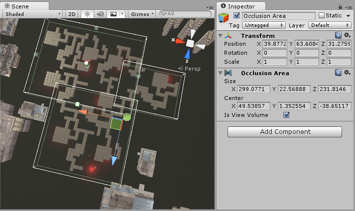
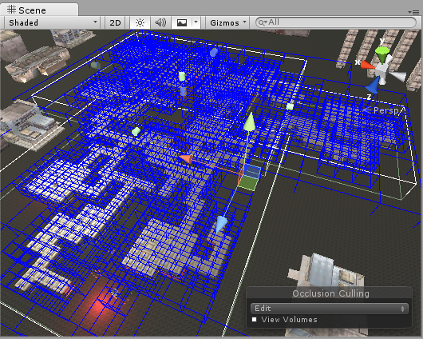

遮挡区域
==============

要将遮挡剔除应用于移动对象，必须创建__遮挡区域 (Occlusion Area)__，然后修改其大小以适合移动对象所在的空间（当然，移动对象不能标记为静态）。可通过将__遮挡区域 (Occlusion Area)__ 组件添加到空游戏对象来创建遮挡区域（菜单：__Component &gt; Rendering &gt; Occlusion Area__）。

创建__遮挡区域__后，请选中 _Is View Volume_ 复选框以遮挡移动对象。

 

|**_属性：_** |**_功能：_** |
|:---|:---|
|__Size__ |定义遮挡区域的大小。|
|__Center__ |设置遮挡区域的中心。默认情况下，此设置为 0,0,0，位于盒体的中心。|
|__Is View Volume__ |定义摄像机的位置。选中此项可遮挡该_遮挡区域_内的静态对象。|

添加遮挡区域后，需要查看它如何将盒体分成单元格。要了解如何计算遮挡区域，请在 __Occlusion Culling 预览面板__中
选择 __Edit__ 并切换 __View__ 按钮。

 

测试生成的遮挡
-------------------------------

设置遮挡后，可通过启用 _Occlusion Culling_（在 Visualize 模式下的 __Occlusion Culling 预览面板__中）并在 Scene 视图中移动__主摄像机__来测试遮挡。

当您移动主摄像机时（无论是否处于播放模式下），您将看到各种对象自行禁用。此处要寻找的是遮挡数据是否有任何错误。如果在移动摄像机时看到有对象突然弹入视图，则表示有错误。如果发生这种情况，修复错误的方法为更改分辨率（如果正在使用目标体积），或者移动对象以掩盖错误。要调试遮挡问题，可将主摄像机移动到有问题的位置进行抽样检查。

处理完成后，您应该在查看区域中看到一些彩色立方体。蓝色立方体表示__目标体积__的单元格划分。白色立方体表示__视图体积__的单元格划分。如果参数设置正确，您应该看到一些对象未被渲染。这是因为它们位于摄像机的视锥体之外，或被其他对象遮挡。

遮挡完成后，如果在场景中没有看到任何对象被遮挡，请尝试将对象分成更小的部分，以便能将它们完全包含在单元格内。
