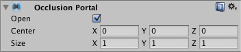

遮挡入口 (Occlusion Portal)
=================

为了创建在运行时可打开和可关闭的遮挡基元，Unity 使用__遮挡入口 (Occlusion Portal)__。

 

|**_属性：_** |**_功能：_** |
|:---|:---|
|__Open__ |指示入口是否打开（可编写脚本）。 |
|__Center__ |设置遮挡区域的中心。默认情况下，此设置为 0,0,0，位于盒体的中心。|
|__Size__ |定义遮挡区域的大小。|
