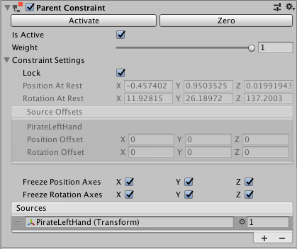

# 父约束 (Parent Constraints)

Parent Constraint 将移动并旋转游戏对象，就好像它是 Hierarchy 窗口中另一个游戏对象的子项一样。不过，该组件提供了一些优势，这是将某个游戏对象变为另一个游戏对象的父项所不能实现的，具体包括：

* Parent Constraint 不会影响缩放比例。

* 一个 Parent Constraint 可以链接到多个游戏对象。

* 游戏对象不必是 Parent Constraint 链接到的游戏对象的子项。

* 可以通过指定权重以及每个源游戏对象的权重来改变约束的影响。

例如，要将一把剑放在角色的手中，应将 Parent Constraint 组件添加到剑游戏对象上。在 Parent Constraint 的 __Sources__ 列表中，链接到角色的手。这样，剑的移动将被约束到手的位置和旋转。

### 属性

| **Property:** || **Function:** |
|:---|:---|
|__Activate__||After you move and rotate the constrained GameObject and its source GameObjects, click __Activate__ to save this information. __Activate__ saves the current offset from the source GameObjects in __Rotation At Rest__, __Position At Rest__, __Position Offset__, and __Rotation Offset__, then checks __Is Active__ and __Lock__. |
|__Zero__||Sets the position and rotation of the constrained GameObject to the source GameObjects. __Zero__ resets the __Rotation At Rest__, __Position At Rest__, __Position Offset__, and __Rotation Offset__ fields then checks __Is Active__ and __Lock__.|
|__Is Active__||Toggles whether or not to evaluate the Constraint. To also apply the Constraint, make sure __Lock__ is checked.|
|__Weight__||The strength of the Constraint. A weight of 1 causes the Constraint to move and rotate this GameObject at the same rate as its source GameObjects. A weight of 0 removes the effect of the Constraint completely. This weight affects all source GameObjects. Each GameObject in the __Sources__ list also has a weight.|
|__Constraint Settings__||&nbsp;|
||Lock|Toggle to let the Constraint move and rotate the GameObject. Uncheck this property to edit the position and rotation of this GameObject. You can also edit the Rotation At Rest, Position At Rest, Position Offset, and Rotation Offset properties. If Is Active is checked, the Constraint updates the Rotation At Rest, Position At Rest, Position Offset, or Rotation Offset properties for you as you move and rotate the GameObject or its Source GameObjects. When you are satisfied with your changes, check Lock to let the Constraint to control this GameObject. This property has no effect in Play Mode.|
||Position At Rest|The X, Y, and Z values to use when Weight is 0 or when the corresponding __Freeze Position Axes__ are not checked. To edit these fields, uncheck __Lock__.|
||Rotation At Rest|The X, Y, and Z values to use when Weight is 0 or when the corresponding __Freeze Rotation Axes__ are not checked. To edit these fields, uncheck __Lock__.|
||Position Offset|The X, Y, and Z position offset from the Transform that the Constraint imposes. To edit these fields, uncheck __Lock__.|
||Rotation Offset|The X, Y, and Z rotation offset from the Transform that the Constraint imposes. To edit these fields, uncheck __Lock__.|
||Freeze Position Axes|Check X, Y, or Z to allow the Constraint to control the corresponding position axes. Uncheck an axis to stop the Constraint from controlling it, which allows you to edit, animate, or script it.|
||Freeze Rotation Axes|Check X, Y, or Z to allow the Constraint to control the corresponding rotation axes. Uncheck an axis to stop the Constraint from controlling it, which allows you to edit, animate, or script it.|
|__Sources__||The list of GameObjects that constrain this GameObject. Unity evaluates source GameObjects in the order they appear in this list. This order affects how this Constraint moves and rotates the constrained GameObject. To get the result you want, drag and drop items in this list. Each source has a weight from 0 to 1. |

---

*  2018-03-13  Page published with [editorial review](DocumentationEditorialReview.html)

* 在 2018.1 版中添加了“约束”
